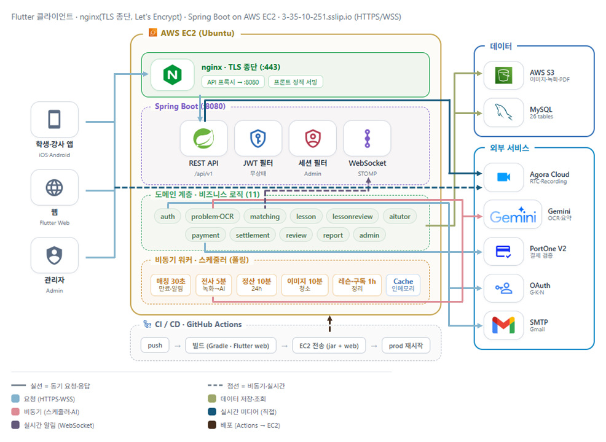
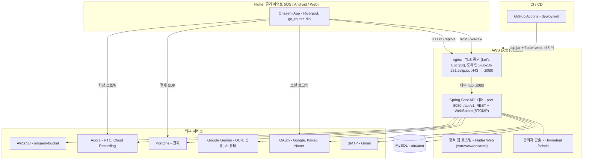
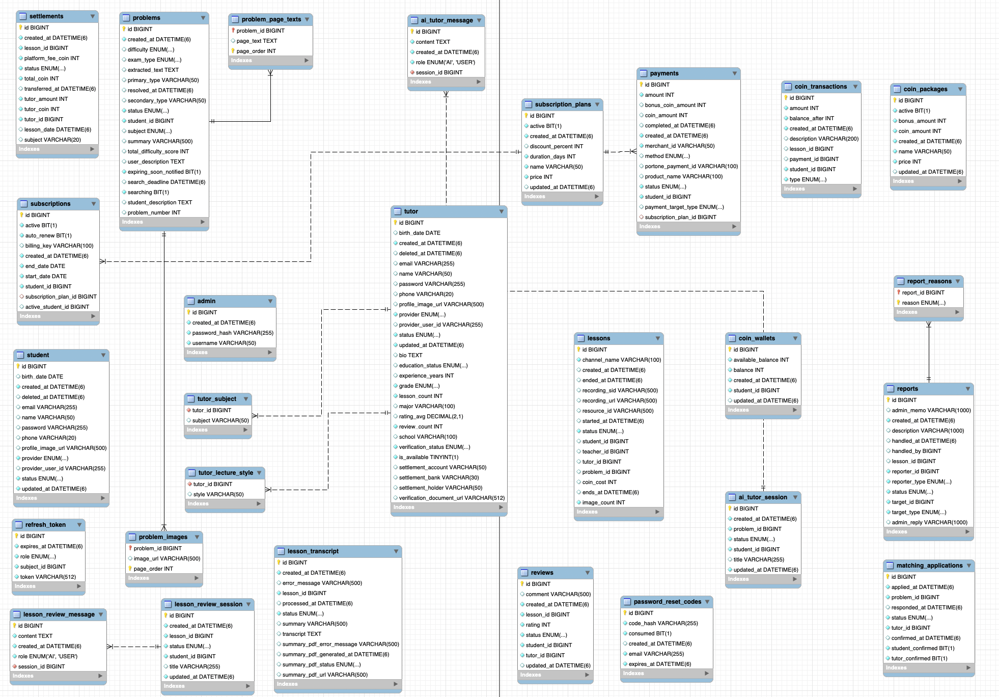

# 온샘 (ONSAEM)

**온디맨드 과외 매칭 플랫폼** — 모르는 문제를 사진으로 올리면, 조건에 맞는 강사와 실시간으로 매칭되어 화상 과외를 받고 AI로 복습까지 이어지는 서비스.


---

## 목차

1. [프로젝트 소개](#프로젝트-소개)
2. [주요 기능](#주요-기능)
3. [화면 미리보기](#화면-미리보기)
4. [기술 스택](#기술-스택)
5. [시스템 아키텍처](#시스템-아키텍처)
6. [기술적 도전](#기술적-도전)
7. [프로젝트 구조](#프로젝트-구조)
8. [시작하기](#시작하기)
9. [환경 변수](#환경-변수)
10. [ERD / 데이터베이스](#erd--데이터베이스)
11. [팀](#팀)

---

## 프로젝트 소개

> **개발 기간** · 2026.05.05 ~ 2026.07.05 (약 2개월, 8주)  
> **진행** · 한국능률협회 미래내일 일경험 프로젝트형 (참여기업: 모바일앱개발협동조합)  
> **팀** · 4인 (백엔드 · 프론트엔드)

<!-- 시연 영상: 취업 시즌에 유튜브 링크 추가 예정 -->

비대면 교육이 확대되었지만, 카카오톡 등 메신저 기반 텍스트·이미지 질의응답은 인지 부하가 크고, Zoom 같은 화상회의 도구는 회의실 생성·링크 공유 절차가 반복되어 단발성 질문에 비효율적입니다. 온샘(Onsaem)은 학생이 막힌 문제를 사진으로 올리는 순간 대기 중인 강사와 실시간으로 매칭되어, 문제 이미지를 배경으로 한 양방향 화이트보드에서 대면 수업처럼 풀이 과정을 함께 공유하며 즉시 과외를 받을 수 있는 온디맨드 과외 매칭 플랫폼입니다.

학생이 풀다 막힌 문제를 **사진으로 등록**하면 AI(OCR)가 과목·유형·난이도를 자동 분류하고, 조건에 맞는 **강사와 매칭**되어 **실시간 화상 강의**를 진행합니다. 강의는 **코인**으로 결제되어 종료 후 강사에게 정산되며, 강의 후에는 **AI 튜터**와 **AI 복습**(녹화 영상 전사·요약)으로 학습을 이어갈 수 있습니다.

전체 플로우: **문제 등록 → 강사 매칭 → 실시간 화상 강의 → 코인 결제·정산 → AI 복습**

클라이언트는 Flutter 기반으로 iOS · Android · Web을 동시에 지원합니다.

<p align="center">
  
</p>
<p align="center"><sub>문제 등록부터 강사 매칭, 실시간 화상강의까지</sub></p>

<!-- docs/images/ 에 demo-main.gif 를 넣으면 자동 표시됩니다. 파일명을 정확히 맞춰주세요. -->

---

## 주요 기능

각 기능의 상세 설계·플로우·API는 위키 문서에서 관리합니다. (링크된 위키 페이지는 순차적으로 채워집니다.)

| 기능 | 요약 | 문서 |
|---|---|---|
| 인증 / 계정 | 학생·강사 가입, JWT, 소셜 로그인(Google·Kakao·Naver), 비밀번호 재설정 | [상세보기 →](./wiki/인증-계정.md) |
| 문제 등록 / OCR | 문제 사진 업로드(S3), Gemini OCR 텍스트 추출·자동 분류 | [상세보기 →](./wiki/문제-등록-OCR.md) |
| 강사 매칭 | 문제 조건에 맞는 강사 지원·상호확인·확정, 탐색 만료 처리 | [상세보기 →](./wiki/매칭-시스템.md) |
| 실시간 화상 강의 | Agora RTC 화상 강의, 판서 공유, 강의 녹화(Cloud Recording → S3) | [상세보기 →](./wiki/화상강의.md) |
| 코인 결제 / 구독 | PortOne 결제로 코인 충전, 지갑(hold·차감·환불), 구독 플랜 | [상세보기 →](./wiki/결제-코인.md) |
| 정산 | 강의 완료 시 강사 몫 코인 산정·현금 정산, 정산 계좌 관리 | [상세보기 →](./wiki/정산.md) |
| AI 튜터 / 복습 | 문제 풀이 챗봇, 강의 녹화 전사(STT)·요약 PDF·복습 챗봇 | [상세보기 →](./wiki/AI-튜터-복습.md) |
| 리뷰 / 신고 | 강의별 강사 평점·후기, 학생↔강사 신고 및 관리자 처리 | [상세보기 →](./wiki/리뷰-신고.md) |

---

## 화면 미리보기

### 핵심 플로우

<table>
  <tr>
    <td align="center"></td>
    <td align="center"></td>
    <td align="center"></td>
  </tr>
  <tr>
    <td align="center"><sub>사진 올리면 AI가 자동 분류</sub></td>
    <td align="center"><sub>조건 맞는 강사와 매칭</sub></td>
    <td align="center"><sub>화상·판서 실시간 과외</sub></td>
  </tr>
</table>

<!-- docs/images/ 에 problem.png · matching.png · lesson.png 를 넣으면 자동 표시됩니다. 파일명을 정확히 맞춰주세요. -->

### 부가 기능

<table>
  <tr>
    <td align="center"></td>
    <td align="center"></td>
    <td align="center"></td>
  </tr>
  <tr>
    <td align="center"><sub>PortOne 결제로 코인 충전</sub></td>
    <td align="center"><sub>문제 풀이 AI 챗봇</sub></td>
    <td align="center"><sub>녹화 전사·요약 복습</sub></td>
  </tr>
</table>

<!-- docs/images/ 에 payment.png · aitutor.png · review.png 를 넣으면 자동 표시됩니다. 파일명을 정확히 맞춰주세요. -->

### 주요 인터랙션

<table>
  <tr>
    <td align="center"></td>
    <td align="center"></td>
    <td align="center"></td>
  </tr>
</table>

<!-- docs/images/ 에 gif-drawing.gif · gif-matching.gif · gif-aitutor.gif 를 넣으면 자동 표시됩니다. 파일명을 정확히 맞춰주세요. -->

---

## 기술 스택

### Frontend


### Backend


### Database


### Infra & DevOps


### External API


### 핵심 기술 선택 이유

- **Flutter** — 하나의 코드베이스로 iOS·Android·Web을 동시에 지원합니다. 운영 배포도 앱과 Flutter Web 빌드를 함께 내보내는 구조라, 학생·강사용 모바일 앱과 웹 접근성을 적은 리소스로 모두 확보할 수 있습니다.
- **Agora RTC + Cloud Recording** — 과외의 핵심인 실시간 화상을 저지연으로 제공하고, 서버 측 Cloud Recording으로 강의를 녹화해 S3에 보관합니다. 이 녹화본이 이후 AI 복습(전사·요약)의 입력이 되어 실시간 강의와 사후 학습을 하나로 연결합니다.
- **코인 + PortOne** — 결제를 코인이라는 내부 화폐로 추상화해, 강의 시작 시 코인을 hold하고 종료 시 확정 차감·정산하는 흐름을 안전하게 관리합니다. 실제 충전은 PortOne 결제로 처리하고 검증 여부를 환경변수로 토글해 단계적 연동이 가능합니다.
- **Google Gemini** — 문제 사진의 OCR·과목/유형/난이도 자동 분류와 AI 튜터·복습 챗봇을 하나의 모델 제품군으로 처리합니다. OCR·분류에 서로 다른 모델과 폴백 모델을 두어 과부하(429/503) 시 부하를 분산합니다.

---

## 시스템 아키텍처

<p align="center">
  
</p>

> 외부 트래픽은 nginx(TLS 종단, Let's Encrypt 인증서)가 HTTPS/WSS로 받아 내부 Spring Boot(:8080)로 전달합니다. 도메인: `3-35-10-251.sslip.io`. 배포는 GitHub Actions가 빌드 산출물을 EC2로 전송하고 서버를 재시작합니다.

<!-- docs/images/ 에 architecture.png 를 넣으면 자동 표시됩니다. -->

<details>
<summary>Mermaid 다이어그램 (코드 버전)</summary>



</details>

> 배포 시 GitHub Actions가 백엔드 JAR과 Flutter Web 빌드 산출물을 EC2로 전송하고 서버를 재시작합니다. EC2에서는 nginx가 리버스 프록시 겸 TLS 종단(Let's Encrypt)을 맡아 `/var/www/onsaem`의 Flutter Web을 서빙하고 `/api/v1`·WebSocket 트래픽을 내부 Spring Boot(:8080)로 전달합니다.

---

## 기술적 도전

주요 기술 난제와 해결 과정입니다. 각 항목의 상세 구현은 위키에서 확인할 수 있습니다.

| 도전 | 해결 요약 | 상세 |
|---|---|---|
| 실시간 화이트보드 동기화 | 점 단위 좌표 전송 + 에코 필터로 지연·충돌 방지, 제스처 충돌·투명 지우개 해결 | [상세 →](./wiki/화이트보드-동기화.md) |
| 결제·정산 데이터 무결성 | 비관적 락 + Append-Only 원장 + 수업 기록 기반 정산으로 위변조 차단 | [상세 →](./wiki/결제-정산-무결성.md) |
| AI 문제 인식 폴백 | OCR·분류 분리 호출, 백오프 재시도 + 폴백 모델 + graceful degradation | [상세 →](./wiki/AI-폴백-처리.md) |
| 복습 자동화 파이프라인 | 녹화→Gemini 전사→5섹션 요약→한글 PDF 자동 생성 | [상세 →](./wiki/복습-자동화.md) |
| Agora 화상·녹화 연동 | RTC 토큰 알고리즘 서버 포팅 + Web Page Recording 방식 | [상세 →](./wiki/Agora-화상-녹화.md) |
| 매칭 상태 머신·스케줄러 | 상태 머신 + 30초 스케줄러로 만료·타임아웃 자동화 | [상세 →](./wiki/매칭-상태머신.md) |

---

## 프로젝트 구조

```
onsaem/
├── backend/                        # Spring Boot REST API 서버
│   ├── build.gradle
│   └── src/main/
│       ├── java/com/ieum/backend/
│       │   ├── domain/             # 도메인별 (entity·controller·service·repository)
│       │   │   ├── auth/           #   인증/계정 (Student·Tutor·JWT·OAuth)
│       │   │   ├── problem/        #   문제 등록·OCR·분류
│       │   │   ├── matching/       #   강사 매칭
│       │   │   ├── lesson/         #   실시간 화상 강의
│       │   │   ├── payment/        #   코인·결제·구독
│       │   │   ├── settlement/     #   강사 정산
│       │   │   ├── aitutor/        #   AI 튜터 챗봇
│       │   │   ├── lessonreview/   #   AI 복습(전사·요약PDF)
│       │   │   ├── review/         #   리뷰(평점)
│       │   │   ├── report/         #   신고
│       │   │   └── admin/          #   관리자 콘솔
│       │   └── global/             # 공통 (config·s3·agora·exception·response·util)
│       └── resources/
│           ├── application.yml           # 공통 설정
│           ├── application-local.yml     # 로컬 프로파일
│           ├── application-prod.yml      # 운영 프로파일
│           ├── data.sql                  # 초기 시드 데이터
│           └── prompts/                  # Gemini 프롬프트(.md)
│
├── frontend/                       # Flutter 앱 (iOS / Android / Web)
│   ├── pubspec.yaml
│   └── lib/
│       ├── main.dart               # 앱 진입점
│       ├── core/                   # 공통 (network·config·theme·storage·widgets)
│       ├── features/               # 기능 모듈 (auth·onboarding·matching·lesson·student·tutor)
│       └── routes/                 # go_router 라우팅
│
└── .github/workflows/deploy.yml    # CI/CD (EC2 배포)
```

---

## 시작하기

### 사전 요구사항

| 도구 | 버전 | 비고 |
|---|---|---|
| JDK | 17 (Temurin 권장) | 백엔드 |
| Flutter SDK | Dart 3.11 이상 (CI 기준 Flutter 3.41.9) | 프론트엔드 |
| MySQL | 8.x | 로컬 DB (`onsaem` 스키마) |

### 1. 저장소 클론

```bash
git clone https://github.com/ieums/onsaem.git
cd onsaem
```

### 2. 데이터베이스 준비

```sql
CREATE DATABASE onsaem CHARACTER SET utf8mb4 COLLATE utf8mb4_unicode_ci;
```

> `ddl-auto: update` 설정으로 애플리케이션 최초 기동 시 테이블이 자동 생성됩니다.

### 3. 백엔드 실행

환경 변수를 설정한 뒤([환경 변수](#환경-변수) 참고) `backend/`에서 실행합니다.

```bash
cd backend

# 로컬 프로파일로 실행
./gradlew bootRun --args='--spring.profiles.active=local'

# 또는 빌드 후 jar 실행
./gradlew build -x test
java -jar build/libs/backend-0.0.1-SNAPSHOT.jar --spring.profiles.active=local
```

- 기본 포트: `8080`
- 헬스체크: `GET http://localhost:8080/api/v1/health`
- 관리자 콘솔: `http://localhost:8080/admin`

### 4. 프론트엔드 실행

```bash
cd frontend
flutter pub get

# 개발 실행 (에뮬레이터/디바이스)
flutter run

# 웹 실행
flutter run -d chrome

# 운영 웹 빌드 (운영 서버로 연결)
flutter build web --release --dart-define=PRODUCTION=true
```

> API 서버 주소는 `lib/core/constants/api_constants.dart`에서 관리됩니다. `--dart-define=PRODUCTION=true`이면 운영 서버, 미지정이면 로컬(`localhost:8080`, Android 에뮬레이터는 `10.0.2.2:8080`)로 연결됩니다.

---

## 환경 변수

백엔드는 환경 변수로 시크릿을 주입받습니다. (키 이름만 표기, 값은 저장소에 커밋 금지)

> 로컬은 gitignore된 설정 파일이나 IDE 실행 구성으로, 운영은 **GitHub Secrets**로 주입합니다.

| 키 | 설명 | 필수 |
|---|---|---|
| `DB_URL` / `DB_USERNAME` / `DB_PASSWORD` | 운영 MySQL 접속 정보 | 운영 |
| `JWT_SECRET` | JWT 서명 시크릿 | 필수 |
| `AWS_ACCESS_KEY_ID` / `AWS_SECRET_ACCESS_KEY` | AWS S3 자격증명 | 필수 |
| `AGORA_APP_ID` / `AGORA_APP_CERTIFICATE` | Agora 앱 ID·인증서(토큰 발급) | 화상 |
| `AGORA_CUSTOMER_ID` / `AGORA_CUSTOMER_SECRET` | Agora Cloud Recording 자격증명 | 녹화 |
| `AGORA_RECORDER_URL_BASE` / `AGORA_RECORDING_ENABLED` | 녹화봇 페이지 URL·녹화 활성화 | 선택 |
| `GEMINI_API_KEY` | Google Gemini API 키 | AI |
| `GEMINI_OCR_MODEL` / `GEMINI_OCR_FALLBACK_MODEL` | OCR 모델·폴백 모델 | 선택 |
| `GEMINI_CLASSIFY_MODEL` / `GEMINI_CLASSIFY_FALLBACK_MODEL` | 분류 모델·폴백 모델 | 선택 |
| `PORTONE_API_SECRET` / `PORTONE_API_BASE_URL` / `PORTONE_VERIFY` | PortOne 시크릿·base URL·검증 활성화 | 결제 |
| `MAIL_ENABLED` / `MAIL_HOST` / `MAIL_PORT` | 메일 발송 여부·SMTP 호스트·포트 | 선택 |
| `MAIL_USERNAME` / `MAIL_PASSWORD` | SMTP 계정·앱 비밀번호 | 메일 |
| `GOOGLE_CLIENT_ID` | Google OAuth 클라이언트 ID | 소셜 |
| `ADMIN_USERNAME` / `ADMIN_PASSWORD` | 관리자 콘솔 기본 계정 | 선택 |

**프론트엔드**

| 변수 | 설명 | 지정 방법 |
|---|---|---|
| `PRODUCTION` | 운영 서버 연결 여부 (기본 false) | `flutter build/run --dart-define=PRODUCTION=true` |

<!-- TODO: Kakao/Naver 소셜 로그인 키의 안전한 주입 방식 정리 (현재 일부 키가 코드에 하드코딩됨) -->

---

## ERD / 데이터베이스

- **DBMS:** MySQL (Hibernate `ddl-auto: update`로 스키마 자동 생성)
- **규모:** 총 **26개 테이블**, **8개 도메인**

| 도메인 | 주요 테이블 |
|---|---|
| 사용자·인증 (Auth) | `student`, `tutor`, `tutor_subject`, `admin`, `refresh_token`, `password_reset_codes` |
| 문제·콘텐츠 (Problem) | `problems`, `problem_images`, `problem_page_texts` |
| 매칭 (Matching) | `matching_applications` |
| 강의·라이브 (Lesson) | `lessons` |
| 결제·코인 (Payment) | `coin_wallets`, `coin_transactions`, `coin_packages`, `payments`, `subscriptions`, `subscription_plans` |
| 정산 (Settlement) | `settlements` |
| AI 튜터·복습 (AI) | `ai_tutor_session`, `ai_tutor_message`, `lesson_review_session`, `lesson_review_message`, `lesson_transcript` |
| 소셜·신뢰 (Social) | `reviews`, `reports`, `report_reasons` |

### 전체 ERD

<p align="center">
  
</p>

<!-- docs/images/ 에 erd.png 를 넣으면 자동 표시됩니다. -->

---

## 팀

| 이름 | 역할 | GitHub | 담당 파트 | 대표 기술 |
|---|---|---|---|---|
| 이류진 (팀장) | 서버 · 백엔드/프론트 API 연결 · UI | [@](https://github.com/) | 실시간 매칭~강의 전체, 온보딩(백엔드+프론트 단독 구현, API 연결 포함), 서버 구축, UI 수정 · [문서 →](./wiki/.md) |   |
| 이유나 | 프론트엔드 UI 초기 구현 | [@](https://github.com/) | 디자인 기반 초기 목업 구현 · [문서 →](./wiki/.md) |  |
| 정수민 | 백엔드/프론트 API 연결 · UI | [@](https://github.com/) | 결제·정산·문제 업로드(OCR)·신고/리뷰·관리자 페이지(단독), 프론트 페이지 보완 · [문서 →](./wiki/.md) |   |
| 함한솔 | 백엔드/프론트 API 연결 · UI | [@](https://github.com/) | 회원가입·로그인(JWT)·AI 튜터·복습, 프론트 페이지 보완 · [문서 →](./wiki/.md) |   |

<!-- GitHub 핸들([@](https://github.com/))과 담당 위키 링크는 실제 값으로 교체해 주세요. -->

### 브랜치 전략

- `main` — 배포 브랜치 (직접 push 금지)
- `develop` — 통합 개발 브랜치
- `feature/be-<기능명>` — 백엔드 기능 개발
- `feature/fe-<기능명>` — 프론트엔드 기능 개발

### 커밋 컨벤션

`type: 한글 설명` 형태의 타입 prefix를 사용합니다. (실제 커밋 히스토리 기준 — merge 제외 225건 중 약 75%가 아래 타입 prefix 사용, 나머지는 prefix 없는 자유형 한글 메시지)

실제로 사용된 타입:

| 타입 | 사용 횟수 | 용도 |
|---|---|---|
| `feat` | 86 | 새 기능 추가 |
| `fix` | 59 | 버그 수정 |
| `chore` | 16 | 설정·빌드·기타 잡무 |
| `refactor` | 4 | 리팩터링 |
| `test` | 2 | 테스트 |

- 형식: `feat: 강사 화면 방향에 따라 강의 녹화 가로/세로 대응` 처럼 **타입 뒤 한글 설명**.
- scope는 선택적으로만 사용: `feat(frontend): ...`, `fix(frontend): ...` 형태가 일부 존재.
- 병합 커밋은 GitHub PR 기본 메시지(`Merge pull request #NN ...`)를 그대로 사용합니다.
