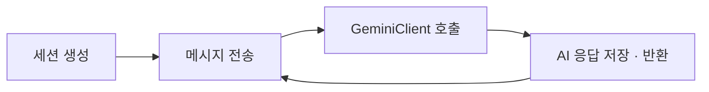
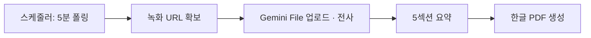

# AI 튜터 / 복습

> 담당: 함한솔 · 최종 수정: 2026-07-04

## 개요

학생이 문제 풀이 중 막힐 때 대화형으로 도와주는 **AI 튜터**와, 종료된 과외 강의 영상을 전사·요약해 다시 학습할 수 있게 하는 **AI 복습** 두 기능을 책임진다. 둘 다 Google Gemini를 기반으로 하되, AI 튜터는 실시간 멀티턴 챗봇에, 복습은 영상 전사→요약→PDF 자동 생성 파이프라인에 가깝다.

## 주요 기능

- 문제 기반 AI 튜터 챗봇 (세션 단위 멀티턴 대화)
- 강의 녹화 영상 전사(STT, 화자·판서 구분)
- 전사 결과 5개 섹션 요약 + 한글 PDF 자동 생성
- 전사·요약 기반 복습 챗봇 (강의 복습 세션)
- 녹화 영상 다시보기 (byte-range 스트리밍)
- Gemini 호출 실패 시 재시도·폴백 모델 전환·안내 메시지 처리

## 핵심 로직 / 플로우

### AI 튜터 / 복습 챗봇 — 공통 세션 패턴
두 기능 모두 세션을 만들고 그 안에서 메시지를 주고받는 동일한 구조를 쓴다. 복습 챗봇은 문제 대신 전사+메타데이터를 시스템 프롬프트로 조립해서 넣는다는 점만 다르다.

### 강의 복습 — 전사·요약 자동화 파이프라인

- 스케줄러(`TranscriptScheduler`)는 강의별로 녹화 URL 확보 → 전사 → 요약 순으로 단계를 확인해, 아직 안 된 단계만 이어서 처리한다. 한 강의가 실패해도 로그만 남기고 다음 강의로 넘어가 배치 전체가 멈추지 않는다.

### Gemini 호출 안정화 — 재시도 · 폴백 · graceful degradation
`GeminiClient.generate()`는 기본 모델로 지수 백오프 재시도(최대 2회) 후에도 실패하면 폴백 모델로 1회 더 시도한다. 그마저 실패하면 예외를 던지는 대신 "AI 튜터가 잠시 응답할 수 없어요" 같은 안내 문구를 AI 메시지로 저장해 대화가 끊기지 않게 한다. 컨텍스트 윈도우는 의도적으로 자르지 않았다 — "학생이 이해할 때까지 반복 질문"하는 게 기능의 본질이라 인위적으로 자르면 UX가 깨지고, 실사용 규모에서는 모델의 입력 한도에 부딪힐 일이 거의 없기 때문이다.

## 관련 API

Base path: `/api/v1`

| 메서드 | 경로 | 설명 |
|---|---|---|
| POST | `/ai-tutor/sessions` | AI 튜터 세션 생성 |
| POST | `/ai-tutor/sessions/{sessionId}/messages` | 메시지 전송 (멀티턴) |
| GET | `/ai-tutor/sessions` | 세션 목록 조회 |
| GET | `/ai-tutor/sessions/{sessionId}/messages` | 메시지 히스토리 조회 |
| POST | `/lesson-review/sessions` | 복습 세션 생성 |
| POST | `/lesson-review/sessions/{sessionId}/messages` | 복습 메시지 전송 |
| GET | `/lesson-review/sessions` | 복습 세션 목록 조회 |
| GET | `/lesson-review/lessons` | 복습 가능한 강의 목록 |
| GET | `/lesson-review/lessons/{lessonId}/summary-pdf` | 요약 PDF 다운로드 |
| GET | `/lesson-review/sessions/{sessionId}/messages` | 복습 메시지 히스토리 |
| GET | `/lesson-review/lessons/{lessonId}/recording` | 녹화 영상 스트리밍 |

## 관련 테이블

- `ai_tutor_session` / `ai_tutor_message` — AI 튜터 세션·메시지
- `lesson_review_session` / `lesson_review_message` — 강의 복습 세션·메시지
- `lesson_transcript` — 강의 전사(STT) + 요약 PDF 캐시 (lesson_id 유니크)

## 트러블슈팅

- **Gemini 호출 실패 대응**: 단일 모델 장애·과부하(429/503)에 대비해 지수 백오프 재시도 → 폴백 모델 → 그래도 실패하면 예외 대신 자연스러운 안내 메시지 저장(graceful degradation). 챗봇 화면이 에러로 끊기지 않도록 하는 게 목표.
- **컨텍스트 윈도우 미절단 결정**: 대화가 길어져도 인위적으로 자르지 않기로 함 — "이해할 때까지 반복 질문"이 기능 본질이라 잘리면 UX가 깨지고, 모델 입력 한도(약 1M 토큰) 대비 실사용 대화량은 무시할 수준.
- **전사 파이프라인 트러블슈팅**(.m3u8/.mp4 레이스 컨디션, Gemini File API 20GB 할당량 초과, 수업 완료 시 복습 이미지 S3 삭제 버그)은 [복습 자동화 파이프라인](./복습-자동화.md) 문서에 정리해둠 — 여기선 중복 생략.
- (참고) 같은 백오프+폴백모델+graceful degradation 패턴이 문제 등록(OCR/분류) 도메인에도 독립적으로 적용돼 있음(`domain/problem/service/GeminiOcrClient`, `GeminiClassifier`) — 코드 공유는 아니고 설계 아이디어만 동일.