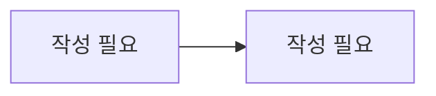

# AI 튜터 / 복습

> 담당: <!-- TODO --> · 최종 수정: <!-- TODO -->

## 개요

<!-- 문제 풀이 AI 튜터와 강의 복습(전사·요약·챗봇)의 책임 범위 -->
<!-- 여기에 작성 -->

## 주요 기능

<!-- 예: 문제 기반 AI 튜터 챗봇, 강의 녹화 전사(STT), 요약 PDF 생성, 복습 챗봇 -->
- <!-- 여기에 작성 -->

## 핵심 로직 / 플로우

<!-- 세션 생성 → 메시지 송수신, 녹화 영상 전사 → 요약 → PDF 생성 스케줄러 흐름 -->

<!-- 여기에 작성 -->

## 관련 API

| 메서드 | 경로 | 설명 |
|---|---|---|
| <!-- TODO --> | <!-- TODO --> | <!-- TODO --> |

## 관련 테이블

- `ai_tutor_session` / `ai_tutor_message` — AI 튜터 세션·메시지
- `lesson_review_session` / `lesson_review_message` — 강의 복습 세션·메시지
- `lesson_transcript` — 강의 전사(STT) + 요약 PDF 캐시 (lesson_id 유니크)

## 트러블슈팅

<!-- 예: 전사 스케줄러 PENDING/FAILED 재시도, Gemini File API 처리, PDF 폰트(NotoSansKR) -->
<!-- 여기에 작성 -->
