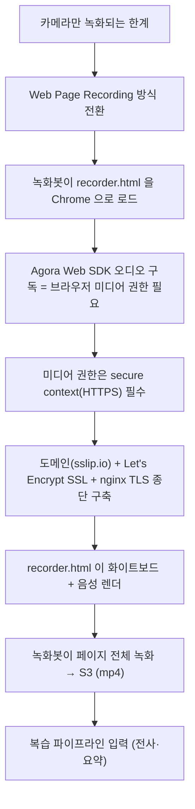

# Agora 화상·녹화 연동

> 카메라만 녹화되던 한계를 Web Page Recording으로 전환해, 화이트보드 화면과 음성을 함께 녹화하고 복습 입력으로 재활용.

## 한눈에 보기

| 항목 | 내용 |
|---|---|
| 녹화 방식 | Agora Cloud Recording — Web Page Recording (scene=1) |
| 녹화 대상 | `recorder.html` (STOMP 화이트보드 + Agora Web SDK 음성) |
| RTC 토큰 | Agora 공식 알고리즘 서버 포팅 (HMAC-SHA256) |
| 인프라 | HTTPS 필수 → nginx + Let's Encrypt (도메인 3-35-10-251.sslip.io) |

## 문제 상황

- 기본 녹화는 카메라 스트림만 담겨, **정작 수업의 핵심인 화이트보드 판서가 녹화되지 않음**.
- 화면+음성을 함께 담으려면 별도 영상 합성이 필요 → 복잡·비용.
- 브라우저 미디어(오디오 구독) 권한은 **secure context(HTTPS)** 를 요구 → 생 IP·HTTP로는 녹화봇 페이지가 동작 안 함.
- Agora RTC 토큰 발급이 초기에 동작하지 않아 채널 입장이 막힘.

## 해결 방법

### 인과 사슬 (왜 HTTPS 인프라까지 갔나)

### AgoraRecordingService (Web Page Recording)

- acquire: `clientRequest.scene = 1` (Web Page Recording 모드)
- start: `mode/web/start`, `extensionServices[].serviceName = "web_recorder_service"`, `errorHandlePolicy = "error_abort"`
- recorder URL: `{recorderUrlBase}?channel={channelName}&orientation={landscape|portrait}`
- 해상도: portrait `720×1280`, landscape `1280×720`
- 파일: `avFileType = ["hls", "mp4"]`, 저장 `vendor=1`(S3), `region=10`(ap-northeast-2), prefix `lessons/recordings/{lessonId}`
- 인증: Basic Auth (`customerId:customerSecret` Base64)
- 공개 메서드: `startRecording()`, `stopRecording()`, `stopRecordingAsync()`(@Async), `resolveRecordingMp4Url()`

### RTC 토큰 서버 포팅 (5개 파일)

| 파일 | 역할 |
|---|---|
| `RtcTokenBuilder2.java` | 진입점. Role PUBLISHER/SUBSCRIBER + PRIVILEGE_JOIN/PUBLISH_AUDIO/VIDEO/DATA 부여 |
| `AccessToken2.java` | VERSION "007", `build()`에서 HMAC-SHA256 서명. `getSign()` 2단계 HMAC (issueTs→appCert, salt→result) |
| `ByteBuf.java` | Little-endian 바이너리 직렬화 |
| `Utils.java` | Deflate 압축 + Base64 + Unix timestamp |

- 발급 API: `POST /api/v1/lesson/token` → `LessonService.generateToken()`

### recorder.html (녹화봇이 여는 페이지)

- 로드 SDK: SockJS 1.6.1, @stomp/stompjs 7.0.0, AgoraRTC N-4.20.2
- `?channel=`로 채널 수신 → SockJS `/ws` + STOMP `/topic/lesson/{channel}/draw` 구독으로 화이트보드 재현(`requestAnimationFrame`)
- Agora `SUBSCRIBER uid=1234567`로 음성만 구독·재생 (강사/학생 uid와 충돌 방지)
- 음성 구독이 실패해도 화면 녹화는 계속

### S3 녹화 폴링 (mp4 우선)

- `stopRecording()` 직후 `stopRecordingAsync()`(@Async) → `findRecordingFromS3()`: **최대 60회 × 10초(≈10분)**
- mp4 발견 즉시 `recording_url` 저장 / m3u8만 있으면 계속 대기(전사 불가라 확정 안 함) / 403·401은 즉시 중단
- 스케줄러 연계: `TranscriptScheduler.pollAndProcess()`(5분)가 `resolveRecordingMp4Url()`로 누락 URL 복구 후 전사·PDF로 연결

## 핵심 포인트

- 외부 SDK 기본 녹화의 한계를 **Web Page Recording**으로 우회해 화이트보드+음성을 한 화면으로 녹화, 복습 입력까지 재활용.
- Agora **공식 RTC 토큰 알고리즘을 서버에 직접 포팅**(HMAC-SHA256 2단계 서명)해 토큰 발급 문제 해결.
- 녹화봇의 브라우저 미디어 권한 요구(secure context)를 근거로 **nginx + Let's Encrypt HTTPS 인프라**를 구축한 인과적 설계.

## 관련 코드

클래스 · 파일 경로

- Agora: `backend/.../global/agora/AgoraRecordingService.java`, `RtcTokenBuilder2.java`, `AccessToken2.java`, `ByteBuf.java`, `Utils.java`
- 녹화봇 페이지: `backend/src/main/resources/static/recorder.html`
- Lesson: `backend/.../domain/lesson/controller/LessonController.java`(`/token`, `/{id}/recording/start`·`stop` 등 8개), `service/LessonService.java`, `entity/Lesson.java`(recordingUrl·resourceId·recordingSid)
- 복습 연계: `backend/.../domain/lessonreview/service/TranscriptScheduler.java` (5분 폴링)
- 설정: `agora.*` (`application.yml`), `AGORA_RECORDER_URL_BASE` 등

