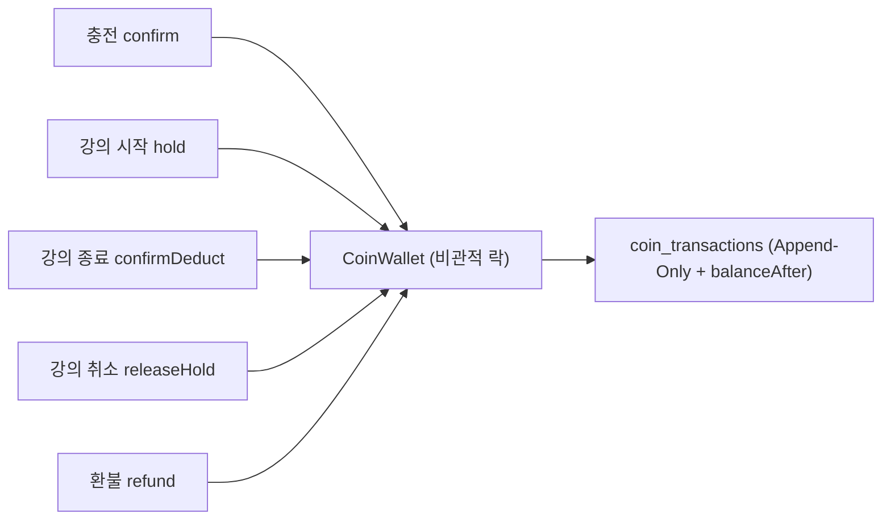
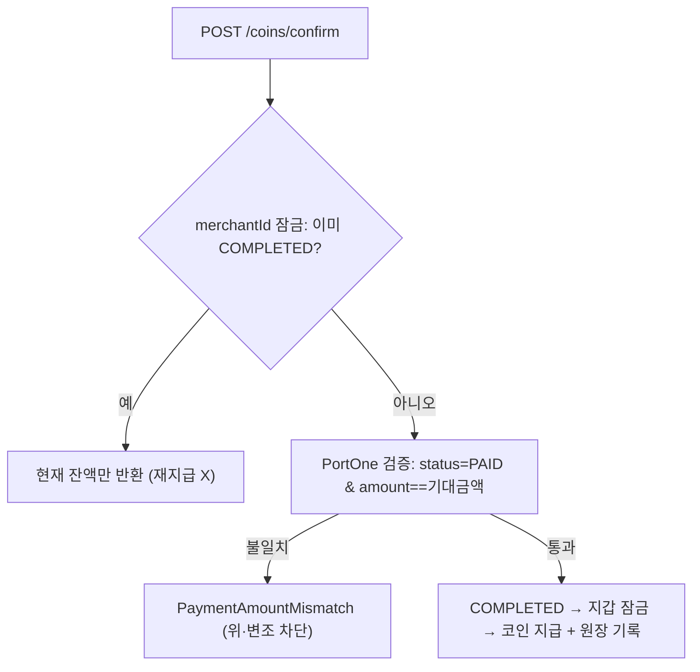

# 결제·정산 데이터 무결성

> 돈이 직접 오가는 코인 충전·차감·정산에서 **잔액 경합 · 위변조 · 중복 지급/정산**을 원천 차단. 비관적 락 + Append-Only 원장 + 서버 기록 기반 산정 + 분쟁 게이트로 정합성과 감사 추적성을 동시에 확보.

## 한눈에 보기

| 항목 | 내용 |
|---|---|
| 동시성 | 코인 지갑 **비관적 락**(pessimistic lock) |
| 원장 | `coin_transactions` **Append-Only** + 거래 후 잔액 스냅샷(`balanceAfter`) |
| 결제 검증 | PortOne 금액 대조(status=PAID & amount 일치) + `merchantId` 멱등 |
| 정산 산정 | **서버의 lesson 기록에서만** 산출 · 기본 수수료 20%(강사 80%, 등급별 10~30%) · 1코인=100원 |
| 중복/위변조 차단 | `payments.merchantId` UNIQUE · `settlements.lesson_id` UNIQUE |
| 분쟁 게이트 | hold → 확정 2단계 + 미해결 신고 시 정산 보류 |

## 문제 상황

- 여러 요청이 **같은 지갑을 동시에** 건드리면 잔액이 어긋남(race condition).
- 결제 확인 요청이 **네트워크 재시도로 중복** 도착하면 코인이 이중 지급될 수 있음.
- 정산금을 **클라이언트가 보낸 값**으로 계산하면 조작 위험.
- 강의 시작 시 코인을 잡아두고 종료 시 차감하는 구조에서 **"강의는 열렸는데 결제 안 됨"** 같은 반쪽 상태.
- 강의 완료 직후 **신고/환불**이 걸린 건까지 정산이 나가버리면 회수가 어려움.

## 해결 방법

### 코인 흐름과 원장

### 동시성 — 지갑 비관적 락

- 잔액을 바꾸는 모든 연산(충전·hold·확정 차감·복구·환불)은 `CoinWallet`을 **비관적 락**으로 잠그고 수행 → 동시 요청이 순차 처리되어 잔액 정합성 보장.

### Append-Only 원장 + 잔액 스냅샷

- 모든 코인 이동은 수정·삭제 불가능한 **INSERT-ONLY 원장**(`coin_transactions`)에 기록.
- 각 행에 **거래 후 잔액(`balanceAfter`)** 을 스냅샷으로 남겨, 언제든 잔액을 재구성·감사할 수 있음.
- `type`(CHARGE/BONUS/HOLD/DEDUCT/RELEASE/REFUND/AI_USE/SIGNUP_BONUS)로 모든 이동 사유가 원장에 남음.

### 결제 검증 · 멱등 (이중 지급 차단)

- **상태 기반 멱등**: `confirm` 진입 시 `merchantId`로 Payment 잠금 → 이미 COMPLETED면 결과만 반환. 지급 직전 재잠금·재검사.
- **DB 방어**: `Payment.merchantId` UNIQUE로 재삽입 차단.
- **금액 대조**: PortOne 응답 `amount.total`이 서버 기대 금액과 다르면 예외 → 조작 결제 차단.

### 정산 산정 — 서버 기록 기반 + UNIQUE

- 정산금은 요청 값이 아니라 **수업(lesson) 기록**에서만 산출하고, 강사는 `lesson.getTutorId()`로 결정(요청 tutorId 불신).
- `settlements.lesson_id` **UNIQUE**로 **한 강의 1정산**을 DB가 보장 → 중복 정산 원천 차단.
- 강의 완료 시 **기본 수수료 20%(강사 80%)** 로 분배하되, 강사 등급에 따라 수수료 **10~30% 차등**(`SettlementPolicy.distribute`). 코인→현금 환산은 **1코인 = 100원**(`COIN_TO_WON`). 수수료를 먼저 떼고 나머지를 강사 몫으로 둬 합이 항상 `totalCoin`과 일치(잔액 보존).

### 분쟁 게이트 — hold 2단계 + 신고 보류

- 코인은 **hold(예약) → confirmDeduct(확정)** 2단계 — 강의 취소면 `releaseHold`로 복구.
- 강의 완료 후 **24시간(WAITING_PERIOD)** 유예, 그 사이 **미해결 신고(PENDING/REVIEWING)** 가 있으면 `REPORT_HOLD`로 정산 보류. 신고 인정 시 `cancelByLesson`으로 취소. (상세: [리뷰·신고 무결성](./리뷰-신고-무결성.md))
- 이미 `TRANSFERRED`된 건은 자동 롤백 불가 → 예외 후 수동 회수(코인 환불은 코인 도메인 책임).

## 핵심 포인트

- **비관적 락 + Append-Only 원장(잔액 스냅샷)** 으로 동시성과 감사 추적성을 동시에 확보.
- 정산 금액의 신뢰 원천을 "요청 값"이 아닌 **"서버의 수업 기록"** 으로 고정하고, `merchantId`·`lesson_id` UNIQUE로 중복/위변조를 차단.
- **hold-확정 2단계 + 신고 보류 게이트**로 반쪽 상태와 분쟁 상황까지 커버.

## 관련 코드

클래스 · 파일 경로

- 코인/결제 (`backend/.../domain/payment/`)
  - `entity/CoinWallet.java`(잔액·홀드) · `CoinTransaction.java`(원장 + `balanceAfter`) · `Payment.java`(`merchantId` UNIQUE)
  - `service/CoinService.java`(hold/confirmDeduct/releaseHold/refund, 비관적 락) · 결제 confirm(멱등)
  - `service/PortOneClient.java` — 금액 대조 검증 · `exception/`(PaymentVerification 계열)
- 정산 (`backend/.../domain/settlement/`)
  - `entity/Settlement.java`(`lesson_id` UNIQUE) · `service/SettlementService.java`(`calculate`·`cancelByLesson`) · `policy/SettlementPolicy.java`(80/20)
- 확정 트리거 (`backend/.../domain/lesson/`)
  - `service/LessonService.java`(`finalizeDueSettlements`) · `scheduler/`(24h 폴링)

