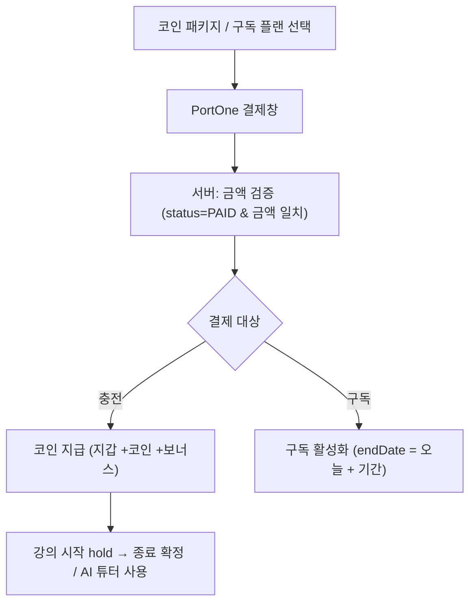

# 코인 결제 / 구독

> 담당: 정수민 · 최종 수정: 2026-07-06
>
> **코인 충전**과 **구독 플랜**을 **PortOne(아임포트)** 로 결제하고, 서버가 **금액 위·변조를 검증**한 뒤 코인/구독을 지급하는 파트. `domain/payment`.

## 한눈에 보기

| 항목 | 내용 |
|---|---|
| PG | PortOne(아임포트) V2 — 금액 대조 검증 |
| 결제 대상 | 코인 충전(`PAY-…`) · 구독(`SUB-…`) |
| 코인 지갑 | `balance`(총) / `availableBalance`(총 − 홀드) |
| 안전장치 | 금액 검증 · `merchantId` 멱등 · 지갑 비관적 락 |
| 정책 | 가입 50코인 · AI 3코인 · 환불 7일 |
| API | `PaymentController` (`/api/v1/payments`) — 코인·구독 |

## 기능 흐름 (사용자 관점)

## 주요 기능

- **충전**: 결제 생성(PENDING) → PortOne 창 → 검증 후 코인 지급(멱등).
- **환불**: 결제 후 7일 이내 COMPLETED 충전건 → PortOne 취소 + 지갑 차감.
- **구독**: 결제 검증 후 활성화, 자동갱신 토글, 취소(만료일까지 유지), 만료 배치(1시간).
- **코인 지갑·원장**: 총잔액 / 사용가능잔액(=총−홀드), 모든 이동을 `coin_transactions` 원장에 기록.

### 코인 사용 (hold / deduct 2단계)
| 시점 | 메서드 | 동작 |
|---|---|---|
| 강의 시작 | `hold(amount)` | `availableBalance`만 차감(예약), 부족 시 거절 |
| 강의 종료 | `confirmDeduct(amount)` | `balance` 확정 차감 |
| 강의 취소 | `releaseHold(amount)` | 홀드 복구 |
| AI 튜터 | `useForAi()` | 구독자 무료, 아니면 3코인 차감 |
| 가입 | `giveSignupBonus()` | 50코인 지급 |

> **hold/deduct 2단계**로 "강의는 열렸는데 결제 안 됨" 같은 정합성 문제를 방지 — 예약 후 종료 시 확정, 취소면 복구.

## API

기본 경로: `/api/v1/payments`

| 메서드 | 경로 | 설명 |
|---|---|---|
| GET | `/coins/balance` | 잔액(총/사용가능) |
| GET | `/coins/transactions` | 코인 거래 내역 |
| GET | `/coins/packages` | 판매 중 패키지 |
| POST | `/coins/charge` | 충전 결제 생성(PENDING) |
| POST | `/coins/confirm` | 결제 검증 후 코인 지급(멱등) |
| POST | `/coins/payments/{id}/refund` | 환불(코인 차감 + PortOne 취소) |
| GET | `/subscriptions/plans` | 구독 플랜 |
| GET | `/subscriptions/me` | 내 활성 구독(없으면 204) |
| POST | `/subscriptions/charge` | 구독 결제 생성 |
| POST | `/subscriptions/confirm` | 검증 후 구독 활성화(멱등) |
| DELETE | `/subscriptions` | 구독 취소(자동갱신 끄고 만료일까지) |
| PATCH | `/subscriptions/auto-renew` | 자동갱신 ON/OFF |

## 관련 테이블

- `coin_wallets` — 지갑(학생당 1). `balance`(총) · `availableBalance`(총−홀드)
- `coin_transactions` — 거래 원장(Append-Only). `type` · `amount`(±) · `balanceAfter`(잔액 스냅샷) · `lessonId`/`paymentId`
- `coin_packages` — 충전 상품. `price` · `coinAmount` · `bonusAmount`
- `payments` — 결제. `merchantId`(**UNIQUE**, `PAY-`/`SUB-`) · `portonePaymentId` · `amount` · `status` · `targetType`
- `subscriptions` / `subscription_plans` — 구독·플랜. `Subscription.activeStudentId`(**UNIQUE**: 활성 1개 보장)

열거형 · 정책 상수

- **PaymentStatus**: PENDING · COMPLETED · FAILED · CANCELED · REFUNDED
- **PaymentMethod**: KAKAOPAY · TOSSPAY · NAVERPAY · CARD · BANK_TRANSFER
- **PaymentTargetType**: COIN_CHARGE · SUBSCRIPTION
- **TransactionType**: CHARGE · BONUS · SIGNUP_BONUS · HOLD · DEDUCT · RELEASE · REFUND · AI_USE
- **PaymentPolicy**: `SIGNUP_BONUS_COIN=50` · `AI_USE_COST_COIN=3` · `REFUND_WINDOW_DAYS=7`

## 더 알아보기

- **동시성(비관적 락)·원장·결제 검증·멱등·정산 무결성** 상세: [결제·정산 데이터 무결성](./결제-정산-무결성.md)
- 강사 정산(payout) 관점: [정산](./정산.md)

## 관련 코드

클래스 · 파일 경로

- 백엔드 (`backend/.../domain/payment/`)
  - `controller/PaymentController.java` — 코인·구독 엔드포인트
  - `service/` — 결제 생성·검증·지급(멱등), `CoinService`(hold/deduct/release/useForAi), `SubscriptionService`(활성화·만료)
  - `service/PortOneClient.java` — PortOne 결제 검증/취소
  - `scheduler/SubscriptionScheduler.java` — 만료 구독 정리(1시간)
  - `entity/` — `Payment` · `CoinWallet` · `CoinTransaction` · `Subscription` · `SubscriptionPlan` · `CoinPackage` (+ `enums/`)
  - `policy/PaymentPolicy.java` · `exception/`(PaymentVerification 계열)
- 프론트: `frontend/lib/features/student/`(충전·구독 결제) · `frontend/lib/features/payment/`

