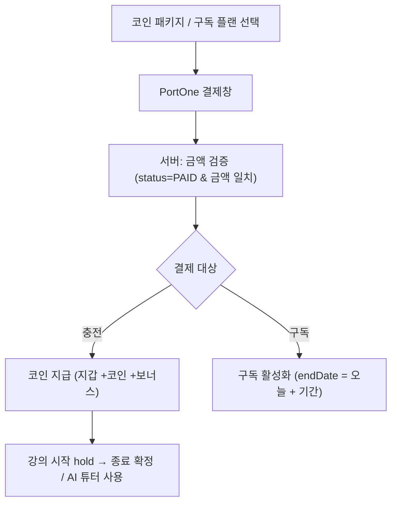

# 코인 결제 / 구독

> 담당: 정수민 · 최종 수정: 2026-07-06
>
> **코인 충전**과 **구독 플랜**을 **PortOne(아임포트)** 로 결제하고, 서버가 **금액 위·변조를 검증**한 뒤 코인/구독을 지급하는 파트. `domain/payment`.

## 한눈에 보기

| 항목 | 내용 |
|---|---|
| PG | PortOne(아임포트) V2 — 금액 대조 검증 |
| 결제 대상 | 코인 충전(`PAY-…`) · 구독(`SUB-…`) |
| 코인 지갑 | `balance`(총) / `availableBalance`(총 − 홀드) |
| 안전장치 | 금액 검증 · `merchantId` 멱등 · 지갑 비관적 락 |
| 정책 | 가입 50코인 · AI 3코인 · 환불 7일 |
| API | `PaymentController` (`/api/v1/payments`) — 코인·구독 |

## 기능 흐름 (사용자 관점)



## 주요 기능

- **충전**: 결제 생성(PENDING) → PortOne 창 → 검증 후 코인 지급(멱등).
- **환불**: 결제 후 7일 이내 COMPLETED 충전건 → PortOne 취소 + 지갑 차감.
- **구독**: 결제 검증 후 활성화, 자동갱신 토글, 취소(만료일까지 유지), 만료 배치(1시간).
- **코인 지갑·원장**: 총잔액 / 사용가능잔액(=총−홀드), 모든 이동을 `coin_transactions` 원장에 기록.

### 코인 사용 (hold / deduct 2단계)
| 시점 | 메서드 | 동작 |
|---|---|---|
| 강의 시작 | `hold(amount)` | `availableBalance`만 차감(예약), 부족 시 거절 |
| 정산 확정 (완료 24h 후·미신고) | `confirmDeduct(amount)` | `balance` 확정 차감 |
| 강의 취소 | `releaseHold(amount)` | 홀드 복구 |
| AI 튜터 | `useForAi()` | 구독자 무료, 아니면 3코인 차감 |
| 가입 | `giveSignupBonus()` | 50코인 지급 |

> **hold/deduct 2단계**로 "강의는 열렸는데 결제 안 됨" 같은 정합성 문제를 방지 — 예약 후 종료 시 확정, 취소면 복구.

## API

기본 경로: `/api/v1/payments`

| 메서드 | 경로 | 설명 |
|---|---|---|
| GET | `/coins/balance` | 잔액(총/사용가능) |
| GET | `/coins/transactions` | 코인 거래 내역 |
| GET | `/coins/packages` | 판매 중 패키지 |
| POST | `/coins/charge` | 충전 결제 생성(PENDING) |
| POST | `/coins/confirm` | 결제 검증 후 코인 지급(멱등) |
| POST | `/coins/payments/{id}/refund` | 환불(코인 차감 + PortOne 취소) |
| GET | `/subscriptions/plans` | 구독 플랜 |
| GET | `/subscriptions/me` | 내 활성 구독(없으면 204) |
| POST | `/subscriptions/charge` | 구독 결제 생성 |
| POST | `/subscriptions/confirm` | 검증 후 구독 활성화(멱등) |
| DELETE | `/subscriptions` | 구독 취소(자동갱신 끄고 만료일까지) |
| PATCH | `/subscriptions/auto-renew` | 자동갱신 ON/OFF |

## 설계 노트

구현하면서 내린 판단 중, 코드만 봐서는 의도가 드러나지 않는 것들.

### 지갑을 `balance` / `availableBalance` 두 칸으로 나눈 이유

강의는 **시작할 때 요금이 확정되지 않는다** — 연장할 수도, 중간에 취소될 수도 있다.
그렇다고 시작 시점에 아무것도 잡아두지 않으면, 강의 중에 학생이 코인을 다 써버려
**끝날 때 받을 돈이 없는** 상황이 생긴다.

그래서 잔액을 둘로 나눴다.

| 시점 | 메서드 | `balance` | `availableBalance` |
|---|---|---|---|
| 강의 시작 | `hold()` | 그대로 | **차감**(예약) |
| 정산 확정 (완료 24h 후) | `confirmDeduct()` | **차감** | 그대로 |
| 강의 취소 | `releaseHold()` | 그대로 | **복구** |

`availableBalance`만 먼저 줄여 **다른 곳에 못 쓰게 묶어두고**, 실제 차감은 정산이 확정될 때 한다.
완료 직후 신고가 들어오면 정산을 막아야 하므로 확정은 24시간 보류되며, 그동안 코인은 홀드 상태로 남는다.
강의 시작·코인 부족 판단은 `availableBalance` 기준이라 묶인 금액을 이중으로 쓸 수 없다.

### 결제 완료를 3단으로 쪼갠 이유

```
beginComplete()          [트랜잭션] 락 + 상태 확인 + 금액·학생 스냅샷 반환
   ↓
portOneClient.verify()   [트랜잭션 밖] 외부 HTTP — 수 초 걸릴 수 있음
   ↓
finalizeCoinCharge()     [트랜잭션] 락 재확인 + 상태 확정 + 코인 적립
```

외부 HTTP 호출을 트랜잭션 안에 두면 **DB 커넥션을 네트워크 대기 시간만큼 붙잡는다.**
결제는 동시 요청이 몰리는 지점이라 커넥션 풀이 먼저 마른다.

주목할 점은 **멱등 검사를 `begin`과 `finalize` 양쪽에서 한다**는 것이다.
`begin`에서 통과한 뒤 외부 검증을 도는 동안 다른 요청이 먼저 완료시킬 수 있어,
`finalize`에서 락을 다시 잡고 `COMPLETED`를 재확인한다.
이 이중 검사가 `PaymentConcurrencyTest`("같은 결제를 동시에 두 번 완료해도 코인은 한 번만 적립된다")가 통과하는 이유다.

### 환불 순서 — 돈을 먼저 돌려준다

```
beginRefund()            [읽기 전용] 자격 검증(완료 상태 · 코인 충전 · 7일 이내)
   ↓
portOneClient.cancel()   [트랜잭션 밖] 실제 환불 — 사용자에게 돈이 나감
   ↓
finalizeRefund()         [트랜잭션] 코인 차감 + REFUNDED 확정
```

순서를 뒤집어 코인을 먼저 차감하면, PG 취소가 실패했을 때
**코인은 사라졌는데 돈은 안 돌아온** 상태가 된다 — 사용자에게 가장 나쁜 실패다.
반대 순서라면 최악의 경우 "돈은 환불됐는데 코인이 남아 있는" 상태이고,
이건 `[환불 보상필요]` 로그를 남겨 운영자가 수동 보정할 수 있다.
**어느 쪽으로 실패하든 사용자가 손해 보지 않는 방향**을 골랐다.

> 분산 트랜잭션을 쓰지 않는 이상 이 구간의 원자성은 보장할 수 없다.
> 그래서 "완벽한 정합성" 대신 **"실패해도 사용자가 손해 보지 않는 순서 + 보상 가능한 로그"** 로 설계했다.

## 한계와 다음 단계

| 한계 | 영향 | 개선 방향 |
|---|---|---|
| 환불 보상이 **수동** | `[환불 보상필요]` 로그를 운영자가 보고 처리해야 함 | 보상 대기 테이블 + 재처리 배치 |
| 정기 결제(자동 갱신)가 **스케줄러 기반** | 갱신 실패 시 재시도 정책이 단순 | 실패 큐 + 단계적 재시도·알림 |
| 코인 환불이 **전액만** 가능 | 부분 환불 요구를 못 받음 | 사용분 차감 후 잔여분 환불 정책 |

## 관련 테이블

- `coin_wallets` — 지갑(학생당 1). `balance`(총) · `availableBalance`(총−홀드)
- `coin_transactions` — 거래 원장(Append-Only). `type` · `amount`(±) · `balanceAfter`(잔액 스냅샷) · `lessonId`/`paymentId`
- `coin_packages` — 충전 상품. `price` · `coinAmount` · `bonusAmount`
- `payments` — 결제. `merchantId`(**UNIQUE**, `PAY-`/`SUB-`) · `portonePaymentId` · `amount` · `status` · `targetType`
- `subscriptions` / `subscription_plans` — 구독·플랜. `Subscription.activeStudentId`(**UNIQUE**: 활성 1개 보장)

<details>
<summary>열거형 · 정책 상수</summary>

- **PaymentStatus**: PENDING · COMPLETED · FAILED · CANCELED · REFUNDED
- **PaymentMethod**: KAKAOPAY · TOSSPAY · NAVERPAY · CARD · BANK_TRANSFER
- **PaymentTargetType**: COIN_CHARGE · SUBSCRIPTION
- **TransactionType**: CHARGE · BONUS · SIGNUP_BONUS · HOLD · DEDUCT · RELEASE · REFUND · AI_USE
- **PaymentPolicy**: `SIGNUP_BONUS_COIN=50` · `AI_USE_COST_COIN=3` · `REFUND_WINDOW_DAYS=7`

</details>

## 더 알아보기

- **동시성(비관적 락)·원장·결제 검증·멱등·정산 무결성** 상세: [결제·정산 데이터 무결성](./결제-정산-무결성.md)
- 강사 정산(payout) 관점: [정산](./정산.md)

## 관련 코드

<details>
<summary>클래스 · 파일 경로</summary>

- 백엔드 (`backend/.../domain/payment/`)
  - `controller/PaymentController.java` — 코인·구독 엔드포인트
  - `service/` — 결제 생성·검증·지급(멱등), `CoinService`(hold/deduct/release/useForAi), `SubscriptionService`(활성화·만료)
  - `service/PortOneClient.java` — PortOne 결제 검증/취소
  - `scheduler/SubscriptionScheduler.java` — 만료 구독 정리(1시간)
  - `entity/` — `Payment` · `CoinWallet` · `CoinTransaction` · `Subscription` · `SubscriptionPlan` · `CoinPackage` (+ `enums/`)
  - `policy/PaymentPolicy.java` · `exception/`(PaymentVerification 계열)
- 프론트: `frontend/lib/features/student/`(충전·구독 결제) · `frontend/lib/features/payment/`

</details>
