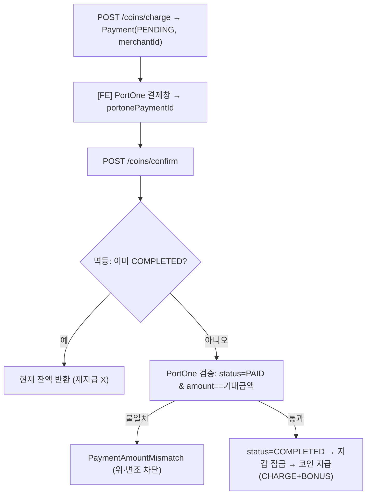

# 코인 결제 / 구독

> 담당: <!-- 이름 --> · 최종 수정: 2026-07-05
>
> **코인 충전**과 **구독 플랜**을 **PortOne(아임포트)** 로 결제하고, 서버가 **금액 위·변조를 검증**한 뒤 코인/구독을 지급하는 파트. `domain/payment`.

## 개요

- **코인 충전**: 패키지 구매 → PortOne 결제 → 서버 검증 → 코인 지급(7일 내 환불).
- **구독**: 플랜 구독 → 결제 검증 → 활성화. 학생당 **활성 구독 1개**(DB UNIQUE).
- **코인 사용**: 강의 시작(hold) → 종료(deduct)/취소(release), AI 튜터(구독자 무료·아니면 3코인).
- **위·변조 방지**: PortOne 결제 금액과 서버 기대 금액 대조, `merchantId` 멱등 처리로 이중 지급 차단.

## 주요 기능

- **충전**: 결제 생성(PENDING) → PortOne 창 → 검증 후 코인 지급(멱등).
- **환불**: 결제 후 7일 이내 COMPLETED 충전건 → PortOne 취소 + 지갑 차감.
- **구독**: 결제 검증 후 활성화, 자동갱신 토글, 취소(만료일까지 유지), 만료 배치.
- **코인 지갑**: 총잔액 / 사용가능잔액(=총−홀드), 거래 원장.

## 핵심 로직 / 플로우

### 코인 충전 (검증 → 지급)

### 코인 사용 (hold / deduct 2단계)
| 시점 | 메서드 | 동작 |
|---|---|---|
| 강의 시작 | `hold(amount)` | `availableBalance`만 차감(예약), 부족 시 거절 |
| 강의 종료 | `confirmDeduct(amount)` | `balance` 확정 차감 |
| 강의 취소 | `releaseHold(amount)` | 홀드 복구 |
| AI 튜터 | `useForAi()` | 구독자 무료, 아니면 3코인 차감 |
| 가입 | `giveSignupBonus()` | 50코인 지급 |

> **hold/deduct 2단계**로 "강의는 열렸는데 결제 안 됨" 같은 정합성 문제를 방지 — 예약 후 종료 시 확정, 취소면 복구.

## 관련 API

`Base: /api/v1/payments`

| 메서드 | 경로 | 설명 |
|---|---|---|
| GET | `/coins/balance` | 잔액(총/사용가능) |
| GET | `/coins/transactions` | 코인 거래 내역 |
| GET | `/coins/packages` | 판매 중 패키지 |
| POST | `/coins/charge` | 충전 결제 생성(PENDING) |
| POST | `/coins/confirm` | 결제 검증 후 코인 지급(멱등) |
| POST | `/coins/payments/{id}/refund` | 환불(코인 차감 + PortOne 취소) |
| GET | `/subscriptions/plans` | 구독 플랜 |
| GET | `/subscriptions/me` | 내 활성 구독(없으면 204) |
| POST | `/subscriptions/charge` | 구독 결제 생성 |
| POST | `/subscriptions/confirm` | 검증 후 구독 활성화(멱등) |
| DELETE | `/subscriptions` | 구독 취소(자동갱신 끄고 만료일까지) |
| PATCH | `/subscriptions/auto-renew` | 자동갱신 ON/OFF |

## 관련 테이블

- `coin_wallets` — 지갑(학생당 1). `balance`(총) · `availableBalance`(총−홀드)
- `coin_transactions` — 거래 원장. `type` · `amount`(±) · `balanceAfter` · `lessonId`/`paymentId`
- `coin_packages` — 충전 상품. `price` · `coinAmount` · `bonusAmount`
- `payments` — 결제. `merchantId`(**UNIQUE**, `PAY-`/`SUB-`) · `portonePaymentId` · `amount` · `status` · `targetType`
- `subscriptions` / `subscription_plans` — 구독·플랜. `Subscription.activeStudentId`(**UNIQUE**: 활성 1개 보장)

열거형 · 정책 상수

- **PaymentStatus**: PENDING·COMPLETED·FAILED·CANCELED·REFUNDED
- **PaymentTargetType**: COIN_CHARGE·SUBSCRIPTION
- **TransactionType**: CHARGE·BONUS·SIGNUP_BONUS·HOLD·DEDUCT·RELEASE·REFUND·AI_USE
- **PaymentPolicy**: `SIGNUP_BONUS_COIN=50` · `AI_USE_COST_COIN=3` · `REFUND_WINDOW_DAYS=7`

## 트러블슈팅

- **이중 지급 방지(멱등)**: `confirm` 진입 시 `merchantId`로 Payment 잠금 → 이미 COMPLETED면 결과만 반환. 지급 직전 재잠금·재검사. DB는 `Payment.merchantId` UNIQUE로 재삽입 차단.
- **활성 구독 1개 강제**: 앱 레벨 재확인 + `Subscription.activeStudentId` UNIQUE(동시 활성화 시 2번째는 409). 만료 배치(`SubscriptionScheduler`, 1시간)가 `active=false`+슬롯 해제.
- **PortOne 검증 토글**: `portone.verification-enabled=false`(테스트)면 금액 검증을 우회하고 경고 로그 — 운영 배포 시 반드시 활성화.
- **환불 보상**: PortOne 취소 성공 후 지갑 차감 실패 시 `[환불 보상필요]` 로그 + 재전파(수동 보정).
