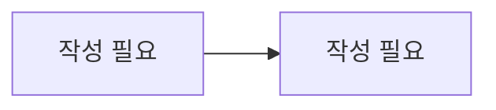

# 코인 결제 / 구독

> 담당: <!-- TODO --> · 최종 수정: <!-- TODO -->

## 개요

<!-- 코인 화폐 시스템과 PortOne 결제·구독의 책임 범위 -->
<!-- 여기에 작성 -->

## 주요 기능

<!-- 예: 코인 충전(PortOne), 지갑 잔액/사용가능잔액, hold·확정차감·환불, 코인 패키지, 구독 플랜 -->
- <!-- 여기에 작성 -->

## 핵심 로직 / 플로우

<!-- 결제 생성 → PortOne 검증 → 코인 지급, 강의 시작 시 hold → 종료 시 확정 차감/환불 흐름 -->

<!-- 여기에 작성 -->

## 관련 API

| 메서드 | 경로 | 설명 |
|---|---|---|
| <!-- TODO --> | <!-- TODO --> | <!-- TODO --> |

## 관련 테이블

- `coin_wallets` — 코인 지갑 (학생당 1, 총잔액·사용가능잔액)
- `coin_transactions` — 코인 거래 원장 (CHARGE/HOLD/DEDUCT/AI_USE 등)
- `coin_packages` — 충전 상품
- `payments` — 결제 (PortOne, merchant_id 유니크)
- `subscriptions` / `subscription_plans` — 구독·구독 플랜

## 트러블슈팅

<!-- 예: hold check-then-act 동시성, PortOne 검증 토글(PORTONE_VERIFY), 활성 구독 1건 강제 -->
<!-- 여기에 작성 -->
