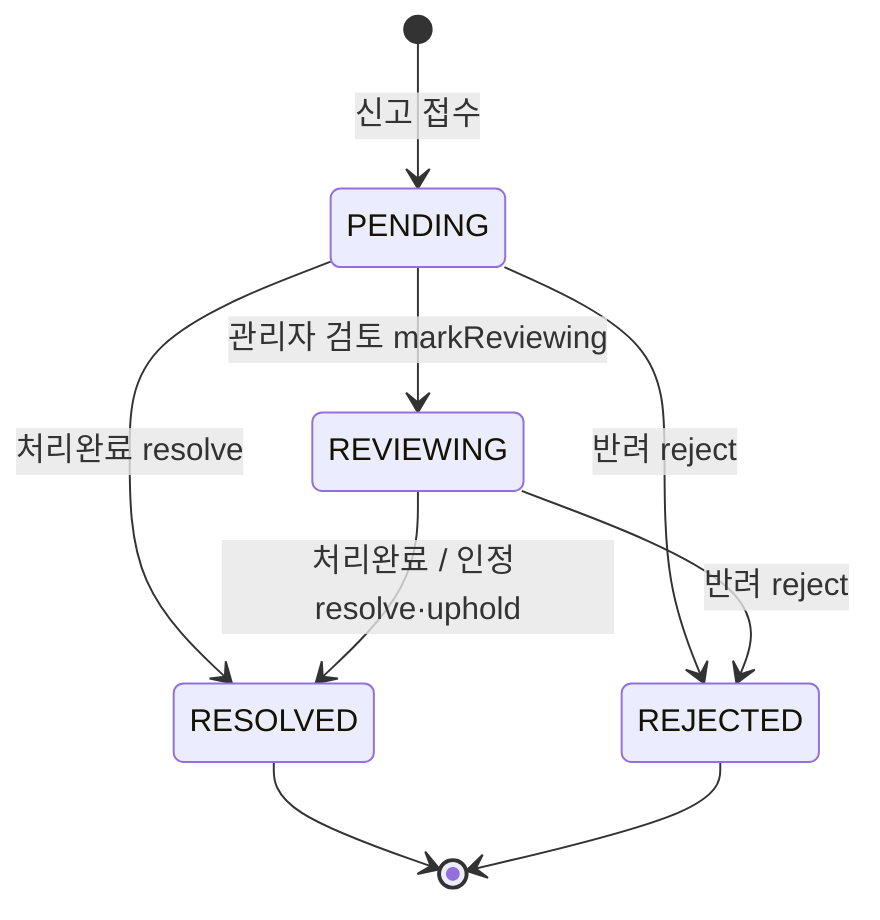
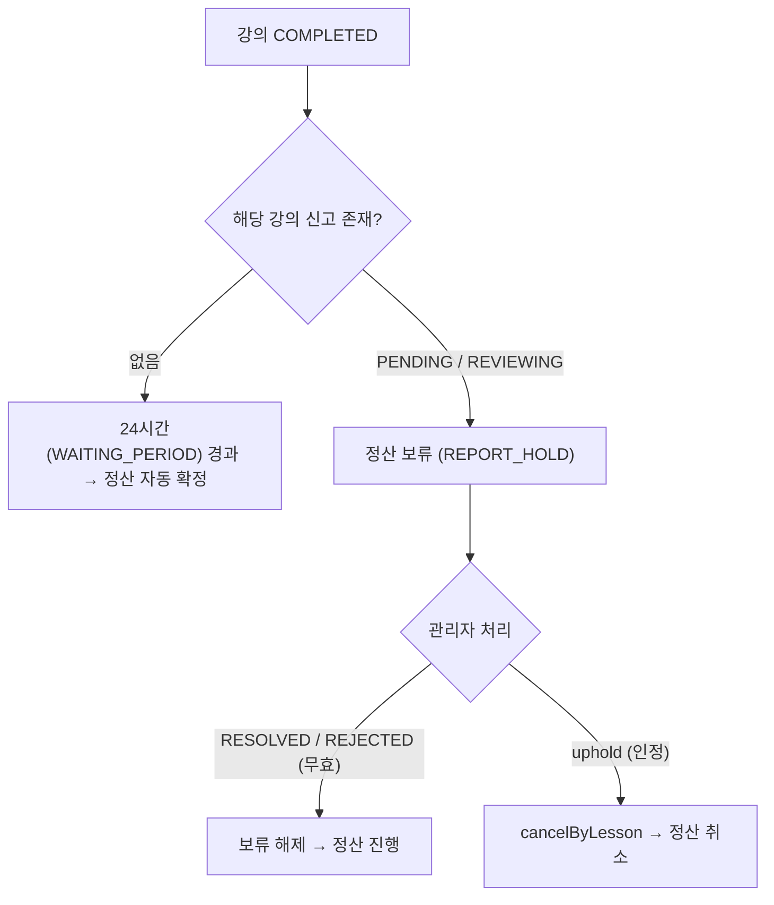

# 리뷰·신고 무결성

> 강의당 1개 리뷰·중복 없는 신고를 **DB 제약**으로 보장하고, 미해결 신고가 있으면 강사 정산을 자동 보류하는 **분쟁 게이트**. 악성 리뷰는 숨겨 평점에서 배제.

## 한눈에 보기

| 항목 | 내용 |
|---|---|
| 중복 차단 | 리뷰 `lessonId` UNIQUE · 신고 `(reporterId, targetType, targetId)` UNIQUE |
| 신고 상태 | `PENDING` → `REVIEWING` → `RESOLVED` / `REJECTED` (처리자·시각 기록) |
| 정산 보류 | 강의 신고 PENDING/REVIEWING → `REPORT_HOLD` → 종결 시 해제 · 인정 시 취소 |
| 평점 집계 | `VISIBLE` 리뷰만 · 평균 소수 1자리 + 별점 분포(1~5) |

## 문제 상황

- 같은 강의에 리뷰가 **중복 작성**되거나, 같은 대상을 **중복 신고**하는 동시 요청 경합.
- 신고가 접수만 되고 **방치**되면 처리 단계를 추적할 수 없음.
- 강의 완료 **직후 신고**가 들어오는데 정산이 이미 나가버리면 분쟁 대응이 불가능.
- 신고로 숨긴 악성 리뷰가 **강사 평점에 계속 반영**되면 평점 신뢰성이 훼손됨.

## 해결 방법

### 중복 차단 (선검사 + DB UNIQUE, 2중 장치)

| 대상 | 선검사 | 최종 방어(DB) |
|---|---|---|
| 리뷰 | `existsByLessonId(lessonId)` | `reviews.lessonId` UNIQUE |
| 신고 | `existsByReporterIdAndTargetTypeAndTargetId(...)` | `reports(reporterId, targetType, targetId)` UNIQUE |

- 경합 시 `saveAndFlush`에서 `DataIntegrityViolationException` → **409 CONFLICT**로 변환.
- **왜 2중?** 선검사는 "확인~저장" 사이에 틈이 있어 동시 요청을 못 막는다 → **UNIQUE 제약이 최종 방어선**.

### 신고 상태 머신

- 전이 메서드: `markReviewing` / `resolve` / `reject` / `uphold` / `writeReply` — 각 전이 시 `handledBy`(처리자)·`handledAt`(시각) 기록.
- 별도 `UPHELD` 상태는 없음 — **인정(`uphold`)도 `RESOLVED`로 마감**하되, 정산 취소라는 부수효과를 동반.
- 강의 기반 신고는 접수 시 신고자가 그 강의의 실제 당사자인지 검증(`validateLessonParties`).

### 신고 → 정산 보류 게이트 (24시간 규칙)

- 완료 후 신고가 없으면 24시간(`WAITING_PERIOD`) 뒤 정산 확정 — 완료 직후 신고가 들어올 여지를 남긴다.
- 강의 신고가 PENDING/REVIEWING이면 그 강의는 확정 대상에서 제외: `existsByLessonIdAndStatusIn(lessonId, [PENDING, REVIEWING])`.
- 정산 배치의 N+1 방지: `findLessonIdsWithStatusIn(lessonIds, statuses)`로 **여러 강의를 일괄 조회**.
- **경계**: `uphold()`는 `lessonId != null`일 때만 `SettlementService.cancelByLesson()` 호출 — 프로필/리뷰 신고는 정산과 무관.

### 리뷰 평점 집계 (VISIBLE만)

- `ratingDistribution(tutorId, VISIBLE)`(native)로 별점별 카운트 → 평균 = `round(가중합 / 총개수 × 10) / 10`(소수 1자리) + 분포(1~5, 없으면 0).
- 리뷰 작성/수정/삭제 시 `refreshTutorRating(tutorId)`로 강사 프로필 평점·리뷰수 갱신.
- 신고로 `hide()` 처리된 리뷰(`HIDDEN`)는 요약·목록·집계에서 **모두 제외** → 악성 리뷰의 영향 제거.

## 검증

"막아야 하는 것이 실제로 막히는가"를 케이스별로 고정했다.

| 테스트 | 검증 내용 |
|---|---|
| `ReviewServiceTest` (5 케이스) | 완료된 **본인** 강의에만 리뷰 작성 성공 / 같은 강의 **두 번째 리뷰는 UNIQUE로 거부** / 미완료 강의 리뷰 불가 / 타인 강의 리뷰 불가 / 강사 리뷰 요약(평균·개수·별점 분포) 집계 정확성 |
| `ReportServiceTest` (3 케이스) | **여러 사유를 한 건으로** 접수해 `PENDING` 저장 / 같은 신고자가 같은 대상을 또 신고하면 **거부(대상당 1건)** / 대상이 다르면 정상 접수 |

> 중복 차단을 선검사만으로 두면 동시 요청에서 둘 다 통과하는 구간이 생긴다.
> 그래서 **선검사(친절한 에러 메시지) + DB UNIQUE(최후 방어선)** 2중으로 두었다.
> 테스트는 중복 리뷰가 `BusinessException`으로 거부되는지를 확인한다.

## 한계와 다음 단계

| 한계 | 영향 | 개선 방향 |
|---|---|---|
| 신고 처리가 **관리자 수동 검토** | 처리량이 운영자 가용 시간에 묶임 | 명백한 패턴(동일 신고 다발 등) 자동 분류 |
| 정산 보류 해제가 **24시간 규칙 기반** | 분쟁이 길어지면 강사 정산이 그만큼 밀림 | 분쟁 상태별 부분 지급 정책 |
| 악성 리뷰 대응이 **관리자 수동 숨김(`HIDDEN`)** 에 의존 | 운영자가 보기 전까지 평점에 반영됨 | 신고 누적 시 자동 임시 숨김·재검토 큐 |

## 핵심 포인트

- **선검사 + UNIQUE 2중 장치**로 리뷰·신고 중복을 앱·DB 양쪽에서 차단(경합 상황까지 커버).
- 신고를 **명시적 상태 머신**으로 관리하고, 미해결 신고는 `REPORT_HOLD`로 정산을 자동 보류하는 **분쟁 게이트**를 둠.
- 평점은 **VISIBLE 리뷰만** 집계해, 숨김 처리된 악성 리뷰가 강사 평점을 흔들지 못하게 함.

## 관련 코드

클래스 · 파일 경로

- 리뷰: `backend/.../domain/review/`
  - `service/ReviewService.java` — `create`(중복검사), `getSummary`/`refreshTutorRating`(집계)
  - `entity/Review.java` — `hide()`, 별점 검증(1~5) · `repository/ReviewRepository.java` — `existsByLessonId`, `ratingDistribution`(native)
- 신고: `backend/.../domain/report/`
  - `service/ReportService.java` — `create`(중복검사·당사자검증), `markReviewing`/`resolve`/`reject`/`uphold`/`writeReply`
  - `entity/Report.java` — 상태 전이(`transitionTo`) · `repository/ReportRepository.java` — `existsByLessonIdAndStatusIn`, `findLessonIdsWithStatusIn`
- 연계: `settlement/service/SettlementService.java`(`cancelByLesson`) · `lesson/service/LessonService.java`(24h 확정: `finalizeDueSettlements`)

