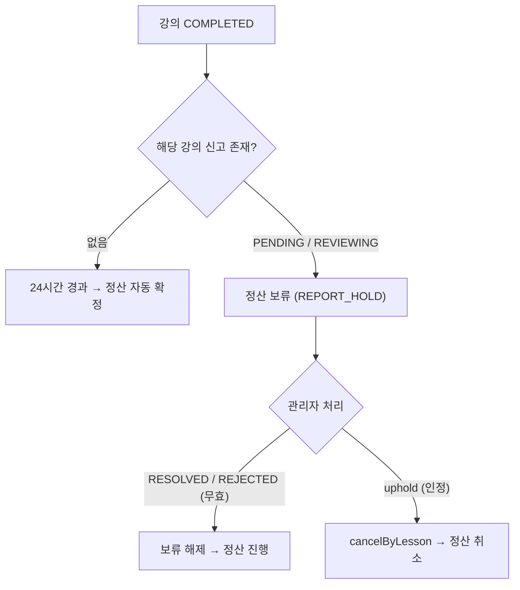

# 리뷰 / 신고

> 담당: <!-- 이름 --> · 최종 수정: 2026-07-05
>
> 강의 종료 후 학생이 남기는 **별점 리뷰**, 사용자 간 **양방향 신고**, 그리고 신고가 **정산 보류**로 이어지는 연계까지. `domain/review`, `domain/report`.

## 개요

- **리뷰** — 강의 1건당 1개, 별점 1~5 + 코멘트. 작성/수정/삭제 시 강사 평점 자동 재집계.
- **신고** — 학생↔강사 양방향, 대상은 강사·학생·강의·리뷰. 사유 복수 선택, 중복 신고 차단.
- **정산 연계** — 강의 신고가 접수/검토 중이면 그 강의 정산이 **보류**되고, 종결 시 해제(인정 시 취소).

## 주요 기능

- **리뷰(Review)**: 완료된 본인 강의에만 작성(강의당 1개), 별점 1~5 + 코멘트(≤500), 강사 평균 평점·별점 분포 자동 집계. 신고로 숨겨진(`HIDDEN`) 리뷰는 집계에서 제외.
- **신고(Report)**: 강의 종료 후 상대/콘텐츠 신고. 대상 유형 4종(TUTOR/STUDENT/LESSON/REVIEW), 사유 복수 선택, 같은 대상 중복 신고 차단.
- **강사 → 자기 리뷰 신고**: 강사가 '받은 리뷰' 화면에서 부적절한 리뷰를 신고(`targetType=REVIEW`).
- **관리자 처리**: 검토중/처리완료/반려/인정 + 신고자 답변. 인정(`uphold`) 시 해당 강의 정산 취소.

## 핵심 로직 / 플로우

### 리뷰 작성 & 평점 집계
1. 강의가 `COMPLETED` + 작성자가 그 강의 학생일 때만 작성 가능.
2. **중복 방지 2중 장치**: `existsByLessonId()` 선검사 + `lessonId` UNIQUE 제약 → 경합 시 `DataIntegrityViolationException` → **409**.
3. 작성/수정/삭제 → `refreshTutorRating(tutorId)`로 강사 평점 갱신.
4. 평균 = `round(가중합 / 총개수, 소수 1자리)`, 별점 분포(1~5). **VISIBLE만 집계**.

### 신고 → 정산 보류 (24시간 규칙)

- 신고 접수 시 `status=PENDING`. 강의 기반 신고면 신고자가 그 강의의 실제 당사자인지 검증(`validateLessonParties`).
- 관리자 상태 전이: `markReviewing` / `resolve` / `reject` / `uphold` / `writeReply` — 각 전이 시 처리자·시각 기록.
- `uphold()`(신고 인정) → `SettlementService.cancelByLesson(lessonId)`로 해당 강의 정산 취소.

## 관련 API

### 리뷰 (`/api/v1/reviews`)
| 메서드 | 경로 | 설명 |
|---|---|---|
| POST | `/reviews` | 리뷰 작성 (강의 COMPLETED + 본인 학생) |
| GET | `/reviews/me` | 내가 쓴 리뷰 목록 |
| GET | `/reviews/tutors/{tutorId}` | 특정 강사 리뷰 목록 (VISIBLE, 최신순) |
| GET | `/reviews/tutors/{tutorId}/summary` | 강사 리뷰 요약 (평균·개수·별점 분포) |
| PATCH | `/reviews/{id}` | 리뷰 수정 (작성자만) |
| DELETE | `/reviews/{id}` | 리뷰 삭제 (작성자만) |

### 신고 (`/api/v1/reports`)
| 메서드 | 경로 | 설명 |
|---|---|---|
| POST | `/reports` | 신고 접수 (신고자 정보는 JWT에서) |
| GET | `/reports/me` | 내가 접수한 신고 목록 (최신순) |

## 관련 테이블

- `reviews` — 리뷰. `id` · `lessonId`(**UNIQUE**, 강의당 1개) · `studentId` · `tutorId` · `rating`(1~5) · `comment`(≤500) · `status`(VISIBLE/HIDDEN) · `createdAt` · `updatedAt`
- `reports` — 신고. `reporterId`/`reporterType` · `targetType`(TUTOR/STUDENT/LESSON/REVIEW)/`targetId` · `lessonId`(강의 무관 신고는 null) · `status`(PENDING→REVIEWING→RESOLVED/REJECTED) · `adminReply`/`adminMemo`/`handledBy`/`handledAt`. **UNIQUE(reporterId, targetType, targetId)**
- `report_reasons` — 신고 사유(복수 선택)

열거형 전체 값

- **ReportReason**: `ABUSE`(욕설/모욕) · `NO_SHOW`(노쇼/불참) · `INAPPROPRIATE`(부적절) · `FRAUD`(사기/허위) · `SPAM`(스팸/광고) · `CONNECTION_ISSUE`(연결/음성·영상) · `TECHNICAL_ISSUE`(기술 오류) · `LESSON_NOT_HELD`(강의 미진행) · `ETC`(기타)
- **ReportStatus**: `PENDING` · `REVIEWING` · `RESOLVED` · `REJECTED`
- **ReportTargetType**: `TUTOR` · `STUDENT` · `LESSON` · `REVIEW`
- **ReporterType**: `STUDENT` · `TUTOR`

## 트러블슈팅

- **리뷰 중복(경합)**: 동시 작성 시 `existsByLessonId` 선검사만으론 못 막음 → `lessonId` UNIQUE로 DB가 최종 차단(→ 409).
- **강사 리뷰 신고 시 리뷰 id 부재**: 강사 프로필 응답(`TutorProfileResponse.ReviewItem`)에 리뷰 `id`가 없어 `targetType=REVIEW` 신고를 만들 수 없었음 → 응답 DTO에 리뷰 `id` 추가 + 프론트 `TutorReviewItem`도 파싱(리뷰 id가 없으면 신고 버튼 숨김). *(백엔드 재배포 후 동작)*
- **신고 인정과 정산의 경계**: `uphold()`는 `lessonId != null`일 때만 정산을 취소 — 강의와 무관한 신고(프로필/리뷰)는 정산에 영향 없음.
