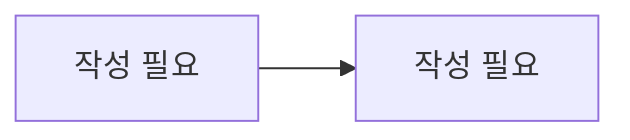

# 리뷰 / 신고

> 담당: <!-- TODO --> · 최종 수정: <!-- TODO -->

## 개요

<!-- 강사 평점·후기와 신고·관리자 처리의 책임 범위 -->
<!-- 여기에 작성 -->

## 주요 기능

<!-- 예: 강의별 강사 리뷰(1강의 1리뷰), 평점 집계, 학생↔강사 신고, 관리자 처리·답변 -->
- <!-- 여기에 작성 -->

## 핵심 로직 / 플로우

<!-- 리뷰 작성 → tutor.rating_avg 갱신, 신고 접수 → 검토 → 처리(RESOLVED/REJECTED) 흐름 -->

<!-- 여기에 작성 -->

## 관련 API

| 메서드 | 경로 | 설명 |
|---|---|---|
| <!-- TODO --> | <!-- TODO --> | <!-- TODO --> |

## 관련 테이블

- `reviews` — 리뷰 (lesson_id 유니크, 별점 1~5, 상태 VISIBLE/HIDDEN)
- `reports` — 신고 (다형성 대상: TUTOR/STUDENT/LESSON/REVIEW, 중복 방지 유니크)
- `report_reasons` — 신고 사유 (복수 선택)

## 트러블슈팅

<!-- 예: 리뷰 반영 시 강사 평점/등급 재산정, 신고 처리에 따른 출금 보류 해제 -->
<!-- 여기에 작성 -->
