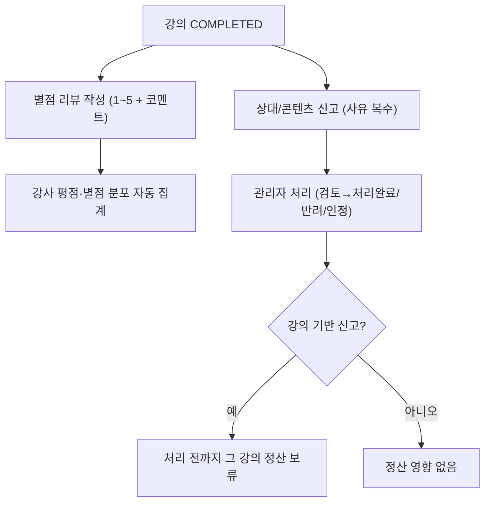

# 리뷰 / 신고

> 담당: 정수민 · 최종 수정: 2026-07-06
>
> 강의 종료 후 학생이 남기는 **별점 리뷰**, 사용자 간 **양방향 신고**, 그리고 신고가 **정산 보류**로 이어지는 연계까지. `domain/review`, `domain/report`.

## 한눈에 보기

| 항목 | 내용 |
|---|---|
| 리뷰 | 강의당 1개 · 별점 1~5 + 코멘트(≤500) · VISIBLE만 집계 |
| 신고 | 양방향(학생↔강사) · 대상 4종(TUTOR/STUDENT/LESSON/REVIEW) · 사유 복수 |
| 상태 | 리뷰 `VISIBLE`/`HIDDEN` · 신고 `PENDING`→`REVIEWING`→`RESOLVED`/`REJECTED` |
| 정산 연계 | 강의 신고 PENDING/REVIEWING → 정산 `REPORT_HOLD`(보류) |
| API | 리뷰 6개(`/api/v1/reviews`) · 신고 2개(`/api/v1/reports`) |

## 기능 흐름 (사용자 관점)

## 주요 기능

- **리뷰(Review)**: 완료된 본인 강의에만 작성(강의당 1개), 별점 1~5 + 코멘트(≤500), 강사 평균 평점·별점 분포 자동 집계. 신고로 숨겨진(`HIDDEN`) 리뷰는 집계에서 제외.
- **신고(Report)**: 강의 종료 후 상대/콘텐츠 신고. 대상 유형 4종(TUTOR/STUDENT/LESSON/REVIEW), 사유 복수 선택, 같은 대상 중복 신고 차단.
- **강사 → 자기 리뷰 신고**: 강사가 '받은 리뷰' 화면에서 부적절한 리뷰를 신고(`targetType=REVIEW`).
- **관리자 처리**: 검토중/처리완료/반려/인정 + 신고자 답변. 인정(`uphold`) 시 해당 강의 정산 취소.

## API

### 리뷰 (`/api/v1/reviews`)
| 메서드 | 경로 | 설명 |
|---|---|---|
| POST | `/reviews` | 리뷰 작성 (강의 COMPLETED + 본인 학생) |
| GET | `/reviews/me` | 내가 쓴 리뷰 목록 |
| GET | `/reviews/tutors/{tutorId}` | 특정 강사 리뷰 목록 (VISIBLE, 최신순) |
| GET | `/reviews/tutors/{tutorId}/summary` | 강사 리뷰 요약 (평균·개수·별점 분포) |
| PATCH | `/reviews/{id}` | 리뷰 수정 (작성자만) |
| DELETE | `/reviews/{id}` | 리뷰 삭제 (작성자만) |

### 신고 (`/api/v1/reports`)
| 메서드 | 경로 | 설명 |
|---|---|---|
| POST | `/reports` | 신고 접수 (신고자 정보는 JWT에서) |
| GET | `/reports/me` | 내가 접수한 신고 목록 (최신순) |

## 관련 테이블

- `reviews` — 리뷰. `id` · `lessonId`(**UNIQUE**, 강의당 1개) · `studentId` · `tutorId` · `rating`(1~5) · `comment`(≤500) · `status`(VISIBLE/HIDDEN) · `createdAt` · `updatedAt`
- `reports` — 신고. `reporterId`/`reporterType` · `targetType`/`targetId` · `lessonId`(강의 무관 신고는 null) · `status` · `adminReply`/`adminMemo`/`handledBy`/`handledAt`. **UNIQUE(reporterId, targetType, targetId)**
- `report_reasons` — 신고 사유(복수 선택)

열거형 전체 값

- **ReportReason**: `ABUSE`(욕설/모욕) · `NO_SHOW`(노쇼/불참) · `INAPPROPRIATE`(부적절) · `FRAUD`(사기/허위) · `SPAM`(스팸/광고) · `CONNECTION_ISSUE`(연결/음성·영상) · `TECHNICAL_ISSUE`(기술 오류) · `LESSON_NOT_HELD`(강의 미진행) · `ETC`(기타)
- **ReportStatus**: `PENDING` · `REVIEWING` · `RESOLVED` · `REJECTED`
- **ReportTargetType**: `TUTOR` · `STUDENT` · `LESSON` · `REVIEW`
- **ReporterType**: `STUDENT` · `TUTOR`
- **ReviewStatus**: `VISIBLE` · `HIDDEN`

## 더 알아보기

- **중복 차단(2중 장치)·신고 상태 머신·정산 보류(24h) 연계·평점 집계** 상세: [리뷰·신고 무결성](./리뷰-신고-무결성.md)
- 정산 취소·보류의 정산 도메인 관점: [정산](./정산.md)

## 관련 코드

클래스 · 파일 경로

- 리뷰 (`backend/.../domain/review/`)
  - `controller/ReviewController.java` · `service/ReviewService.java`(`refreshTutorRating`) · `entity/Review.java`(`hide()`)
  - `repository/ReviewRepository.java` — `existsByLessonId`, `ratingDistribution`(native)
- 신고 (`backend/.../domain/report/`)
  - `controller/ReportController.java` · `service/ReportService.java`(`uphold`/`resolve`/`reject`) · `entity/Report.java`
  - `repository/ReportRepository.java` — `existsByLessonIdAndStatusIn`, `findLessonIdsWithStatusIn`(N+1 방지)
- 연계: `settlement/service/SettlementService.java`(`cancelByLesson`) · `lesson/service/LessonService.java`(24h 확정)
- 프론트: `frontend/lib/features/student/`(리뷰 작성·신고), `frontend/lib/features/tutor/`(받은 리뷰·리뷰 신고)

