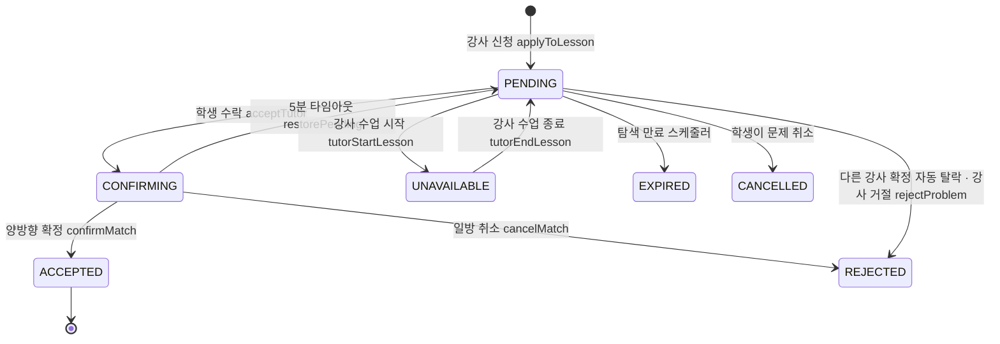
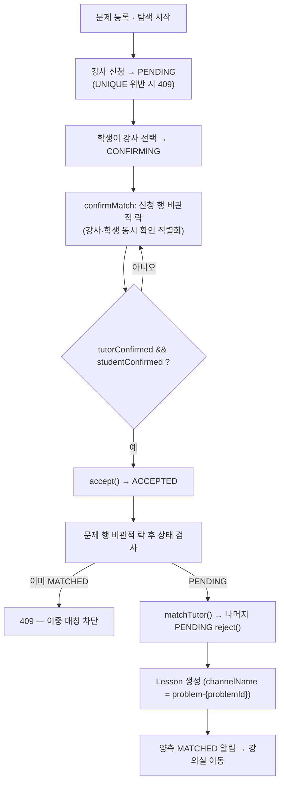

# 매칭 상태 머신·스케줄러

> 강사·학생의 비동기 응답을 상태 머신 + 30초 스케줄러로 정리하고, 비관적 락 + UNIQUE 제약으로 동시 요청을 직렬화해, 방치도 이중 매칭도 없는 실시간 매칭 시스템.

## 한눈에 보기

| 항목 | 내용 |
|---|---|
| 상태 | `ApplicationStatus` 7개 (PENDING/CONFIRMING/ACCEPTED/REJECTED/UNAVAILABLE/EXPIRED/CANCELLED) |
| 스케줄러 | `MatchingScheduler` 30초 주기, 3종 체크 |
| 실시간 알림 | 17종, WebSocket(STOMP) 목적지 3계열 |
| 확정 방식 | 양방향 확인(double opt-in) — 강사·학생 모두 확인해야 ACCEPTED |
| 동시성 제어 | confirmMatch 비관적 락(신청 행 + 문제 행) · UNIQUE(problem_id, tutor_id) |

## 문제 상황

- 문제 하나에 여러 주체(학생 · 다수 강사)가 **비동기로** 개입 → 한쪽이 응답 안 하면 매칭이 방치됨.
- 강사가 **여러 문제에 동시 신청** → 한 수업에 들어가면 나머지 신청을 어떻게 처리할지 문제.
- 탐색 기간이 지난 문제가 강사 목록에 계속 남음.
- CONFIRMING(수락 대기) 상태에서 상대가 무응답이면 무한 대기.
- **동시 요청 경합**: 강사·학생이 동시에 '확인'을 누르면 서로의 확인 플래그를 stale하게 읽어 갱신이 유실되고, 서로 다른 강사의 확정이 동시에 최종 단계에 도달하면 **한 문제에 Lesson이 2개 생기는 이중 매칭**이 날 수 있음. 같은 강사의 중복 신청도 check-then-insert 사이 틈으로 뚫림.

## 해결 방법

### 상태 머신 (ApplicationStatus 7개)

- 신청 진입 조건: 관리자 학력 인증 **VERIFIED** 강사만 신청 가능하고, 수업 중(UNAVAILABLE 보유) 강사는 신청 불가.
- 강사의 자발적 **신청 취소**(`cancelApplication`)는 상태 전이가 아니라 **행 삭제** — UNIQUE 제약과 재신청을 위해 기록을 남기지 않는다.
- 만료된 문제의 **'다시 요청'**(`startSearching`에 EXPIRED 문제가 들어오면 `reopen()`): 이전 라운드의 신청 기록(거절 포함)을 `deleteByProblemId`로 전부 삭제해 새 탐색 라운드에서 모든 강사에게 다시 노출.

### 매칭 확정 흐름 (double opt-in + 동시성 제어)

- **양방향 확인**: `confirmMatch(problemId, tutorId, confirmedBy)`에서 `tutorConfirmed && studentConfirmed`가 모두 참일 때만 `accept()`. 이후 나머지 PENDING 신청을 `reject()`하고 `Lesson`을 생성한다.
- **확인 플래그 갱신 유실 방지**: `findByProblemIdAndTutorIdForUpdate`(PESSIMISTIC_WRITE)로 **신청 행에 쓰기 락**을 걸어 강사·학생의 동시 확인을 직렬화. 락이 없으면 둘 다 상대 플래그를 stale로 읽어 '둘 다 확인했는데 미확정'이 될 수 있다.
- **이중 매칭(double-matching) 방지**: 최종 확정 직전 `problemRepository.findByIdForUpdate`로 **문제 행에도 쓰기 락**을 걸고, 먼저 확정한 강사가 이미 문제를 MATCHED로 바꿨으면(`status != PENDING`) `BusinessException.conflict`(409)로 거부 → 한 문제에 Lesson이 2개 생기지 않는다. 취소/만료된 문제의 뒤늦은 확정도 같은 검사로 차단.
- **중복 신청 방지**: `applyToLesson`의 `existsBy` 체크(check-then-insert)를 통과한 동시 요청은 테이블의 **`UNIQUE(problem_id, tutor_id)`**(`uk_matching_problem_tutor`) 제약이 최종 차단. `saveAndFlush`로 제약 위반을 즉시 감지해 409로 변환한다 — **결제/정산 도메인에서 쓰던 동시성 패턴을 그대로 이식**한 것. `rejectProblem`도 기존 신청 행이 있으면 새 행을 만들지 않고 PENDING만 REJECTED로 전환해 UNIQUE를 준수한다.
- **UNAVAILABLE 동시성**: 강사가 여러 문제에 신청한 상태에서 한 수업에 들어가면 `tutorStartLesson(tutorId)`가 그 강사의 PENDING을 전부 `markUnavailable()` → 수업 종료 시 `tutorEndLesson(tutorId)`가 `restorePending()`으로 복구. 별도로 `LessonService`의 과금 시작/완료도 상태 변경 없이 '수업 중/해제' 알림만 라이브 발송하고(순환 참조 회피), 비정상 종료로 UNAVAILABLE이 남으면 `LessonScheduler`가 `tutorEndLesson`을 호출해 복구한다.
- **스케줄러 3종 체크**: `MatchingScheduler.run()` `@Scheduled(fixedDelay = 30000)`
  - `checkExpiringSoon()` — 만료 60분 전 SEARCH_EXPIRING_SOON 알림
  - `checkExpired()` — 만료 문제 처리 + PENDING을 EXPIRED, SEARCH_EXPIRED 알림
  - `checkConfirmingTimeout()` — CONFIRMING 5분 초과 시 `restorePending()` + `resetConfirmation()`, `timeout_tutor`/`timeout_student` 구분 알림

### 실시간 알림 (17종 · 목적지 3계열)

| 목적지 | 대상 | 예시 메시지 타입 |
|---|---|---|
| `/topic/student/{studentId}` | 학생 | TUTOR_APPLIED, TUTOR_CANCELLED, MATCH_REQUESTED, MATCH_CANCELLED, SEARCH_EXPIRING_SOON, SEARCH_EXPIRED |
| `/topic/tutor/{tutorId}` | 강사 | PROBLEM_MATCHED, PROBLEM_CANCELLED, MATCH_REQUESTED, MATCH_CANCELLED, VERIFICATION_APPROVED, VERIFICATION_REJECTED |
| `/topic/matching/{problemId}` | 매칭방 | MATCHED, TUTOR_UNAVAILABLE, TUTOR_AVAILABLE, TUTOR_ONLINE, TUTOR_OFFLINE |
| `/topic/new-problem` | 전역(강사 피드) | NEW_PROBLEM, PROBLEM_REMOVED |

## 핵심 포인트

- 다자간 비동기 협상을 **명시적 상태 머신(7상태)** 으로 모델링해 전이 규칙을 코드로 강제.
- **양방향 확인(double opt-in)** 으로 한쪽만 수락한 불완전 매칭을 원천 차단.
- **비관적 락 2단(신청 행 → 문제 행) + DB UNIQUE 제약**으로 동시 확인의 갱신 유실·이중 매칭·중복 신청을 모두 DB 수준에서 차단 — 결제 도메인의 검증된 동시성 패턴 재사용.
- **30초 스케줄러**로 만료 임박·만료·확정 타임아웃(5분)을 자동 정리해 방치 상태 제거.

## 관련 코드

클래스 · 파일 경로

- 엔티티/상태: `backend/.../domain/matching/entity/MatchingApplication.java`(`@UniqueConstraint uk_matching_problem_tutor`), `ApplicationStatus.java`
  - 전이 메서드: `confirm()`, `tutorConfirm()`, `studentConfirm()`, `resetConfirmation()`, `accept()`, `reject()`, `markUnavailable()`, `restorePending()`, `expire()`, `cancel()`
- 서비스: `backend/.../domain/matching/service/MatchingService.java`
  - `applyToLesson()`(VERIFIED 체크·saveAndFlush→409), `acceptTutor()`, `confirmMatch()`(비관적 락 2단), `cancelMatch()`, `tutorStartLesson()`, `tutorEndLesson()`, `rejectProblem()`, `startSearching()`(EXPIRED reopen)
- 리포지토리: `backend/.../domain/matching/repository/MatchingApplicationRepository.java` — `findByProblemIdAndTutorIdForUpdate`(PESSIMISTIC_WRITE), `deleteByProblemId`
  - `backend/.../domain/problem/repository/ProblemRepository.java` — `findByIdForUpdate`
- 알림: `backend/.../domain/matching/service/MatchingNotificationService.java` (notify… 17종)
- 스케줄러: `backend/.../domain/matching/scheduler/MatchingScheduler.java` (30초, 3종 체크), `backend/.../domain/lesson/scheduler/LessonScheduler.java` (비정상 종료 시 강사 상태 복구)
- 컨트롤러: `backend/.../domain/matching/controller/MatchingController.java` (`/api/v1/matching`, 13개 엔드포인트)
- 프론트: `frontend/lib/features/matching/` (repository·stomp_service·provider·screens), `frontend/lib/features/student/` (student_matching_stomp_service, session provider)

