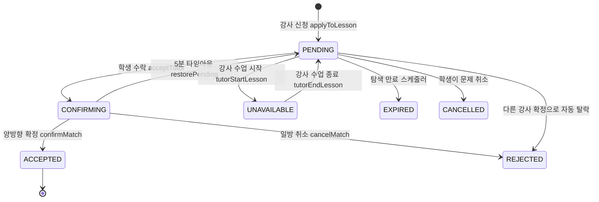
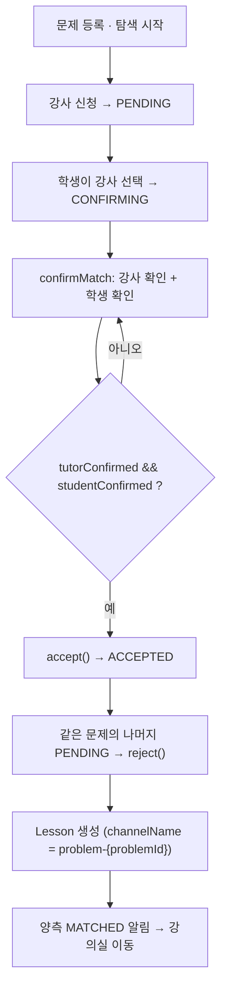

# 매칭 상태 머신·스케줄러

> 강사·학생의 비동기 응답을 상태 머신 + 30초 스케줄러로 정리해, 방치 없이 매칭을 확정하는 실시간 매칭 시스템.

## 한눈에 보기

| 항목 | 내용 |
|---|---|
| 상태 | `ApplicationStatus` 7개 (PENDING/CONFIRMING/ACCEPTED/REJECTED/UNAVAILABLE/EXPIRED/CANCELLED) |
| 스케줄러 | `MatchingScheduler` 30초 주기, 3종 체크 |
| 실시간 알림 | 17종, WebSocket(STOMP) 목적지 3계열 |
| 확정 방식 | 양방향 확인(double opt-in) — 강사·학생 모두 확인해야 ACCEPTED |

## 문제 상황

- 문제 하나에 여러 주체(학생 · 다수 강사)가 **비동기로** 개입 → 한쪽이 응답 안 하면 매칭이 방치됨.
- 강사가 **여러 문제에 동시 신청** → 한 수업에 들어가면 나머지 신청을 어떻게 처리할지 문제.
- 탐색 기간이 지난 문제가 강사 목록에 계속 남음.
- CONFIRMING(수락 대기) 상태에서 상대가 무응답이면 무한 대기.

## 해결 방법

### 상태 머신 (ApplicationStatus 7개)

### 매칭 확정 흐름 (double opt-in)

- **양방향 확인**: `confirmMatch(problemId, tutorId, confirmedBy)`에서 `tutorConfirmed && studentConfirmed`가 모두 참일 때만 `accept()`. 이후 나머지 PENDING 신청을 `reject()`하고 `Lesson`을 생성한다.
- **UNAVAILABLE 동시성**: 강사가 여러 문제에 신청한 상태에서 한 수업에 들어가면 `tutorStartLesson(tutorId)`가 그 강사의 PENDING을 전부 `markUnavailable()` → 수업 종료 시 `tutorEndLesson(tutorId)`가 `restorePending()`으로 복구.
- **스케줄러 3종 체크**: `MatchingScheduler.run()` `@Scheduled(fixedDelay = 30000)`
  - `checkExpiringSoon()` — 만료 60분 전 SEARCH_EXPIRING_SOON 알림
  - `checkExpired()` — 만료 문제 처리 + PENDING을 EXPIRED, SEARCH_EXPIRED 알림
  - `checkConfirmingTimeout()` — CONFIRMING 5분 초과 시 `restorePending()` + `resetConfirmation()`, `timeout_tutor`/`timeout_student` 구분 알림

### 실시간 알림 (17종 · 목적지 3계열)

| 목적지 | 대상 | 예시 메시지 타입 |
|---|---|---|
| `/topic/student/{studentId}` | 학생 | TUTOR_APPLIED, TUTOR_CANCELLED, MATCH_REQUESTED, MATCH_CANCELLED, SEARCH_EXPIRING_SOON, SEARCH_EXPIRED |
| `/topic/tutor/{tutorId}` | 강사 | PROBLEM_MATCHED, PROBLEM_CANCELLED, MATCH_REQUESTED, MATCH_CANCELLED, VERIFICATION_APPROVED, VERIFICATION_REJECTED |
| `/topic/matching/{problemId}` | 매칭방 | MATCHED, TUTOR_UNAVAILABLE, TUTOR_AVAILABLE, TUTOR_ONLINE, TUTOR_OFFLINE |
| `/topic/new-problem` | 전역(강사 피드) | NEW_PROBLEM, PROBLEM_REMOVED |

## 핵심 포인트

- 다자간 비동기 협상을 **명시적 상태 머신(7상태)** 으로 모델링해 전이 규칙을 코드로 강제.
- **양방향 확인(double opt-in)** 으로 한쪽만 수락한 불완전 매칭을 원천 차단.
- **30초 스케줄러**로 만료 임박·만료·확정 타임아웃(5분)을 자동 정리해 방치 상태 제거.

## 관련 코드

클래스 · 파일 경로

- 엔티티/상태: `backend/.../domain/matching/entity/MatchingApplication.java`, `ApplicationStatus.java`
  - 전이 메서드: `confirm()`, `tutorConfirm()`, `studentConfirm()`, `resetConfirmation()`, `accept()`, `reject()`, `markUnavailable()`, `restorePending()`, `expire()`, `cancel()`
- 서비스: `backend/.../domain/matching/service/MatchingService.java`
  - `applyToLesson()`, `acceptTutor()`, `confirmMatch()`, `cancelMatch()`, `tutorStartLesson()`, `tutorEndLesson()`
- 알림: `backend/.../domain/matching/service/MatchingNotificationService.java` (notify… 17종)
- 스케줄러: `backend/.../domain/matching/scheduler/MatchingScheduler.java` (30초, 3종 체크)
- 컨트롤러: `backend/.../domain/matching/controller/MatchingController.java` (`/api/v1/matching`, 13개 엔드포인트)
- 프론트: `frontend/lib/features/matching/` (repository·stomp_service·provider·screens), `frontend/lib/features/student/` (student_matching_stomp_service, session provider)

