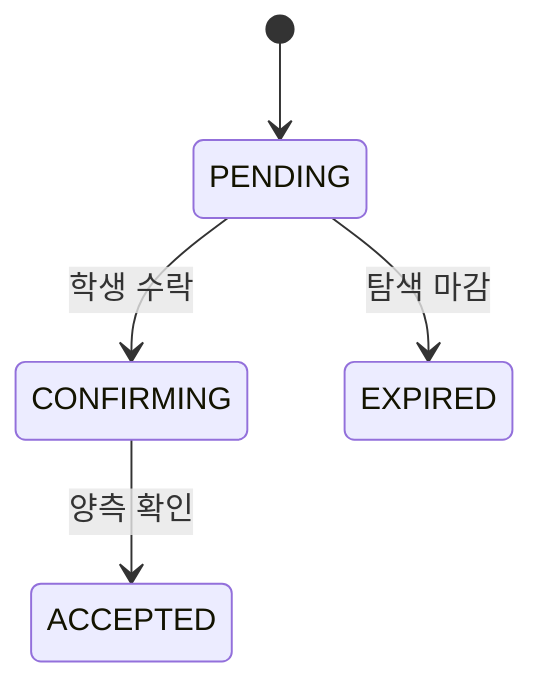

# 강사 매칭

> 담당: <!-- TODO --> · 최종 수정: <!-- TODO -->

## 개요

<!-- 문제에 대한 강사 지원부터 매칭 확정까지의 책임 범위 -->
<!-- 여기에 작성 -->

## 주요 기능

<!-- 예: 강사 지원, 학생 수락, 강사·학생 상호 확인, 매칭 확정, 탐색 만료/취소 처리 -->
- <!-- 여기에 작성 -->

## 핵심 로직 / 플로우

<!-- 상태 전이(PENDING → CONFIRMING → ACCEPTED / REJECTED / UNAVAILABLE / EXPIRED / CANCELLED)를 설명 -->

<!-- 여기에 작성 -->

## 관련 API

| 메서드 | 경로 | 설명 |
|---|---|---|
| <!-- TODO --> | <!-- TODO --> | <!-- TODO --> |

## 관련 테이블

- `matching_applications` — 매칭 신청 (problem_id, tutor_id, 상태, 상호 확인 플래그)
- 참조: `problems`(대상 문제), `tutor`(지원 강사)

## 트러블슈팅

<!-- 예: 동시에 여러 강사 수락 시 처리, 강사 UNAVAILABLE 복구 -->
<!-- 여기에 작성 -->
