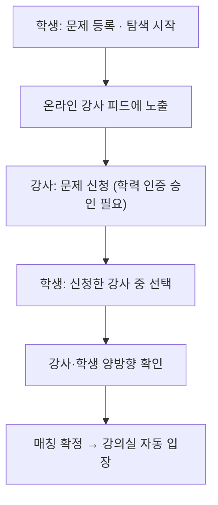

# 강사 매칭

> 문제 등록 → 강사 매칭 → 강의실 입장까지, 학생과 강사를 실시간으로 이어주는 매칭 시스템.

## 한눈에 보기

| 항목 | 내용 |
|---|---|
| 매칭 형태 | 1:1 (문제당 강사 1명) |
| 확정 방식 | 양방향 확인 — 강사·학생 모두 수락해야 성립 |
| 실시간 채널 | WebSocket(STOMP) 알림 |
| 동시성 | 비관적 락 + DB UNIQUE로 중복 신청·이중 매칭 차단 |
| API | `MatchingController` 13개 (`/api/v1/matching`) |

## 기능 흐름 (사용자 관점)

## 주요 기능

- **문제 등록·탐색**: 학생이 문제를 등록하고 탐색을 시작하면 온라인 강사 피드에 실시간 노출.
- **강사 신청 / 학생 선택**: 강사가 원하는 문제에 신청 → 학생이 신청 강사 목록에서 선택. 관리자 학력 인증(VERIFIED)이 승인된 강사만 신청 가능하며, 승인/반려는 실시간 알림으로 전달.
- **양방향 확인**: 학생 선택 후 강사·학생이 서로 확인해야 매칭이 확정되고 강의실로 자동 입장.
- **1:1 전용**: 한 문제는 강사 1명과 매칭. 동시에 두 강사가 확정을 눌러도 비관적 락이 이중 매칭을 차단.
- **강사 다중 신청**: 강사는 여러 문제에 동시 신청 가능. 한 수업을 시작하면 그 강사의 나머지 신청은 자동 보류(수업 종료 시 복구). 같은 문제 중복 신청은 DB UNIQUE 제약으로 차단.
- **학생 다중 등록**: 학생은 여러 문제를 동시에 등록·탐색 가능.
- **탐색 연장 / 만료 / 재요청**: 학생이 탐색 기간을 연장할 수 있고, 기간이 지나면 자동 만료 처리. 만료된 문제는 '다시 요청'으로 재탐색 가능 — 이전 라운드의 신청·거절 기록이 초기화되어 모든 강사에게 다시 노출된다.
- **세션 복구**: 앱을 재실행해도 진행 중이던 매칭(놓친 수락 등)을 복구.

## API

기본 경로: `/api/v1/matching`

| 메서드 | 경로 | 설명 |
|---|---|---|
| POST | `/{problemId}/start` | 문제 탐색 시작 (기간 설정, 만료 문제 재요청 포함) |
| POST | `/{problemId}/apply` | 강사 신청 (VERIFIED 강사만, 중복 신청 시 409) |
| GET | `/{problemId}/applicants` | 학생: 신청 강사 목록 조회 (수업 중 여부 포함) |
| POST | `/{problemId}/accept` | 학생: 강사 선택 (확인 대기로 전환) |
| POST | `/{problemId}/extend` | 학생: 탐색 기간 연장 |
| DELETE | `/{problemId}/apply` | 강사: 신청 취소 (신청 기록 삭제) |
| POST | `/{problemId}/confirm` | 강사/학생: 수락 확인 (이미 매칭된 문제면 409) |
| POST | `/{problemId}/cancel-confirm` | 강사/학생: 확인 대기 취소 |
| POST | `/{problemId}/reject` | 강사: 문제 거절 기록 |
| GET | `/student/{studentId}/pending-confirm` | 학생: 놓친 수락 복구 |
| GET | `/tutor/{tutorId}/applications` | 강사: 신청 목록 조회 |
| POST | `/tutor/{tutorId}/start-lesson` | 강사: 수업 시작 (나머지 신청 보류) |
| POST | `/tutor/{tutorId}/end-lesson` | 강사: 수업 종료 (보류 신청 복구) |

## 더 알아보기

- 상태 머신(7상태) · 30초 스케줄러 · 알림 17종 · 확정 동시성 제어(비관적 락 + UNIQUE) 등 내부 구현: [매칭 상태 머신](./매칭-상태머신.md)

## 관련 코드

클래스 · 파일 경로

- 백엔드 (`backend/.../domain/matching/`)
  - `controller/MatchingController.java` — 엔드포인트 13개
  - `service/MatchingService.java` — 신청/수락/확정/취소, 강사 수업 시작·종료, 동시성 제어
  - `service/MatchingNotificationService.java` — WebSocket 알림
  - `scheduler/MatchingScheduler.java` — 만료·타임아웃 자동 처리
  - `entity/MatchingApplication.java`(UNIQUE 제약), `entity/ApplicationStatus.java`
  - `repository/MatchingApplicationRepository.java` — 비관적 락 조회
- 프론트
  - `frontend/lib/features/matching/` — repository(Dio) · stomp_service · provider(Riverpod) · screens
  - `frontend/lib/features/student/` — 학생 측 매칭 세션 · STOMP 구독 · 화면

