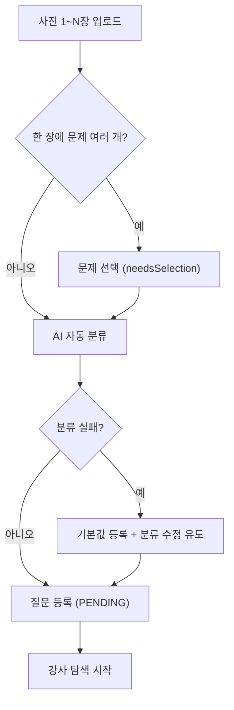

# 문제 등록 / OCR

> 담당: 정수민 · 최종 수정: 2026-07-06
>
> 학생이 **문제 사진(1~N장)** 을 올리면 → **Gemini OCR** 로 글자를 뽑고 → **AI가 과목·단원·난이도·시험유형을 자동 분류** 해 질문으로 등록하는 파트. `domain/problem`.

## 한눈에 보기

| 항목 | 내용 |
|---|---|
| OCR·분류 | Gemini 2.5 Flash (OCR temp 0.1 / 분류 temp 0.2 · 폴백 모델) |
| 과목 | KOREAN · MATH · ENGLISH · SOCIAL · SCIENCE · UNKNOWN |
| 질문 상태 | `ProblemStatus` 5종 (PENDING → MATCHED → RESOLVED / EXPIRED / CANCELED) |
| 안전장치 | 진행 중 3개 상한(SERIALIZABLE) · Idempotency-Key · 분석 마감 150s |
| API | `ProblemController` 8개 (`/api/v1/problems`) |

## 기능 흐름 (사용자 관점)

## 주요 기능

- **문제 등록**: 이미지 1~N장 업로드 → OCR → 분류 → `PENDING`(탐색 대기)로 저장.
- **여러 문제 선택**: 한 장에 문제가 여러 개면 `needsSelection` → 학생이 고른 문제만 등록(재OCR 없음).
- **여러 장 재정렬**: 한 문제가 여러 장이면 페이지 순서(`suggestedOrder`) 인식 후 드래그로 재정렬(재OCR 없음).
- **분류 수정**: 과목·단원·난이도·시험유형 직접 수정(AI 판정 보정).
- **질문 취소**: 관련 신청·알림 정리 + 이미지 즉시 삭제.

## API

기본 경로: `/api/v1/problems`

| 메서드 | 경로 | 설명 |
|---|---|---|
| POST | `/problems` | 문제 등록(multipart, `Idempotency-Key` 헤더로 중복 차단) |
| POST | `/problems/select` | 여러 문제 감지 시 고른 문제 하나만 확정(캐시 재사용, 재OCR 없음) |
| GET | `/problems/searching?tutorId=` | 강사 담당 과목의 탐색 중(PENDING) 질문 목록 |
| GET | `/problems/student?studentId=` | 학생의 내 질문 목록(최신순, 복습용 lessonId 포함) |
| GET | `/problems/{id}` | 문제 단건 상세 |
| PATCH | `/problems/{id}/classification` | 분류 수정(과목·단원·난이도·시험유형) |
| PATCH | `/problems/{id}/page-order` | 여러 장 한 문제의 페이지 순서 재정렬 |
| DELETE | `/problems/{id}` | 질문 취소(→ CANCELED, 이미지 삭제, 신청·알림 정리) |

## 관련 테이블

- `problems` — 문제 본문·분류·상태. `extractedText`(OCR 본문) · `summary`(핵심 요약) · `subject`/`primaryType`/`secondaryType` · `difficulty`/`totalDifficultyScore` · `examType` · `status` · `searching`/`searchDeadline`
- `problem_images` — 문제 이미지 URL(페이지 순서 보존)
- `problem_page_texts` — 장별 OCR 텍스트(재정렬 시 재조합)

열거형 상세

- **Subject**: KOREAN · MATH · ENGLISH · SOCIAL · SCIENCE · UNKNOWN
- **ProblemStatus**: PENDING(탐색중) · MATCHED · RESOLVED · EXPIRED · CANCELED
- **Difficulty**: EASY(0~33) · MEDIUM(34~66) · HARD(67~100) — 점수→등급 `Difficulty.fromScore()`
- **ExamType**: SUNUNG · MOCK_EVALUATION · ACADEMIC_EVALUATION · EBS_SUNEUNG_TEUKGANG · EBS_SUNEUNG_WANSUNG · SCHOOL_INTERNAL · ACADEMY · OTHER · UNKNOWN

## 더 알아보기

- **여러 문제 인식·등록 규칙(R1~R6)·동시성/정합성** 상세: [문제 등록 정합성·다중 인식](./문제-등록-정합성-다중-인식.md)
- **AI(Gemini) 폴백·재시도·graceful degradation** 상세: [AI 문제 인식 폴백](./AI-폴백-처리.md)

## 관련 코드

클래스 · 파일 경로

- 백엔드 (`backend/.../domain/problem/`)
  - `controller/ProblemController.java` — 엔드포인트 8개
  - `service/ProblemService.java` — 등록·선택·취소·조회·분류수정·재정렬 오케스트레이션 + 등록 규칙(R1~R6)
  - `service/GeminiClient.java` · `GeminiOcrClient.java` · `GeminiClassifier.java` — AI 분석(OCR→분류)·타임아웃·재시도·폴백
  - `service/DetectionCache.java` — 다중 감지 결과 임시 보관(TTL 10분)
  - `service/ProblemPersistence.java` — 3개 상한 확인 + INSERT(SERIALIZABLE)
  - `service/ProblemIdempotencyService.java` — Idempotency-Key 중복 차단
  - `service/ImageStorageService.java` (+ `S3ImageStorageService` / `LocalImageStorageService`)
  - `scheduler/ProblemImageCleanupScheduler.java` — 삭제되지 않은 이미지 10분 주기 청소
  - `entity/Problem.java` (+ `enums/`) — 상태 전이·페이지 재정렬
- 프론트 (`frontend/lib/features/student/`)
  - `screens/` — 문제 업로드·분류 수정·내 질문 목록/상세
  - `providers/` · `models/student_problem_model.dart`

