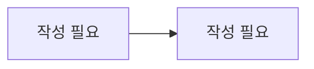

# 문제 등록 / OCR

> 담당: <!-- TODO --> · 최종 수정: <!-- TODO -->

## 개요

<!-- 문제 사진 등록부터 OCR·자동 분류까지의 책임 범위 -->
<!-- 여기에 작성 -->

## 주요 기능

<!-- 예: 문제 사진 업로드(S3), Gemini OCR 텍스트 추출, 과목/유형/난이도 자동 분류, 여러 장 페이지 재정렬 -->
- <!-- 여기에 작성 -->

## 핵심 로직 / 플로우

<!-- 업로드 → OCR → 분류 → 탐색 대기 흐름. OCR/분류 모델·폴백 전략 포함 -->

<!-- 여기에 작성 -->

## 관련 API

| 메서드 | 경로 | 설명 |
|---|---|---|
| <!-- TODO --> | <!-- TODO --> | <!-- TODO --> |

## 관련 테이블

- `problems` — 문제(질문) 본문·분류·상태
- `problem_images` — 문제 이미지 (페이지 순서 포함)
- `problem_page_texts` — 장별 OCR 텍스트 (재정렬 시 재조합)

## 트러블슈팅

<!-- 예: OCR 429/503 폴백, 다중 페이지 재정렬 시 텍스트 재조합 -->
<!-- 여기에 작성 -->
