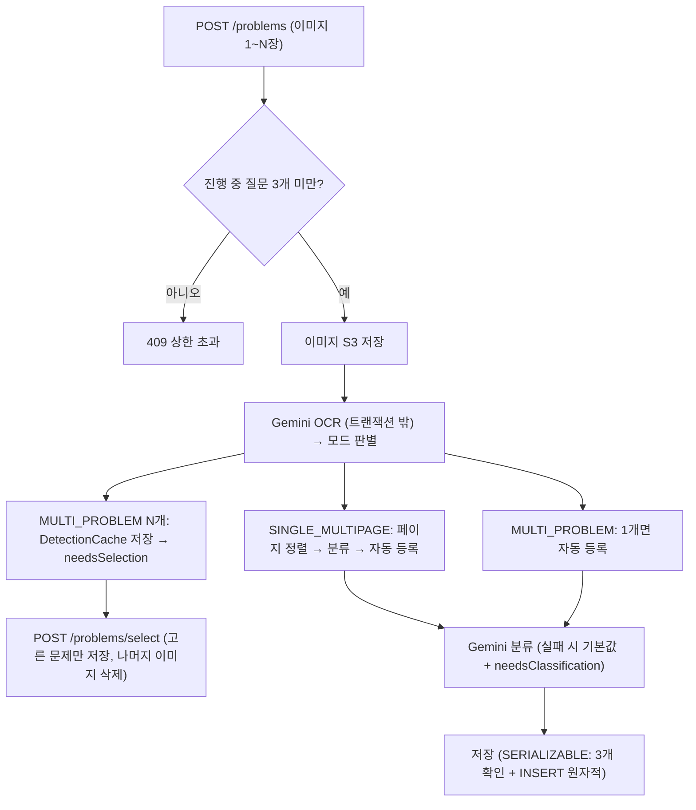

# 문제 등록 / OCR

> 담당: <!-- 이름 --> · 최종 수정: 2026-07-05
>
> 학생이 **문제 사진(1~N장)** 을 올리면 → **Gemini OCR** 로 글자를 뽑고 → **AI가 과목·단원·난이도·시험유형을 자동 분류** 해 질문으로 등록하는 파트. `domain/problem`.

## 개요

- **이미지 → OCR → 자동 분류 → 등록** 을 한 번의 업로드로 처리.
- **한 장에 여러 문제**면 학생이 고른 문제만 등록(재OCR 없음), **한 문제가 여러 장**이면 페이지 순서를 인식·재정렬.
- AI 분류가 실패해도 기본값으로 등록 후 학생이 직접 수정.
- **동시 진행 질문 3개 제한**, **중복 등록 차단(Idempotency-Key)**, **타임아웃·재시도**로 "실패했는데 등록됨" 불일치 방지.

## 주요 기능

- **문제 등록**: 이미지 1~N장 업로드 → OCR → 분류 → `PENDING`(탐색 대기)로 저장.
- **여러 문제 선택**: 한 장에 문제가 여러 개면 `needsSelection` → 학생이 고른 문제만 등록.
- **여러 장 재정렬**: 한 문제가 여러 장이면 페이지 순서(`suggestedOrder`) 인식 후 드래그로 재정렬(재OCR 없음).
- **분류 수정**: 과목·단원·난이도·시험유형 직접 수정.
- **질문 취소**: 관련 신청·알림 정리 + 이미지 즉시 삭제.

## 핵심 로직 / 플로우

- **OCR/분류는 트랜잭션 밖**에서 수행(외부 API 지연이 DB 커넥션을 잡지 않도록).
- **저장은 SERIALIZABLE 트랜잭션**에서 "3개 상한 확인 + INSERT"를 원자적으로 → 동시 업로드에도 상한 초과 없음.
- 저장 **실패일 때만** 이미지 즉시 삭제. 저장 성공 후 예외는 이미지 보존(유령 URL 방지).

## 관련 API

`Base: /api/v1/problems`

| 메서드 | 경로 | 설명 |
|---|---|---|
| POST | `/problems` | 문제 등록(multipart, `Idempotency-Key` 헤더로 중복 차단, TTL 10분) |
| POST | `/problems/select` | 여러 문제 감지 시 고른 문제 하나만 확정(캐시 재사용, 재OCR 없음) |
| GET | `/problems/searching?tutorId=` | 강사 담당 과목의 탐색 중(PENDING) 질문 목록 |
| GET | `/problems/student?studentId=` | 학생의 내 질문 목록(최신순, 복습용 lessonId 포함) |
| GET | `/problems/{id}` | 문제 단건 상세 |
| PATCH | `/problems/{id}/classification` | 분류 수정(과목·단원·난이도·시험유형) |
| PATCH | `/problems/{id}/page-order` | 여러 장 한 문제의 페이지 순서 재정렬 |
| DELETE | `/problems/{id}` | 질문 취소(→ CANCELED, 이미지 삭제, 신청·알림 정리) |

## 관련 테이블

- `problems` — 문제 본문·분류·상태. `extractedText`(OCR 본문) · `summary`(핵심 요약) · `subject`/`primaryType`/`secondaryType` · `difficulty`/`totalDifficultyScore` · `examType` · `status`(ProblemStatus) · `searching`/`searchDeadline`
- `problem_images` — 문제 이미지 URL(페이지 순서 보존)
- `problem_page_texts` — 장별 OCR 텍스트(재정렬 시 재조합)

열거형 · 외부 모델

- **Subject**: KOREAN·MATH·ENGLISH·SOCIAL·SCIENCE·UNKNOWN
- **ProblemStatus**: PENDING(탐색중)·MATCHED·RESOLVED·EXPIRED·CANCELED
- **Difficulty**: EASY(0~33)·MEDIUM(34~66)·HARD(67~100) — 점수→등급 `Difficulty.fromScore()`
- **ExamType**: SUNUNG·MOCK_EVALUATION·ACADEMIC_EVALUATION·EBS_SUNEUNG_TEUKGANG·EBS_SUNEUNG_WANSUNG·SCHOOL_INTERNAL·ACADEMY·OTHER·UNKNOWN
- **Gemini**: OCR=`GeminiOcrClient`(gemini-2.5-flash, temp 0.1), 분류=`GeminiClassifier`(temp 0.2). connect 5초 / read 80초 타임아웃, OCR 2회+폴백 1회, 분석 마감 150초(FE 240초보다 짧게)

## 트러블슈팅

- **"프론트는 실패인데 서버는 등록"**: OCR·분류 재시도가 FE 타임아웃을 넘겨도 서버는 계속 커밋 → 분석 마감(`ANALYZE_DEADLINE_MS=150s`)을 FE 타임아웃(240s)보다 짧게 두고 OCR 후·분류 전에 확인. 중복은 `Idempotency-Key`(키별 락 + 10분 캐시)로 차단.
- **여러 장 한 문제의 지문 이미지 유실** *(수정)*: 지문이 1번 장에만 있고 문제가 여러 장에 걸칠 때, 2번 장 문제를 고르면 지문(1번 장)이 고아로 삭제되던 문제. → OCR 후처리 `linkPassageGroups`로 **같은 지문을 공유하는 문제들을 묶어, 지문이 있는 가장 앞 장을 그룹 전원의 `imageIndices`에 추가**(문제 번호에 의존하지 않는 일반 규칙). 예: 지문+14가 0장, 15·16·17이 1장 → 14는 `[0]`, 15·16·17은 `[0,1]`. *(백엔드 재배포 후 새 등록부터 적용)*
- **고아 이미지 정리**: 다중 감지 후 10분간 미선택 이미지는 `ProblemImageCleanupScheduler`(10분 주기)가 S3에서 정리.
