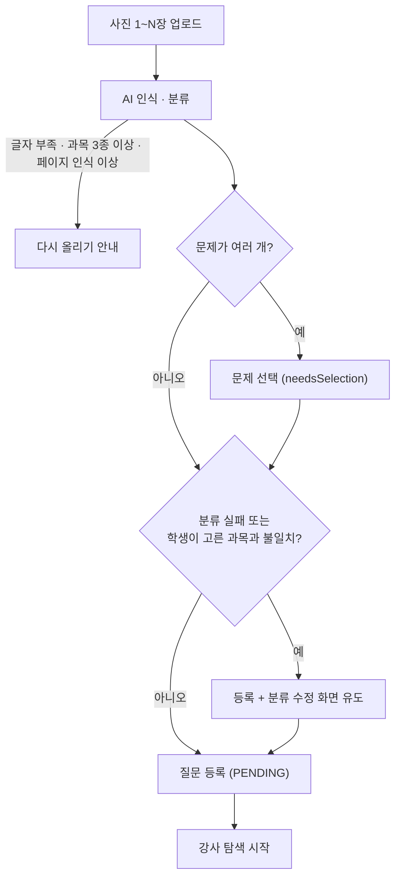
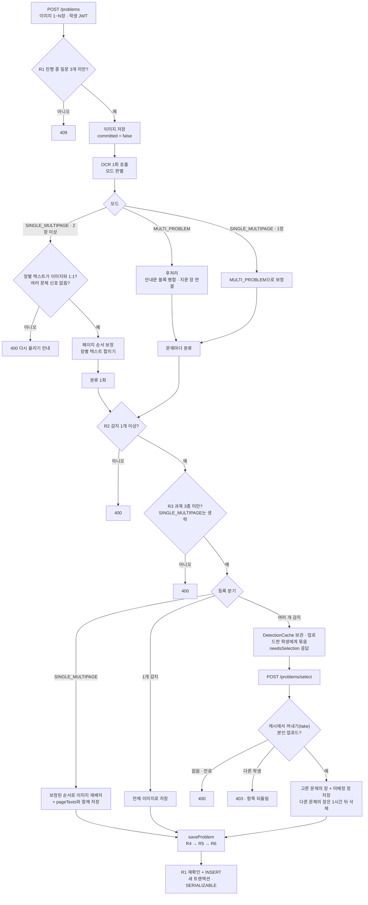

# 문제 등록 / OCR

> 담당: 정수민 · 최종 수정: 2026-09-14
>
> 학생이 **문제 사진(1~N장)** 을 올리면 → **Gemini OCR** 로 글자를 뽑고 → **AI가 과목·단원·난이도·시험유형을 자동 분류** 해 질문으로 등록하는 파트. `domain/problem`.

## 한눈에 보기

| 항목 | 내용 |
|---|---|
| OCR·분류 | Gemini 2.5 Flash (OCR temp 0.1 / 분류 temp 0.2 · 폴백 모델) |
| 과목 | KOREAN · MATH · ENGLISH · SOCIAL · SCIENCE · UNKNOWN |
| 질문 상태 | `ProblemStatus` 5종 (PENDING → MATCHED → RESOLVED / EXPIRED / CANCELED) |
| 접근 제어 | JWT 인증 주체 기반 · 등록·수정·취소는 학생 본인 문제만 · 탐색 목록은 강사 |
| 안전장치 | 진행 중 3개 상한(SERIALIZABLE) · Idempotency-Key · 분석 마감 150s · OCR 응답 구조 검증 |
| API | `ProblemController` 8개 (`/api/v1/problems`, 전부 로그인 필요) |

## 기능 흐름 (사용자 관점)

## 주요 기능

- **문제 등록**: 이미지 1~N장 업로드 → OCR → 분류 → `PENDING`(탐색 대기)로 저장.
- **여러 문제 선택**: 문제가 여러 개 감지되면 `needsSelection` → 학생이 고른 문제만 등록(재OCR 없음).
- **여러 장 재정렬**: 한 문제가 여러 장이면 페이지 순서(`suggestedOrder`) 인식 후 드래그로 재정렬(재OCR 없음).
- **분류 수정**: 과목·단원·난이도·시험유형 직접 수정(AI 판정 보정).
- **질문 취소**: 관련 신청·알림 정리 + 이미지 즉시 삭제.
- 조회·수정·취소는 모두 **본인 질문만** 가능하다.

## 핵심 로직 / 분기

등록 요청 하나가 거치는 분기를 코드 순서대로 정리한다.
**각 가드가 왜 필요한지**(동시성·정합성·이미지 정리)는 [문제 등록 정합성·다중 인식](./문제-등록-정합성-다중-인식.md), **AI 호출 실패 처리**는 [AI 문제 인식 폴백](./AI-폴백-처리.md)에서 다룬다.

### 전체 흐름

> 흐름도에서는 한눈에 보이도록 R2·R3를 분류 뒤에 두었지만, 코드에서는 분류까지 끝난 **분석 결과**를 받아 `createProblem`이 검사한다.
> 캐시에 보관하는 순간에도 `committed = true`가 되어, 선택 대기 중인 이미지는 지워지지 않는다.

### 0단계 — 접근 제어: 누가 요청했는가

학생·강사 ID는 **요청값이 아니라 JWT 인증 주체**(`@AuthenticationPrincipal`)에서 가져온다. 프론트가 예전처럼 `studentId`·`tutorId`를 보내도 서버는 사용하지 않는다.

| API | 허용 역할 (`SecurityConfig`) | 추가 검사 (`ProblemService`) |
|---|---|---|
| `GET /problems/searching` | 강사 | 로그인한 강사의 담당 과목 기준 |
| `GET /problems/student` | 학생 | 로그인한 학생의 질문만 |
| `GET /problems/{id}` | 로그인 사용자 | 학생이면 **본인 질문만** (강사는 매칭 과정에서 봐야 하므로 제한 없음) |
| `POST /problems` · `/select` | 학생 | 선택 시 **업로드한 학생 본인인지** 확인 |
| `PATCH` 분류·순서 · `DELETE` | 학생 | **본인 질문만** |

토큰이 없으면 401, 역할이 맞지 않거나 남의 질문이면 403이다.

### 1단계 — 모드 판별: "이 이미지들이 몇 문제인가"

개수를 세기 **전에**, OCR 모델이 업로드 전체를 보고 두 모드 중 하나를 고른다. (`GeminiOcrClient`)

| 모드 | 의미 | 모델 응답 |
|---|---|---|
| `SINGLE_MULTIPAGE` | 여러 장이 사실은 **한 문제** (긴 지문이 장에 걸쳐 잘림) | `pages`(장별 텍스트) + `suggestedOrder`(읽기 순서) |
| `MULTI_PROBLEM` | 그 외 전부 — 문제 여러 개, 과목 섞임, **한 장에 한 문제인 단순한 경우도 포함** | `detectedTexts`(문제별 텍스트 + `imageIndices`) |

과목이 둘 이상 보이거나 문제 번호·발문이 둘 이상이면 무조건 `MULTI_PROBLEM`, 애매해도 `MULTI_PROBLEM`이라고 프롬프트로 지시한다.

**서버는 모델 판단을 그대로 믿지 않는다.** 이후 분기(선택 화면 생략, R3 생략)가 모두 이 판단에 걸려 있어서, 구조적으로 성립하지 않는 판단은 `GeminiClient`가 바로잡거나 거부한다.

| 모델 응답 | 서버 처리 | 이유 |
|---|---|---|
| `SINGLE_MULTIPAGE`인데 `pages`가 비어 있음 | `MULTI_PROBLEM`으로 해석 | 장별 텍스트가 없으면 한 문제로 조합할 수 없다 |
| `SINGLE_MULTIPAGE`인데 **이미지가 1장** | `MULTI_PROBLEM`(그 장을 가리키는 문제 1개)으로 보정 | 한 장은 "여러 장에 걸친 한 문제"가 될 수 없다 |
| 장별 텍스트가 이미지와 **1:1이 아님** (장 누락·중복·범위 밖) | 400 "일부 페이지의 글자를 인식하지 못했어요. 사진을 다시 올려 주세요." | 빠진 장의 글이 조용히 사라진 채 등록되는데, 등록 후에는 본문을 고칠 수단이 없다 |
| **두 장 이상에 선택지(①)** 가 있거나 **EBS 문제 코드가 2종 이상** | 400 "여러 문제가 한 문제로 합쳐져 인식됐어요. 문제별로 나눠서 올려 주세요." | 묶인 채 등록되면 선택 화면과 과목 혼합 검사(R3)를 모두 건너뛴다 |

> 마지막 검사는 **뚜렷한 신호만 잡는 휴리스틱**이다. 신호가 없는 오판, 그리고 반대 방향의 오판(한 문제를 여러 문제로 쪼갬)은 막지 못한다.

### 2단계-A — `MULTI_PROBLEM`: 감지 개수로 분기

**"감지 개수"는 모델 응답 그대로가 아니라 후처리를 거친 개수다.**

| 후처리 | 하는 일 | 개수에 주는 영향 |
|---|---|---|
| `mergePassageOnly` | "다음 글을 읽고 물음에 답하시오"처럼 **안내문만 있고 선택지·발문이 없는 블록**을, 실제 문제들의 본문 앞에 붙이고 그 장 번호도 문제에 합친다 | 안내문 블록이 빠지므로 **줄어들 수 있다** |
| `linkPassageGroups` | 공백을 뺀 본문 앞 40자가 같은(= 지문을 공유하는) 문제가 2개 이상이면, 그중 가장 앞 장(지문 장)을 모든 문제의 `imageIndices`에 넣는다 | 개수는 그대로. 선택했을 때 **지문 장이 함께 보존**된다 |

그다음 문제마다 분류를 호출하고(실패하면 기본값 + `classificationFailed`), R2·R3를 통과하면 개수로 나뉜다.

| 조건 | 처리 |
|---|---|
| 1개 | 업로드한 전체 이미지로 바로 등록 |
| 2개 이상 | 결과를 **업로드한 학생에게 묶어** `DetectionCache`(TTL 10분)에 넣고, `detectionId` + 후보 목록을 응답 |

> 예전에는 선택 인덱스(`selectedProblemIndex`)를 담아 **이미지를 다시 올리는** 경로도 있었다.
> 다시 OCR한 결과는 1차와 문제 순서·개수가 달라질 수 있어 인덱스가 다른 문제를 가리킬 위험이 있었고, 비용도 두 배라 제거했다.

#### 선택 확정 — `POST /problems/select`

| 순서 | 위치 | 하는 일 |
|---|---|---|
| ① | `ProblemController` | `select:{학생ID}:{detectionId}`를 멱등 키로 실행 — 버튼 연타·재시도로 같은 선택이 다시 와도 **처음 결과를 그대로** 돌려준다 |
| ② | `DetectionCache.take` | 항목을 **꺼내면서 동시에 제거**(원자적). 없거나 만료면 400. 같은 선택이 동시에 두 번 와도 한 요청만 항목을 받는다 |
| ③ | `selectDetectedProblem` | 업로드한 학생이 아니면 403, 인덱스가 범위 밖이면 400 |
| ④ | `imagesToKeep` | 저장할 이미지를 고른다 (아래 표) |
| ⑤ | `saveProblem` | 3단계 공통 저장. **②~⑤에서 실패하면 `restore`로 항목을 되돌려** 학생이 다시 고를 수 있다 |
| ⑥ | `PendingImageDeletions` | 제외된 장을 **즉시 지우지 않고** 유예 삭제 대기열에 넣는다 |

`selectDetectedProblem`은 트랜잭션 밖(`NOT_SUPPORTED`)에서 실행된다. 여기서 트랜잭션을 열면 3단계의 상한 확인이 그 트랜잭션에 합류해 SERIALIZABLE이 적용되지 않기 때문이다.

**남길 이미지 규칙 (`imagesToKeep`)** — 모델이 매긴 장 번호는 틀릴 수 있으므로, 지우는 쪽을 최대한 보수적으로 판단한다.

| 상황 | 문제에 붙여 저장하는 장 |
|---|---|
| 어느 문제든 **범위 밖 장 번호**가 있음 · 고른 문제의 장 번호가 비어 있음 · 업로드가 1장 | **전부** |
| 그 외 | **고른 문제의 장** + **어느 문제에도 배정되지 않은 장** (다른 문제에만 배정된 장만 제외) |

예: 3장을 올렸고 문제 A는 0번 장, 문제 B는 1번 장, 2번 장은 어디에도 배정되지 않았다면 → A를 고르면 **0·2번 장**이 저장되고, 1번 장만 제외된다.

제외된 장은 **1시간 뒤** 10분 주기로 도는 `ProblemImageCleanupScheduler`가 삭제한다. 선택하지 않고 캐시 TTL(10분)이 지난 업로드의 이미지도 같은 스케줄러가 정리한다.

### 2단계-B — `SINGLE_MULTIPAGE`: 페이지 순서 보정

학생이 장을 순서대로 올리지 않을 수 있어서, **읽기 순서를 맞춘 뒤 한 문제로 합친다.** 개수 분기는 타지 않는다(항상 1문제, 선택 화면 없음, R3 생략). 1단계의 서버 측 검증을 통과한 경우에만 여기로 온다.

| 순서 | 위치 | 하는 일 |
|---|---|---|
| ① | `GeminiOcrClient.callApi` | 이미지마다 앞에 `[페이지 N / 총 M]` 텍스트를 붙여 보낸다. 모델이 장을 `imageIndex = N-1`로 가리킬 수 있게 하기 위함 |
| ② | Gemini | 장별 텍스트(`pages`)와, 쪽 번호·문장 연결로 판단한 읽기 순서(`suggestedOrder`)를 돌려준다. 근거가 약하면 업로드 순서 그대로 |
| ③ | `GeminiClient.sanitizeOrder` | `suggestedOrder`가 **0..N-1을 정확히 한 번씩** 담은 순열인지 검사. 길이가 다르거나 빠지거나 중복·범위 밖이면 **업로드 순서로 되돌린다** |
| ④ | `GeminiClient.analyzeSingleMultipage` | 순서대로 장별 텍스트를 빈 줄로 이어 붙여 본문을 만들고, 이 본문으로 **분류를 1회만** 호출한다. 장별 텍스트는 같은 순서로 `pageTexts`에 보관(빈 장도 자리를 유지해 이미지와 1:1) |
| ⑤ | `ProblemService.reorderByIndex` | 저장된 이미지 URL을 같은 순서로 재배치 |
| ⑥ | `saveProblem` | 정렬된 이미지 · 합친 본문 · `pageTexts`를 함께 저장 |

**등록 후 순서 수정** — `PATCH /problems/{id}/page-order`

- `order`는 **현재 저장된 순서** 기준의 순열이다(업로드 순서가 아님). 예: `[2, 0, 1]`
- 본인 질문이 아니면 403, 이미지가 2장 이상이 아니면 400, 순열이 아니면 400.
- `Problem.reorderPages`가 이미지를 재배치하고, `pageTexts`가 이미지와 1:1이면 **텍스트도 같은 순서로 재배치해 본문을 다시 조합한다(재OCR 없음).**
- `MULTI_PROBLEM`으로 등록된 여러 장 문제는 `pageTexts`가 없으므로 **이미지 순서만** 바뀌고 본문은 그대로다. `MULTI_PROBLEM`에서는 모델이 여러 장에 걸친 본문을 합치면서 읽기 순서를 맞추지만, **이미지 순서는 업로드 순서 그대로**라 필요하면 학생이 이 API로 고친다.

### 3단계 — 공통 저장 (`saveProblem` → `ProblemPersistence`)

모든 등록 경로가 여기로 모인다.

| 순서 | 규칙 | 처리 |
|---|---|---|
| R4 | 본문(앞뒤 공백 제외) 10자 미만 | 400 |
| R5 | 한글+영문 20자 이상이고 영문이 한글의 4배 이상 | AI 판정 과목을 `ENGLISH`로 보정 |
| R6 | 학생이 과목을 골랐고, 보정된 AI 판정이 `UNKNOWN`이 아니면서 서로 다름 | 과목은 **학생 선택값**으로 저장하되 `classificationFailed = true` |
| R1 재확인 | 진행 중 질문 3개 이상 | 409 |

R1 재확인과 INSERT는 `ProblemPersistence`가 **항상 새 트랜잭션**(`REQUIRES_NEW`, SERIALIZABLE)으로 묶는다. 같은 학생의 등록이 동시에 겹쳐 DB가 한쪽을 교착·직렬화 실패로 끊으면, 500 대신 **409 "잠시 후 다시 시도해 주세요"** 로 응답한다.

### 응답

**성공 응답 플래그**

| 플래그 | 켜지는 조건 | 프론트 동작 |
|---|---|---|
| `needsSelection` | 여러 문제 감지 | 후보 목록을 보여주고 `detectionId`로 `/problems/select` 호출 |
| `needsClassification` | 분류 호출 실패로 기본값 등록, 또는 R6 불일치 | 분류 수정 화면으로 유도 |
| `multiPage` | 저장된 이미지가 **2장 이상** (모드와 무관) | 수정 화면에 페이지 순서 재정렬 노출 |

**주요 거부 응답**

| 코드 | 상황 |
|---|---|
| 400 | 감지 0건(R2) · 과목 3종 이상(R3) · 본문 10자 미만(R4) · 페이지 인식 이상 · 여러 문제 묶임 · 선택 만료/이미 처리됨 · 잘못된 인덱스·순서 |
| 401 | 토큰 없음 |
| 403 | 역할 불일치 · 남의 질문 조회/수정/취소 · 남이 업로드한 결과 선택 |
| 409 | 진행 중 질문 3개 초과(R1) · 같은 계정 등록이 동시에 겹침 |
| 500 | 과부하가 아닌 OCR 호출 실패 |
| 503 | AI 과부하 · 분석 마감(150초) 초과 — [AI 문제 인식 폴백](./AI-폴백-처리.md) |

## API

기본 경로: `/api/v1/problems` · 모든 요청에 JWT 필요

| 메서드 | 경로 | 권한 | 설명 |
|---|---|---|---|
| POST | `/problems` | 학생 | 문제 등록(multipart, `Idempotency-Key` 헤더로 중복 차단) |
| POST | `/problems/select` | 학생(업로드한 본인) | 여러 문제 감지 시 고른 문제 하나만 확정(캐시 재사용, 재OCR 없음, 같은 선택 재요청은 처음 결과 반환) |
| GET | `/problems/searching` | 강사 | 로그인한 강사 담당 과목의 탐색 중(PENDING) 질문 목록 |
| GET | `/problems/student` | 학생 | 내 질문 목록(최신순, 복습용 lessonId 포함) |
| GET | `/problems/{id}` | 로그인 사용자 | 문제 단건 상세(학생은 본인 질문만) |
| PATCH | `/problems/{id}/classification` | 학생(본인) | 분류 수정(과목·단원·난이도·시험유형) |
| PATCH | `/problems/{id}/page-order` | 학생(본인) | 여러 장 문제의 페이지 순서 재정렬 |
| DELETE | `/problems/{id}` | 학생(본인) | 질문 취소(→ CANCELED, 이미지 삭제, 신청·알림 정리) |

## 관련 테이블

- `problems` — 문제 본문·분류·상태. `extractedText`(OCR 본문) · `summary`(핵심 요약) · `subject`/`primaryType`/`secondaryType` · `difficulty`/`totalDifficultyScore` · `examType` · `status` · `searching`/`searchDeadline`
- `problem_images` — 문제 이미지 URL(페이지 순서 보존)
- `problem_page_texts` — 장별 OCR 텍스트(재정렬 시 재조합)

열거형 상세

- **Subject**: KOREAN · MATH · ENGLISH · SOCIAL · SCIENCE · UNKNOWN
- **ProblemStatus**: PENDING(탐색중) · MATCHED · RESOLVED · EXPIRED · CANCELED
- **Difficulty**: EASY(0~33) · MEDIUM(34~66) · HARD(67~100) — 점수→등급 `Difficulty.fromScore()`
- **ExamType**: SUNUNG · MOCK_EVALUATION · ACADEMIC_EVALUATION · EBS_SUNEUNG_TEUKGANG · EBS_SUNEUNG_WANSUNG · SCHOOL_INTERNAL · ACADEMY · OTHER · UNKNOWN

## 더 알아보기

- **등록 규칙(R1~R6)·동시성·이미지 생애주기의 설계 근거와 검증**: [문제 등록 정합성·다중 인식](./문제-등록-정합성-다중-인식.md)
- **AI(Gemini) 폴백·재시도·graceful degradation**: [AI 문제 인식 폴백](./AI-폴백-처리.md)

## 관련 코드

클래스 · 파일 경로

- 백엔드 (`backend/.../domain/problem/`)
  - `controller/ProblemController.java` — 엔드포인트 8개, JWT 주체로 학생·강사 ID 결정, 등록·선택 멱등 처리
  - `service/ProblemService.java` — 등록·선택·취소·조회·분류수정·재정렬 오케스트레이션 + 등록 규칙(R1~R6) + 소유권 검사
    - `createProblem()` · `selectDetectedProblem()` · `imagesToKeep()` · `saveProblem()` · `findOwnedProblem()`
  - `service/GeminiClient.java` — OCR→분류 오케스트레이션 + 모드 판단 검증(`validatePagesCoverAllImages` · `rejectIfSeveralProblemsMerged`)
  - `service/GeminiOcrClient.java` · `GeminiClassifier.java` — OCR·분류 호출, 후처리, 타임아웃·재시도·폴백
  - `service/DetectionCache.java` — 다중 감지 결과 임시 보관(학생별, TTL 10분) · `take` / `restore` / `sweepExpired`
  - `service/ProblemPersistence.java` — 3개 상한 확인 + INSERT(`REQUIRES_NEW` · SERIALIZABLE)
  - `service/ProblemIdempotencyService.java` — 등록·선택 중복 차단
  - `service/PendingImageDeletions.java` — 선택에서 제외된 장의 유예 삭제 대기열(1시간)
  - `service/ImageStorageService.java` (+ `S3ImageStorageService` / `LocalImageStorageService`)
  - `scheduler/ProblemImageCleanupScheduler.java` — 미선택 만료 업로드 · 유예 삭제 대상 10분 주기 청소
  - `entity/Problem.java` (+ `enums/`) — 상태 전이·페이지 재정렬
- 보안: `backend/.../global/config/SecurityConfig.java` — 문제 API 역할별 접근 규칙
- 프론트 (`frontend/lib/features/student/`)
  - `screens/` — 문제 업로드·분류 수정·내 질문 목록/상세
  - `providers/` · `repositories/problem_repository.dart` · `models/student_problem_model.dart`

