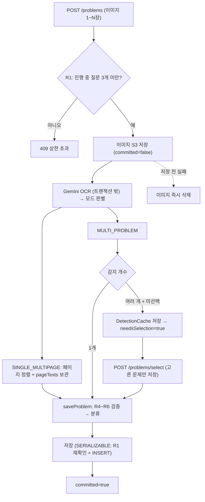

# 문제 등록 정합성·다중 인식

> 한 장에 여러 문제, 한 문제가 여러 장, AI 오분류, 동시 업로드, 느린 외부 AI — 이 모든 변수 속에서 **"쓰레기·중복·유령 데이터 없이" 질문을 등록**하기 위한 규칙(R1~R6)·캐시·트랜잭션 설계.

## 한눈에 보기

| 항목 | 내용 |
|---|---|
| 등록 규칙 | R1~R6 (상한 · 감지 0건 · 과목혼합 · 최소길이 · 언어보정 · 과목결정) |
| OCR 모드 | `SINGLE_MULTIPAGE`(한 문제 여러 장) / `MULTI_PROBLEM`(여러 문제) |
| 다중 감지 캐시 | `DetectionCache` 인메모리 · TTL 10분 · 재OCR 없음 |
| 정합성 | 상한 확인+INSERT(SERIALIZABLE) · 분석 마감 150s(FE 240s보다 짧게) · Idempotency-Key |
| 이미지 정리 | 즉시삭제(`committed` 플래그) + 10분 스케줄러 청소 |

## 문제 상황

- 한 장에 **여러 문제**가 섞여 들어오면 어떤 문제를 등록할지 모호하고, 잘못 등록하면 강사 매칭이 엉킴.
- 한 **문제가 여러 장**에 걸치면(지문+문항 분리) 페이지 순서를 맞추고 본문을 조합해야 함.
- 외부 AI(Gemini)가 **과목을 틀리게 판정**(영어 지문을 국어로 등)하는 경우가 있음.
- 같은 학생이 **동시에 여러 번 업로드**하면 "진행 중 질문 상한"을 넘겨버리는 경합(race condition).
- OCR·분류가 재시도로 길어져 **프론트는 타임아웃(실패)인데 서버는 등록을 커밋**하는 불일치.
- 네트워크 재시도로 **같은 등록 요청이 중복** 도착.
- 선택 안 된/실패한 이미지가 S3에 **삭제되지 않은 채** 남음(참조 없는 URL).

## 해결 방법

### 등록 파이프라인 흐름

### 모드 판별 (`SINGLE_MULTIPAGE` vs `MULTI_PROBLEM`)

- **SINGLE_MULTIPAGE** — 한 문제가 여러 장에 걸침. `suggestedOrder`대로 이미지를 정렬하고 장별 텍스트(`pageTexts`)를 보관 → 이후 드래그 재정렬 시 **재OCR 없이** `pageTexts`만 새 순서로 재조합(`Problem.reorderPages`).
- **MULTI_PROBLEM** — 한 장에 문제 1개 이상. 1개면 자동 등록, 여러 개면 선택 흐름으로.

### 다중 감지 → 선택 (`DetectionCache`)

- OCR은 비싸므로(돈·수 초), 여러 문제 감지 후 학생이 고르기 전까지 **1차 결과를 그대로 보관**하고 `detectionId`(교환권)만 응답.
- `POST /problems/select`가 `detectionId`로 캐시에서 꺼내 **고른 문제만 저장** → 재OCR·재업로드 없음.
- 인메모리 + TTL 10분(`ConcurrentHashMap`). *재시작·다중 인스턴스엔 안 남음 — MVP 허용, 추후 Redis로 이전 여지.*

### 등록 규칙 R1~R6

`createProblem` → `saveProblem` 경로에서 **입구 가드(guard clause)** 로 나쁜 케이스를 순서대로 걸러낸다.

| 규칙 | 검증 | 막는 상황 | 설계 의도 |
|---|---|---|---|
| **R1** | 진행 중(PENDING) 질문 3개 미만 | 질문 도배 | 강사 풀 보호·비용 통제. **OCR 전** 사전 차단 + 저장 시 재확인 |
| **R2** | 감지 문제 ≥ 1개 | 빈 종이·풍경 사진 | 쓰레기 데이터 차단 |
| **R3** | 서로 다른 과목 < 3종 | 여러 과목 뒤섞인 사진 | OCR/분류 정확도 급락 방지 → 나눠 올리기 유도 |
| **R4** | 추출 텍스트 ≥ 10자 | 글씨 안 보이는 흐린 사진 | "문제 글"이 실제로 있어야 등록 |
| **R5** | 언어 휴리스틱(라틴 ≥ 한글×4 & ≥20자 → ENGLISH) | AI가 영어를 국어로 오인식 | 과분류 사후 보정 |
| **R6** | 과목 결정: 학생 선택 우선, AI와 불일치 시 `needsClassification` | AI 맹신 / 학생 맹신 | 학생 존중 + 재확인(human-in-the-loop) |

> **R6가 핵심 철학** — AI를 자동 실행기가 아니라 조수로 사용한다. 학생 선택을 최우선 존중하되, AI 판정과 다르면 강제로 덮지 않고 `classificationFailed=true`만 켜 **분류 수정 화면으로 재확인**을 유도한다.

### 동시성·정합성

- **동시 업로드 경합 방어** — `ProblemPersistence.saveUnderActiveLimit`을 `@Transactional(isolation = SERIALIZABLE)`로 열어 "상한 확인 + INSERT"를 원자적으로 실행 → 3개 상한을 절대 초과하지 않음.
- **"실패인데 등록됨" 완화** — 느린 OCR·분류는 **트랜잭션 밖**에서 수행(DB 커넥션 미점유)하고, `ANALYZE_DEADLINE_MS = 150,000ms`(FE 타임아웃 240s보다 짧게)를 OCR 완료 후·각 문제 분류 전에 확인해 서버가 FE보다 먼저 포기하도록 함.
  > 단, 이 마감은 **호출과 호출 사이에서만 검사하는 체크포인트**이지 하드 캡이 아니다. 마감 직전에 시작된 분류 호출이 read 80초를 다 쓰면 총 소요가 150초를 넘을 수 있다. 엄밀한 상한이 필요하면 분석을 별도 스레드로 돌리고 `Future.get(timeout)`으로 끊어야 한다 — [한계와 다음 단계](#한계와-다음-단계) 참고.
- **중복 등록 차단** — `Idempotency-Key` 헤더(키별 락 + 10분 캐시). 같은 키 재요청은 처음 결과를 그대로 반환.
- **외부 API 안정화** — OCR connect 5s / read 80s, 기본 2회 시도 후 폴백 모델 1회. (상세: [AI 문제 인식 폴백](./AI-폴백-처리.md))

### 이미지 생애주기

이미지는 S3에 **먼저** 올라가므로, 안 쓰는 파일을 반드시 정리한다 — 2단 청소.

| 상황 | 처리 |
|---|---|
| 저장/캐시 **전** 실패(감지 0건·과목 혼합·짧은 글 등) | `committed=false` → **즉시 삭제** |
| 저장/캐시 **성공 후** 예외 | `committed=true` → **삭제 안 함**(유령 URL 방지) |
| 다중 감지 후 **선택된 문제** 이미지 | 유지, 안 고른 장은 선택 시 즉시 삭제 |
| 다중 감지 후 **10분간 미선택** | `ProblemImageCleanupScheduler`(10분 주기)가 `sweepExpired()`로 S3 청소 |

## 검증

동시성·트랜잭션 경계는 눈으로 확인하기 어려워, 재현 테스트로 고정했다.

| 테스트 | 무엇을 보장하는가 |
|---|---|
| `ProblemCreateTransactionTest` "AI 호출을 트랜잭션 밖에서 해도 문제 등록·응답 매핑이 정상 동작한다" | `createProblem`을 `NOT_SUPPORTED`로 바꾼 뒤에도 (1) 등록이 자체 트랜잭션으로 실제 커밋되고, (2) save 이후 **detached 엔티티의 LAZY `imageUrls` 접근에서 예외가 나지 않는지**를 검증. 트랜잭션 경계를 옮길 때 가장 먼저 깨지는 지점이라 회귀 방지용으로 고정했다. |

> 테스트 프로파일은 `gemini.api.key=none`으로 두어 OCR·분류가 Mock으로 동작한다 —
> 외부 API 없이도 파이프라인 전체를 재현할 수 있게 `GeminiOcrClient`·`GeminiClassifier`에 Mock 경로를 심어 둔 덕분이다.

## 선택한 대안과 버린 대안

| 결정 | 선택 | 버린 대안과 이유 |
|---|---|---|
| 동시 등록 상한 | `SERIALIZABLE`로 "개수 확인 + INSERT" 원자화 | **UNIQUE 제약** — "PENDING 3개까지"는 개수 조건이라 유니크 키로 표현할 수 없다. **애플리케이션 락** — 다중 인스턴스에서 무력. 등록은 초당 수 건 수준이라 SERIALIZABLE의 경합 비용을 감당할 수 있다고 판단. |
| OCR·분류 호출 | 2단계로 **분리** 호출 | **1회 통합 호출** — 프롬프트가 비대해져 정확도가 떨어지고, 무엇보다 **분류 실패가 등록 실패로 번진다.** 분리한 덕에 분류만 실패하면 기본값으로 등록하고 수정 화면으로 유도할 수 있다. |
| 다중 감지 결과 보관 | 인메모리 `DetectionCache` + TTL | **재OCR** — 선택할 때마다 Gemini 호출이 한 번 더 발생(비용·수 초 지연). **DB 임시 테이블** — 10분 뒤 버릴 데이터에 스키마·정리 로직을 더하는 비용이 MVP 단계에서 과했다. |
| AI 판정과 학생 선택 충돌 | 학생 선택 우선 + `needsClassification` 플래그 | **AI로 덮어쓰기** — 학생이 맞는 경우를 뭉갠다. **학생 값 그대로 신뢰** — 오분류가 그대로 매칭까지 전파된다. 둘 다 취하지 않고 재확인을 요청하는 쪽을 골랐다(R6). |

## 한계와 다음 단계

설계상 알고 있는 약점과, 운영 단계로 갈 때 손봐야 할 지점.

| 한계 | 영향 | 개선 방향 |
|---|---|---|
| 분석 마감이 **체크포인트**라 하드 캡이 아님 | 최악의 경우 총 소요가 150초를 넘겨 FE 타임아웃과 엇갈릴 수 있음 | 분석을 별도 스레드로 실행하고 `Future.get(timeout)`으로 강제 중단 |
| `DetectionCache`·멱등 캐시가 **인메모리** | 서버 재시작 시 선택 대기 건 소실, 다중 인스턴스에서 미동작 | Redis로 이전 (TTL 정책은 그대로 사용 가능) |
| 멱등 서비스의 `locks` 맵이 **evict되지 않음** | 키가 누적되어 점진적 메모리 증가 | 응답 캐시와 같은 TTL로 함께 정리하거나 `Caffeine` 도입 |
| `SERIALIZABLE` 경합 시 **재시도 없음** | 동시 업로드가 몰리면 락 대기·데드락으로 실패 응답 | 데드락 예외에 한해 짧은 백오프 재시도 |
| Gemini API 키를 **쿼리스트링**으로 전달 | 중간 로그에 키가 남을 여지 | `x-goog-api-key` 헤더로 전환 |

## 핵심 포인트

- **입구 6단계 가드(R1~R6)** 로 쓰레기·오분류·도배를 등록 전에 차단하고, AI 판정은 학생 확인으로 보정(human-in-the-loop).
- **"외부 호출은 트랜잭션 밖 + 분석 마감 + Idempotency-Key + SERIALIZABLE"** 조합으로 느린 AI·재시도·동시성이 만드는 정합성 붕괴("실패인데 등록"·이중 등록·상한 초과)를 원천 차단.
- 다중 감지는 **교환권(detectionId) 캐시** 로 재OCR을 없애고, 이미지는 **`committed` 즉시삭제 + TTL 스케줄러** 2단으로 남는 이미지 없이 관리.

## 관련 코드

클래스 · 파일 경로

- 컨트롤러: `backend/.../domain/problem/controller/ProblemController.java` (`/api/v1/problems`, 8개)
- 오케스트레이션 + 규칙: `backend/.../domain/problem/service/ProblemService.java`
  - `createProblem()` — 파이프라인·모드 분기·`committed` 이미지 정리
  - `assertUnderActiveLimit()` — R1 · `saveProblem()` — R4~R6 · `languageAdjustedSubject()` — R5
  - `selectDetectedProblem()` — 다중 감지 선택
- 저장(동시성): `service/ProblemPersistence.java` — `saveUnderActiveLimit()`(SERIALIZABLE)
- 멱등: `service/ProblemIdempotencyService.java` — Idempotency-Key
- 다중 감지 캐시: `service/DetectionCache.java` — put/get/remove/sweepExpired (TTL 10분)
- AI: `service/GeminiClient.java`(`analyze`, `ANALYZE_DEADLINE_MS`) · `GeminiOcrClient.java` · `GeminiClassifier.java`
- 청소: `scheduler/ProblemImageCleanupScheduler.java` (10분 주기)
- 엔티티: `entity/Problem.java` — `reorderPages()`(재조합) · 상태 전이

