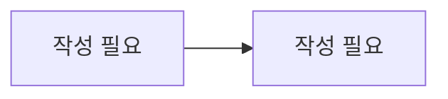

# 인증 / 계정

> 담당: <!-- TODO --> · 최종 수정: <!-- TODO -->

## 개요

<!-- 이 도메인이 무엇을 책임지는지 2~3문장으로 작성 -->
<!-- 여기에 작성 -->

## 주요 기능

<!-- 기능을 불릿으로. 예: 학생/강사 회원가입, JWT 발급·재발급, 소셜 로그인, 비밀번호 재설정, 강사 학력 검증 -->
- <!-- 여기에 작성 -->

## 핵심 로직 / 플로우

<!-- 로그인·토큰 회전·소셜 로그인 등 핵심 흐름을 설명. 아래 mermaid에 시퀀스/플로우 작성 -->

<!-- 여기에 작성 -->

## 관련 API

<!-- 엔드포인트 표. Base path: /api/v1 -->

| 메서드 | 경로 | 설명 |
|---|---|---|
| <!-- TODO --> | <!-- TODO --> | <!-- TODO --> |

## 관련 테이블

- `student` — 학생 계정
- `tutor` / `tutor_subject` — 강사 계정·담당 과목
- `admin` — 관리자 콘솔 계정
- `refresh_token` — 리프레시 토큰 (role + subject_id 당 1건)
- `password_reset_codes` — 비밀번호 재설정 인증 코드

> 공통 인증 필드는 `Account`(@MappedSuperclass)가 `student`·`tutor`에 펼쳐집니다.

## 트러블슈팅

<!-- 겪은 이슈와 해결책. 예: 소셜 로그인 provider 유니크 처리, 탈퇴 시 재가입 -->
<!-- 여기에 작성 -->
