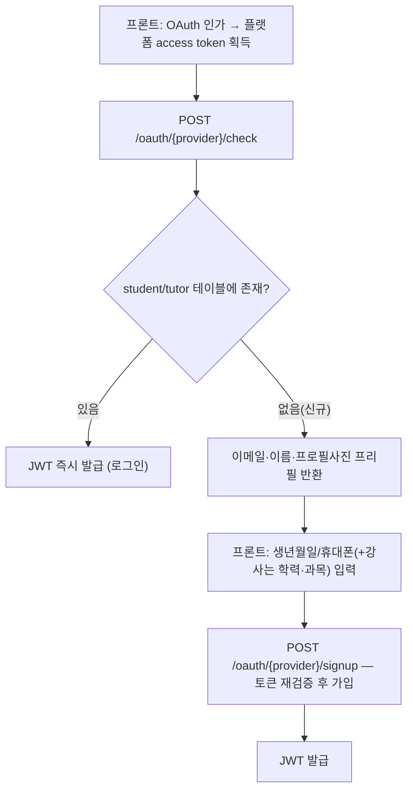
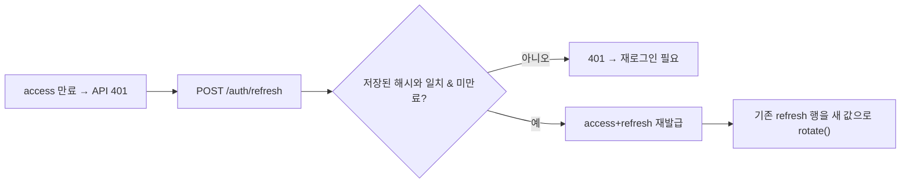

# 인증 / 계정

> 담당: 함한솔 · 최종 수정: 2026-07-04

## 개요

학생·강사 회원의 가입·로그인·인증을 책임지는 도메인. 로컬(이메일/비밀번호) 가입과 소셜 로그인(Google·Naver·Kakao) 3종을 모두 지원하고, JWT 발급·재발급으로 이후 모든 API 요청의 인증 주체를 제공한다. 그 외 비밀번호 재설정, 강사 학력 증빙 검증(활동 제한)까지 계정과 관련된 전체 라이프사이클을 다룬다.

## 주요 기능

- 학생/강사 로컬 회원가입·로그인 (이메일+비밀번호, 가입 즉시 JWT 발급)
- 소셜 로그인 3종(Google·Naver·Kakao) — 앱(SDK 토큰) + 웹(인가코드 서버 교환) 둘 다 지원
- JWT 발급·재발급(회전)·로그아웃, `@AuthenticationPrincipal`로 전 도메인 인증 주체 전환
- 비밀번호 재설정(이메일 인증코드, 로컬 계정만)
- 강사 학력 증빙 업로드 + 관리자 승인 전까지 강의 신청 제한
- 탈퇴(soft delete) — 개인정보 파기 + 재가입 허용
- 프로필 조회/수정(내 정보, 강사 가능시간, 정산 계좌)

## 핵심 로직 / 플로우

### 소셜 로그인 — 2단계(check → signup)
소셜 프로필엔 생년월일·휴대폰·강사 학력 같은 필수 정보가 없어서, 신규 유저를 바로 가입시키지 않고 "확인 → (신규면) 추가정보 받아 가입" 두 단계로 나눴다.

- `check` 단계는 학생/강사 테이블을 **둘 다** 조회한다 — 프론트가 어느 화면에서 로그인을 시도했는지와 무관하게 실제 가입된 역할로 로그인시키기 위함.
- `signup` 단계는 프론트가 보낸 토큰을 서버가 다시 파싱해 사용자 신원을 재검증한다(폼 위변조 방지). 이미 가입된 소셜 계정이면 거부.

### 토큰 재발급 — 회전(rotation)

- refresh 토큰은 DB에 평문이 아닌 SHA-256 해시로 저장(`TokenHasher`). 검증도 요청받은 토큰을 다시 해시해서 대조.
- `(role, subject_id)` 유니크 제약으로 사용자당 refresh 1건만 유지 — 재로그인하면 이전 토큰은 자동으로 회전(무효화)되어 사실상 단일 세션.
- 프론트(Dio 인터셉터)는 401을 가로채 refresh 후 원래 요청을 재시도한다. 인터셉터를 타지 않는 별도 Dio 인스턴스로 refresh를 호출해 무한루프를 피함.

### 탈퇴 후 재가입
탈퇴는 행을 지우지 않고(soft delete) 개인정보(이름/이메일/비밀번호/프로필/소셜식별자)만 null로 파기한다. `email`/`providerUserId`가 null이 되면 유니크 제약에서 자유로워져 같은 사람이 나중에 새 계정으로 재가입할 수 있다. 행 자체는 matching·settlement·lessons 등이 FK 없이 raw ID로 참조하고 있어서 무결성 때문에 남겨둔다.

## 관련 API

Base path: `/api/v1`

| 메서드 | 경로 | 설명 |
|---|---|---|
| POST | `/auth/student/signup` | 학생 로컬 회원가입 |
| POST | `/auth/tutor/signup` | 강사 로컬 회원가입 (multipart, 학력 증빙 포함) |
| POST | `/auth/student/login` | 학생 로컬 로그인 |
| POST | `/auth/tutor/login` | 강사 로컬 로그인 |
| POST | `/auth/oauth/{provider}/check` | 소셜 로그인 1단계 — 기존회원 로그인 or 프리필 반환 |
| POST | `/auth/oauth/{provider}/signup` | 소셜 로그인 2단계 — 신규 가입(multipart) |
| POST | `/auth/oauth/kakao/web-exchange` | 카카오 웹 전용 — 인가코드(PKCE) → access token 서버 교환 |
| POST | `/auth/oauth/naver/web-exchange` | 네이버 웹 전용 — 위와 동일 |
| POST | `/auth/password/forgot` | 비밀번호 재설정 코드 발송 (로컬 계정만) |
| POST | `/auth/password/reset` | 비밀번호 재설정 확정 |
| POST | `/auth/refresh` | access/refresh 재발급(회전) |
| POST | `/auth/logout` | 로그아웃 (refresh 토큰 폐기) |
| GET | `/auth/me` | 내 정보 조회 |
| PATCH | `/auth/me` | 내 정보 수정 |
| POST | `/auth/me/profile-image` | 프로필 이미지 업로드 |
| GET | `/tutors/{tutorId}` | 강사 프로필 조회 |
| PATCH | `/tutors/{tutorId}/availability` | 강사 온라인/오프라인 상태 변경 |
| GET/PATCH | `/tutors/me/settlement-account` | 정산 계좌 조회/등록 |
| POST | `/tutors/me/verification-document` | 강사 학력 증빙 업로드 |

## 관련 테이블

- `student` — 학생 계정
- `tutor` / `tutor_subject` — 강사 계정·담당 과목
- `admin` — 관리자 콘솔 계정
- `refresh_token` — 리프레시 토큰 (role + subject_id 당 1건)
- `password_reset_codes` — 비밀번호 재설정 인증 코드

> 공통 인증 필드는 `Account`(@MappedSuperclass)가 `student`·`tutor`에 펼쳐집니다.

## 트러블슈팅

- **소셜 로그인 크로스 가입 버그**: 같은 구글/카카오/네이버 계정으로 학생 로그인도, 강사 로그인도 되던 문제. provider+providerUserId로 "없으면 생성"만 하다 보니 반대쪽 테이블 존재 여부를 안 봤음 → 가입 전 반대 테이블도 조회해 존재하면 차단. 이후 아예 check/signup 2단계 구조로 재설계해 계정 생성 자체를 신중하게 만듦.
- **카카오 웹 로그인 CORS**: 카카오 토큰 엔드포인트가 브라우저 발 요청을 CORS로 막아놔서, 프론트가 직접 access token을 못 받아옴 → 프론트는 인가코드(PKCE)까지만 받고, 백엔드가 대신 access token으로 교환(`/oauth/kakao/web-exchange`).
- **refresh 토큰 저장 방식**: 처음엔 평문 저장을 고려했으나, DB 유출 시 토큰 재사용 위험이 있어 SHA-256 해시로 저장하고 대조하도록 변경.
- **필터체인 매처 순서**: `/tutors/me/**`를 `/tutors/**`(permitAll) 뒤에 선언했더니 인증 없이 통과 → 순서를 앞으로 옮겨서 토큰 없을 때 500(NPE) 대신 401을 내려 프론트가 재발급 로직을 타도록 수정.
- **탈퇴 후 재가입**: 탈퇴 시 행을 삭제하면 FK 무결성이 깨져서, 개인정보만 null로 파기하는 soft delete로 처리(위 "핵심 로직" 참고).