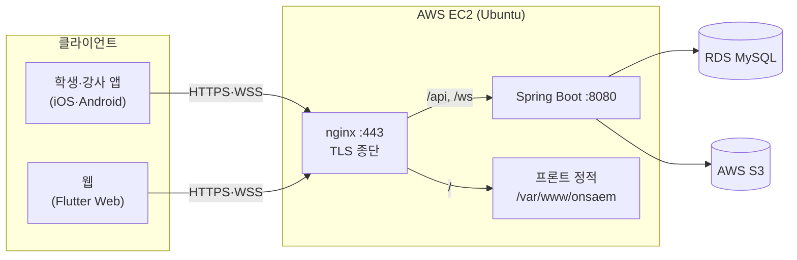
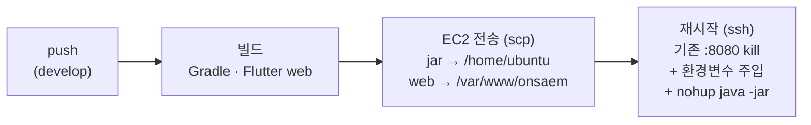

# 인프라 · 배포

> AWS EC2 단일 인스턴스 위에 nginx(TLS 종단·리버스 프록시)와 Spring Boot(:8080)를 올리고, GitHub Actions로 자동 배포하도록 구축한 구조. Flutter 웹은 nginx가 정적 서빙하고, 모바일 앱과 함께 같은 백엔드를 바라본다.

> **기록 문서**: EC2 프리티어 종료로 현재 인스턴스는 내려간 상태다. 아래는 운영 당시 구성과 그 과정에서 겪은 문제·해결을 남긴 기록이다.

## 한눈에 보기

| 항목 | 내용 |
|---|---|
| 서버 | AWS EC2 (Ubuntu) · 단일 인스턴스 |
| 리버스 프록시 | nginx — TLS 종단(:443) + `/api` 프록시(:8080) + 프론트 정적 서빙 |
| 애플리케이션 | Spring Boot (:8080), `--spring.profiles.active=prod` |
| 도메인 · TLS | `3-35-10-251.sslip.io` (sslip.io 무료 와일드카드 DNS) · Let's Encrypt |
| 데이터 | AWS RDS(MySQL) · AWS S3 (`onsaem-bucket`, ap-northeast-2) |
| CI/CD | GitHub Actions (`deploy.yml`) — `develop` push → 빌드 → EC2 전송 → 재시작 |
| 클라이언트 | Flutter (iOS · Android · Web) — 웹은 nginx가 서빙 |

## 전체 구조



## nginx — 한 서버, 세 가지 역할

nginx가 EC2 앞단에서 세 가지를 동시에 처리한다.

| 경로 | 처리 | 용도 |
|---|---|---|
| `/` | `/var/www/onsaem` 정적 서빙 | Flutter 웹 앱 |
| `/api/` | `proxy_pass :8080` | REST API |
| `/ws`, `/ws-raw` | `proxy_pass :8080` (WebSocket upgrade) | STOMP 실시간 |
| `/recorder.html` | `proxy_pass :8080` | Agora 녹화봇 (백엔드 static) |

- **TLS 종단**: nginx가 `:443`에서 HTTPS/WSS를 받아 복호화한 뒤 내부 `:8080`으로 평문 전달. 인증서는 Let's Encrypt(`3-35-10-251.sslip.io`).
- **sslip.io**: IP를 도메인처럼 쓰게 해주는 무료 와일드카드 DNS(`3-35-10-251.sslip.io` → `3.35.10.251`). 별도 도메인 구매 없이 HTTPS 인증서를 발급받기 위해 사용했다. (녹화봇이 Agora Web SDK로 오디오를 구독하려면 secure context가 필요 — [Agora 화상·녹화 연동](./Agora-화상-녹화.md))
- **웹 프론트 서빙**: `location /`이 `/var/www/onsaem`(Flutter 웹 빌드 산출물)을 서빙하되, SPA 라우팅을 위해 `try_files $uri $uri/ /index.html`로 폴백. 단 `/recorder.html`은 백엔드(`backend/src/main/resources/static/`)가 서빙하므로 예외 처리.

> nginx 설정 파일(`/etc/nginx/sites-available/default`)은 EC2에만 있고 저장소에 없다. 위 경로 구성은 운영 당시 설정 기준.

## CI/CD — GitHub Actions 자동 배포

`develop` push → 빌드 → EC2 전송 → 재시작이 자동으로 이어진다.



- 백엔드(jar)와 프론트(web)를 각각 다른 위치로 전송 — jar는 실행용, web은 nginx 정적 서빙용.
- 프론트는 `flutter build web --release --dart-define=PRODUCTION=true`로 빌드 → `api_constants.dart`의 `PRODUCTION` 플래그가 운영 주소(HTTPS/WSS)를 선택한다.
- 환경변수(DB·AWS·Agora·Gemini·JWT·Mail·PortOne)는 GitHub Secrets에서 주입. 단 `MAIL_ENABLED="true"`, `PORTONE_VERIFY="false"`는 워크플로에 리터럴로 박혀 있다(PortOne은 실결제 연동 완료 전까지 검증 비활성).
- **테스트 스킵**: 빌드가 `./gradlew build -x test`라 CI에서 테스트가 한 번도 돌지 않는다. 스킵되는 건 빈 스캐폴드가 아니라 **테스트 클래스 11개**이고, 그중엔 이 프로젝트의 핵심 불변식을 지키는 동시성 테스트가 포함된다 — `MatchingConfirmConcurrencyTest`(한 문제에 Lesson 하나), `PaymentConcurrencyTest`·`WalletConcurrencyTest`·`SubscriptionConcurrencyTest`, `SettlementConcurrencyTest`. 회귀를 잡을 수 있는 자산을 배포 속도와 맞바꾼 셈이라, CI에서 테스트를 켜는 것이 우선 개선 대상이다.

## 트러블슈팅 · 값진 실패

### ① "배포는 초록인데 502 Bad Gateway"

**문제**: WebSocket 인증 배포 후 GitHub Actions는 초록(성공)인데, 서버는 502 Bad Gateway. 로그인·API 전부 불가.

**원인(메커니즘)**: 배포 스크립트가 `nohup java -jar ... &`로 애플리케이션을 백그라운드로 던지고 **즉시 성공 처리**한다. 명령을 실행한 것까지만 확인하고, jar가 실제로 부팅에 성공했는지는 확인하지 않는다.
- 기존 프로세스는 이미 `kill`됨
- 새 jar는 부팅에 실패해 뜨지 않음
- → `:8080`에 아무도 없음 → nginx가 502

즉 **"배포 명령 실행 완료"와 "서버 실제 기동"이 분리**돼 있었고, 헬스체크가 없어서 CI가 실패를 감지하지 못했다. 워크플로 어디에도 기동 검증 단계가 없으니, 무엇이 부팅을 막았든 결과는 항상 "초록 + 502"로 같다 — 이게 문제의 본질이다.

**해결**: 서버 로그(`~/app.log`)에서 부팅 실패 원인을 확인하고, `git revert`로 직전 정상 상태(WebSocket 인증 도입 이전)로 되돌려 재배포 → 복구. 이후 원인을 고쳐 재적용했다(`Reapply`).

**배운 것 · 개선 방향**:
- 배포 후 헬스체크(`GET /api/v1/health` 200 확인)를 추가해 부팅 실패 시 CI가 실패 처리하도록
- 부팅 실패 시 이전 jar로 롤백
- `nohup` 대신 systemd 서비스로 프로세스 관리
- 무중단 배포(새 인스턴스 기동 확인 후 트래픽 전환)

### ② STOMP 세션에 인증 정보가 전파되지 않던 버그

**문제**: WebSocket 화이트보드에 JWT 인증을 넣었더니, 정상 로그인 사용자인데도 SUBSCRIBE 단계에서 "로그인이 필요합니다"로 거부됨.

**원인**: STOMP 인터셉터의 CONNECT 처리에서 `StompHeaderAccessor.wrap(message)`가 만든 **읽기 전용 복사본**에 `setUser()`를 호출 → 원본 메시지 세션에 Principal이 전파되지 않음 → 이후 SUBSCRIBE 때 `getUser()`가 null.

**해결**: `wrap()` 대신 `MessageHeaderAccessor.getAccessor(message, StompHeaderAccessor.class)`(원본에 바인딩된 가변 accessor)를 사용해 Principal이 세션에 유지되도록 수정.

> 상세: [실시간 화이트보드 동기화](./화이트보드-동기화.md)

### ③ 매칭 확정 동시성 — 한 문제에 Lesson이 둘 생길 수 있던 구멍

**문제**: 서로 다른 두 강사의 신청이 모두 확인 대기 상태일 때 학생 확인이 동시에 들어오면, 두 요청이 같은 `PENDING` 문제 상태를 읽고 각자 매칭을 확정 → **한 문제에 Lesson이 2개** 생길 수 있었다.

**해결**: 확정 직전 `problemRepository.findByIdForUpdate`로 문제 행에 비관적 락을 걸고, 이미 `MATCHED`면 409로 거부(상태 가드). 신청 행에도 쓰기 락을 걸어 강사·학생 동시 확인의 갱신 유실을 막고, `UNIQUE(problem_id, tutor_id)`로 중복 신청을 DB에서 차단했다. 동시 확정 시나리오를 재현하는 `MatchingConfirmConcurrencyTest`를 함께 추가.

> 상세: [매칭 상태 머신](./매칭-상태머신.md)

### ④ 배포 = 서버 재시작 = 실시간 연결 끊김

배포할 때마다 기존 프로세스를 `kill`하고 새로 띄우므로, 접속 중이던 클라이언트의 STOMP 연결이 그 순간 끊긴다. 프론트에 자동 재연결(`reconnectDelay` 3초)이 있어 앱을 다시 켤 필요는 없지만, 재연결이 붙기까지 화이트보드 실시간 동기화가 잠깐 끊긴다. (①의 무중단 배포로 근본 개선 가능.)

## 보안 · 설정

- **HTTP CORS**: 전역 허용(`addAllowedOriginPattern("*")`)에서 실제 프론트 오리진 3개만 화이트리스트로 제한 — `https://3-35-10-251.sslip.io`(운영), `http://localhost:*`·`http://127.0.0.1:*`(개발). 개발 서버 포트가 가변이라 `allowedOrigins`가 아닌 `allowedOriginPatterns`를 쓴다(포트 `*` 미지원). Bearer 토큰 방식(쿠키 미사용)이라 `allowCredentials`는 켜지 않는다.
- **WebSocket 핸드셰이크는 아직 `*`**: 위 제한은 HTTP CORS(`SecurityConfig`)에만 적용된다. `WebSocketConfig`의 `/ws`·`/ws-raw`는 `setAllowedOriginPatterns("*")`가 그대로라 오리진 제한이 없다 — 화이트보드 접근 통제는 오리진이 아니라 **STOMP 인터셉터의 JWT 인증·참여자 인가**가 담당한다. 오리진까지 좁히는 건 남은 과제.
- **HTTPS/WSS 통일**: 클라이언트가 생 IP(`http://`)가 아닌 도메인(`https://`/`wss://`)으로 통신하도록 `api_constants.dart`의 운영 주소를 도메인 기반으로 구성 — `https://3-35-10-251.sslip.io/api/v1`, `wss://3-35-10-251.sslip.io/ws-raw`.
- **환경변수 주입**: 시크릿은 코드에 두지 않고 GitHub Secrets → 배포 시 EC2 환경변수로 주입.

## 배포 전 검증 습관 (502 재발 방지)

로컬에서 클린 빌드가 통과한 뒤에만 배포한다.

```bash
cd backend && ./gradlew clean build -x test   # 아티팩트 생성 확인
```

`java -jar`로 로컬 기동까지 확인하려면 **환경변수를 실제로 다 채워야 한다**. `application.yml`에는 기본값 없는 플레이스홀더가 `JWT_SECRET` 외에도 `AWS_ACCESS_KEY_ID`·`AWS_SECRET_ACCESS_KEY`, `GOOGLE_CLIENT_ID`, `KAKAO_JS_CLIENT_ID`, `NAVER_CLIENT_ID`·`NAVER_CLIENT_SECRET`가 있고, 모두 `@ConfigurationProperties`에 바인딩돼 하나라도 비면 placeholder 해석 실패로 기동 자체가 막힌다(DB 연결에 닿기도 전이다). 그래서 로컬 단독 기동 확인은 실효가 낮고, **실제 검증은 배포 직후 헬스체크로** 하는 편이 확실하다.

```bash
curl -i https://3-35-10-251.sslip.io/api/v1/health   # 200 + "healthy" 면 정상, 502면 부팅 실패
```

이 확인을 사람이 매번 하는 대신 워크플로 마지막 단계로 넣는 것이 ①의 개선 방향이다.

## 관련 코드 · 설정

<details>
<summary>주요 파일</summary>

- `.github/workflows/deploy.yml` — CI/CD 파이프라인 (`develop` push 트리거)
- `/etc/nginx/sites-available/default` (EC2, 저장소에 없음) — nginx 리버스 프록시 · 정적 서빙 · TLS
- `backend/.../global/config/SecurityConfig.java` — HTTP CORS · 인가 규칙
- `backend/.../global/config/WebSocketConfig.java` — STOMP 엔드포인트(`/ws-raw`·`/ws`) · 인터셉터 등록
- `backend/.../global/config/StompAuthChannelInterceptor.java` — CONNECT 인증 · 화이트보드 인가 (setUser 버그 수정 지점)
- `backend/.../global/health/HealthController.java` — `GET /api/v1/health`
- `backend/src/main/resources/application.yml`, `application-prod.yml` — 환경변수 플레이스홀더 · prod 설정
- `backend/src/main/resources/static/recorder.html` — 녹화봇 페이지(백엔드 static 서빙)
- `frontend/lib/core/constants/api_constants.dart` — 환경별 API·WS 주소(`PRODUCTION` 플래그)
- Let's Encrypt: `/etc/letsencrypt/live/3-35-10-251.sslip.io/` (EC2)

</details>
