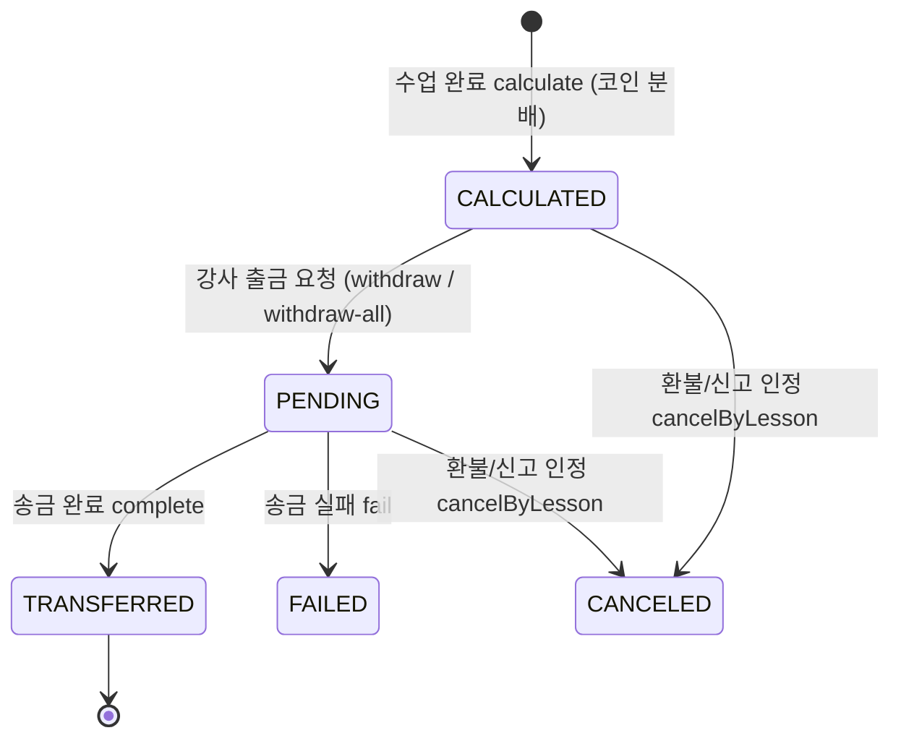

# 정산

> 담당: <!-- 이름 --> · 최종 수정: 2026-07-05
>
> 강의 완료 후 강사에게 지급되는 **정산(payout)** — 수업 1건 = 정산 1건. `domain/settlement`.

## 개요

- 수업이 완료되면 학생이 낸 코인을 **플랫폼 수수료 / 강사 몫**으로 분배해 정산을 생성.
- 강사는 앱에서 정산 목록·요약을 보고 **출금 요청**(단건/일괄), 관리자/시스템이 실제 송금 처리.
- 신고·환불이 걸리면 정산이 **보류/취소**된다(리뷰·신고 도메인과 연계).

## 주요 기능

- **정산 산정**: 수업 완료 → `calculate` → `SettlementPolicy.distribute()`로 코인 분배 → `CALCULATED`(출금 가능).
- **출금 요청**: 강사가 단건(`/withdraw`)·일괄(`/withdraw-all`)로 요청 → `PENDING`(송금 대기). 요청 전 **정산 계좌 등록 강제**.
- **정산 계좌 관리**: 은행/계좌번호/예금주 등록·조회(Tutor 엔티티에 저장).
- **취소/롤백**: 강의 환불·신고 인정 시 `cancelByLesson()`으로 정산 무효화(집계 제외).

## 핵심 로직 / 플로우

- **권위 있는 강사 결정**: `calculate`는 요청의 tutorId를 신뢰하지 않고 `lesson.getTutorId()`로 강사를 정한다.
- **한 강의 1정산**: `lesson_id` **UNIQUE**로 DB가 보장.
- **신고 보류(REPORT_HOLD)**: 강의 신고가 PENDING/REVIEWING이면 그 강의는 정산 확정에서 제외 → 종결 시 해제, 인정 시 취소. (상세는 [리뷰-신고](./리뷰-신고.md))
- **송금 완료/실패(`complete`/`fail`)** 는 사업자·PG(펌뱅킹) 확보 전까지 **수동 stub**.

## 관련 API

`Base: /api/v1/settlements`

| 메서드 | 경로 | 설명 |
|---|---|---|
| POST | `/calculate` | 정산 생성(코인 분배) — 수업 완료(시스템) |
| GET | `/?tutorId=` | 강사 정산 목록 |
| GET | `/summary?tutorId=` | 총정산/송금완료/대기 집계 |
| GET | `/{id}` | 정산 단건 |
| POST | `/{id}/withdraw` | 단건 출금 요청 → PENDING |
| POST | `/withdraw-all` | 일괄 출금 요청 → PENDING |
| POST | `/{id}/complete` | 송금 완료(⚠️ 수동 stub) |
| POST | `/{id}/fail` | 송금 실패(⚠️ 수동 stub) |
| POST | `/{id}/cancel` | 정산 취소(관리자) |

정산 계좌 (`/api/v1/tutors/me/settlement-account`):
| 메서드 | 경로 | 설명 |
|---|---|---|
| GET | `/tutors/me/settlement-account` | 계좌 조회 |
| PATCH | `/tutors/me/settlement-account` | 계좌 등록·수정 |

## 관련 테이블

- `settlements` — 정산. `tutorId` · `lessonId`(**UNIQUE**) · `totalCoin`(학생 제출) · `platformFeeCoin`(수수료) · `tutorCoin`(강사 몫) · `tutorAmount`(현금 환산) · `status`(SettlementStatus) · `createdAt` · `transferredAt`
- 참조: `tutor`(정산 계좌 `settlement_bank/account/holder`), `lessons`(정산 대상 강의)
- **SettlementStatus**: `CALCULATED` → `PENDING` → `TRANSFERRED`/`FAILED`/`CANCELED`
- 보류 사유 `PendingSettlementReason`: `WAITING_PERIOD`(24h) · `REPORT_HOLD`(신고) · `PROCESSING`

> 참고: 이 코드베이스는 도메인 결합을 피하려 식별자를 `Long`으로 들고 다녀(`@ManyToOne` FK 대신), **애플리케이션 레벨 정합성**으로 보장한다.

## 트러블슈팅

- **송금 완료 건 취소 불가**: `cancelByLesson()`은 CALCULATED/PENDING이면 `CANCELED`로, 이미 `TRANSFERRED`면 예외(자동 롤백 불가 → 수동 회수). 코인 환불(학생 지갑 복원)은 코인 도메인 책임이라 정산은 무효화만 담당.
- **정산 계좌 저장 간헐 실패(500)** *(수정)*: `/api/v1/tutors/**`가 `permitAll` 그룹이라, 토큰 만료 시 `@AuthenticationPrincipal`이 비어 `principal.id()`에서 NPE → 500(FE 자동 재발급은 401에서만 동작해 실패). → SecurityConfig에 `.requestMatchers("/api/v1/tutors/me/**").hasRole("TUTOR")`를 permitAll **위에** 추가해 401을 내보내고 FE가 재발급 후 재시도하게 함. *(백엔드 재시작 필요)*
- **정산 내역 상세 표기** *(개선)*: 입출금 상세에서 **시각만** 보이던 것을 **`{과목} 수업 정산`**(입금)·`정산 출금`(출금)을 크게, 시각은 보조로 표시.
