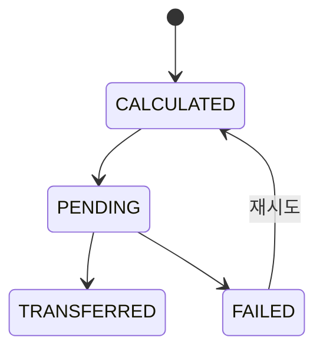

# 정산

> 담당: <!-- TODO --> · 최종 수정: <!-- TODO -->

## 개요

<!-- 강의 완료 후 강사에게 지급되는 정산(payout)의 책임 범위 -->
<!-- 여기에 작성 -->

## 주요 기능

<!-- 예: 강의 완료 시 정산 산정(플랫폼 수수료·강사 몫), 정산 상태 관리, 송금, 정산 계좌 관리, 실패 재시도 -->
- <!-- 여기에 작성 -->

## 핵심 로직 / 플로우

<!-- 강의 완료 → 코인 정산 산정 → 대기 → 송금 → 완료/실패. 신고 보류(REPORT_HOLD) 연동 -->

<!-- 여기에 작성 -->

## 관련 API

| 메서드 | 경로 | 설명 |
|---|---|---|
| <!-- TODO --> | <!-- TODO --> | <!-- TODO --> |

## 관련 테이블

- `settlements` — 정산 (lesson_id 유니크, 총코인·수수료·강사몫·정산금·상태)
- 참조: `tutor`(정산 계좌), `lessons`(정산 대상 강의)

## 트러블슈팅

<!-- 예: 송금 완료(TRANSFERRED) 건 취소 불가 처리, 신고로 인한 출금 보류 -->
<!-- 여기에 작성 -->
