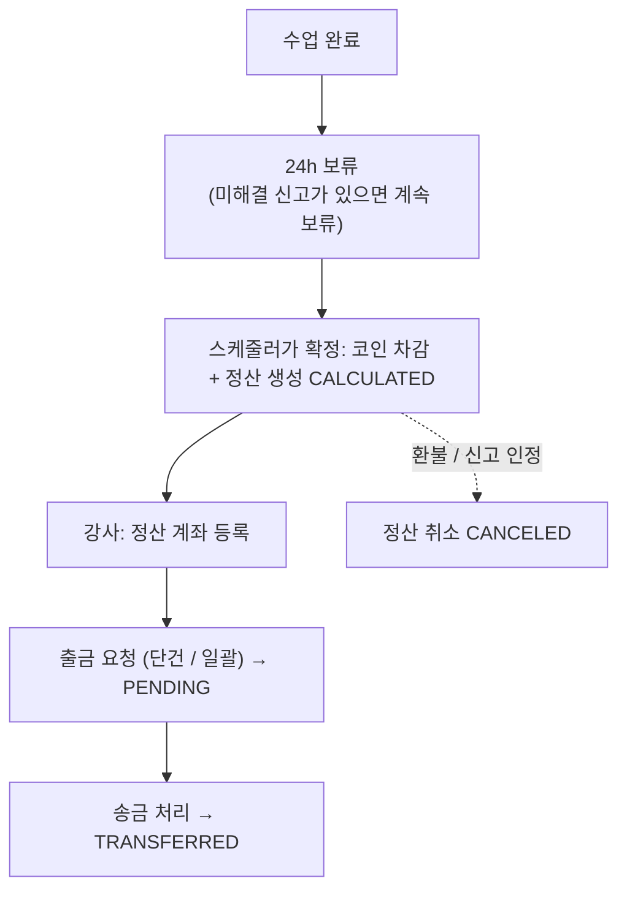
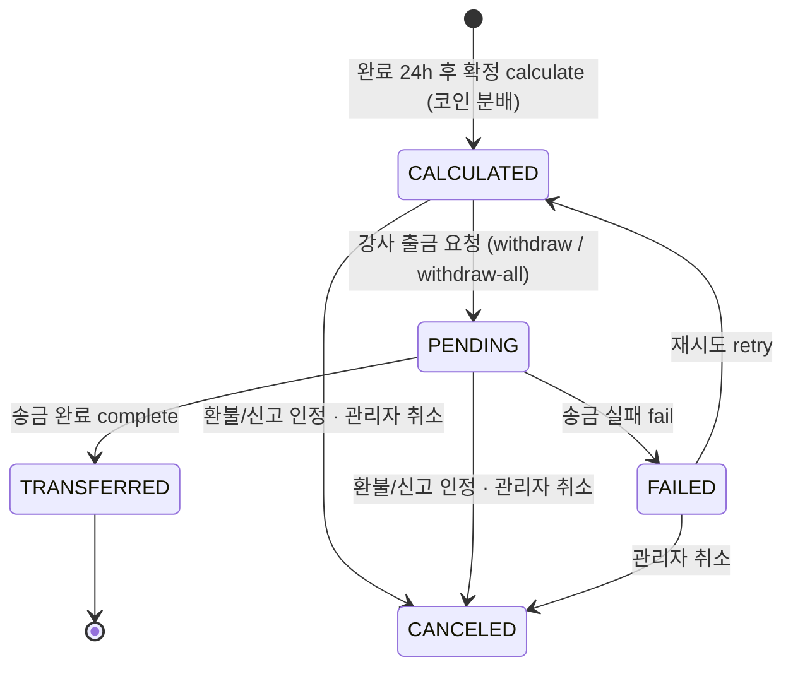

# 정산

> 담당: 정수민 · 최종 수정: 2026-09-14
>
> 강의 완료 후 강사에게 지급되는 **정산(payout)** — 수업 1건 = 정산 1건. `domain/settlement`.

## 한눈에 보기

| 항목 | 내용 |
|---|---|
| 산정 | 수업 완료 → **24h 보류** → 미신고면 스케줄러가 확정 → 코인 분배(기본 수수료 20% · 등급별 10~30% · 1코인=100원) → `CALCULATED` |
| 상태 | `CALCULATED` → `PENDING` → `TRANSFERRED` / `FAILED`(→ 재시도 시 `CALCULATED`) · 송금 완료 전이면 `CANCELED` |
| 무결성 | `lesson_id` UNIQUE(1강의 1정산) · 강사는 `lesson.tutorId`로 결정 |
| 보류/취소 | 신고 PENDING/REVIEWING → 보류 · 환불/신고 인정 → 취소 |
| API | `SettlementController` (`/api/v1/settlements`) 강사용 6개 · 관리자용 5개 + 정산 계좌 2개 · 강사 ID는 JWT에서 |

## 기능 흐름 (사용자 관점)



## 주요 기능

- **정산 산정**: 수업 완료 후 24시간이 지나고 미해결 신고가 없으면 스케줄러(`LessonService.finalizeDueSettlements` → `LessonSettlementFinalizer.finalizeOne`)가 코인 확정 차감과 함께 `calculate` 호출 → `SettlementPolicy.distribute()`로 코인 분배(기본 수수료 20% = 강사 80%, 강사 등급별 **10~30%** 차등, **1코인=100원**) → `CALCULATED`(출금 가능).
- **정산 예정 조회**: 완료됐지만 아직 정산되지 않은 강의와 그 이유(`REPORT_HOLD` · `WAITING_PERIOD` · `PROCESSING`)를 보여준다(`/pending`).
- **출금 요청**: 강사가 단건(`/withdraw`)·일괄(`/withdraw-all`)로 요청 → `PENDING`(송금 대기). 요청 전 **정산 계좌 등록 강제**, 신고 처리 중인 강의는 제외.
- **송금 처리**: 관리자 콘솔에서 완료·실패·재시도·취소.
- **정산 계좌 관리**: 은행/계좌번호/예금주 등록·조회(Tutor 엔티티에 저장).
- **취소/롤백**: 강의 환불·신고 인정 시 `cancelByLesson()`으로 정산 무효화(집계 제외).

## 핵심 로직 / 플로우



- **권위 있는 강사 결정**: `calculate`는 요청의 tutorId를 신뢰하지 않고 `lesson.getTutorId()`로 강사를 정한다.
- **한 강의 1정산**: `lesson_id` **UNIQUE**로 DB가 보장.
- **신고 보류(REPORT_HOLD)**: 강의 신고가 PENDING/REVIEWING이면 스케줄러가 그 강의의 정산 확정을 건너뛰고(코인은 홀드 유지), 이미 정산된 뒤 들어온 신고면 출금을 막는다 → 종결 시 해제, 인정 시 취소. (상세: [리뷰·신고 무결성](./리뷰-신고-무결성.md))
- **송금 완료/실패(`complete`/`fail`)** 는 사업자·PG(펌뱅킹) 확보 전까지 **수동 stub** — 실제 이체 없이 상태만 바꾼다.
- **취소**는 송금 완료(`TRANSFERRED`) 전까지만 가능하고, **재시도**는 `FAILED`에서만 가능하다(엔티티가 검사, 아니면 409).

## API

기본 경로: `/api/v1/settlements`

- 강사 ID는 **JWT 인증 주체**에서 가져온다. 요청 파라미터로 받지 않는다.
- 응답은 공통 `ApiResponse`로 감싸지 않고 DTO를 그대로 반환한다.

### 강사용 (역할: `TUTOR`)

| 메서드 | 경로 | 설명 |
|---|---|---|
| GET | `/settlements` | 내 정산 목록. `?status=`(선택)로 상태 필터 |
| GET | `/settlements/pending` | 정산 예정 목록 — 완료됐지만 아직 정산되지 않은 강의와 보류 사유, 예상 지급액 |
| GET | `/settlements/summary` | 총정산 / 송금 완료 / 대기 집계 |
| GET | `/settlements/{id}` | 정산 단건 — 본인 정산이 아니면 403 |
| POST | `/settlements/{id}/withdraw` | 단건 출금 요청 `CALCULATED` → `PENDING` — 본인 정산 · 계좌 등록 · 신고 처리 중 아님 필요 |
| POST | `/settlements/withdraw-all` | `CALCULATED` 전체 일괄 출금 요청 — 신고 처리 중인 강의는 제외 |

### 관리자·시스템용 (역할: `ADMIN`)

| 메서드 | 경로 | 설명 | 실제 호출 경로 |
|---|---|---|---|
| POST | `/settlements/calculate` | 정산 생성 — `lessonId`만 받음 | 스케줄러가 서비스 직접 호출 (`LessonSettlementFinalizer`) |
| POST | `/settlements/{id}/complete` | 송금 완료 `PENDING` → `TRANSFERRED` (수동 stub) | 관리자 콘솔 `POST /admin/settlements/{id}/complete` |
| POST | `/settlements/{id}/fail` | 송금 실패 `PENDING` → `FAILED` | 관리자 콘솔 `POST /admin/settlements/{id}/fail` |
| POST | `/settlements/{id}/retry` | 재시도 `FAILED` → `CALCULATED` | 관리자 콘솔 `POST /admin/settlements/{id}/retry` |
| POST | `/settlements/{id}/cancel` | 정산 취소 → `CANCELED` (송금 완료 건 제외) | 관리자 콘솔 `POST /admin/settlements/{id}/cancel` |

> 현재 JWT로 `ADMIN` 역할이 발급되는 경로가 없어, 이 5개 REST 엔드포인트는 **외부 HTTP로는 호출할 수 없다**(`SecurityConfig`에서 `ADMIN` 요구).
> 강사가 스스로 송금 완료·취소를 하지 못하게 잠가 둔 것이고, 실제 운영 작업은 세션 로그인 기반 **관리자 콘솔**(`/admin/**`)이 같은 서비스 메서드를 호출한다.

### 정산 계좌 (역할: `TUTOR`)

| 메서드 | 경로 | 설명 |
|---|---|---|
| GET | `/tutors/me/settlement-account` | 내 계좌 조회 |
| PATCH | `/tutors/me/settlement-account` | 계좌 등록·수정 |

## 설계 노트

### 요청값을 하나도 믿지 않는다

정산 생성 API는 `lessonId`만 신뢰하고, **나머지는 전부 서버가 DB에서 다시 구한다.**

| 항목 | 어디서 가져오는가 | 요청값을 믿으면 |
|---|---|---|
| 정산받을 강사 | `lesson.getTutorId()` | 엉뚱한 강사에게 돈이 나간다 |
| 정산 금액 | `lesson.getCoinCost()` | 외부에서 임의 금액으로 정산을 만들 수 있다 |
| 수업 날짜 | `lesson.getEndedAt()` (없으면 `startedAt`) | 정산 시점을 조작할 수 있다 |

돈이 나가는 API에서 클라이언트가 보낸 금액을 그대로 쓰면 **그 자체가 취약점**이다.
그래서 `CalculateSettlementRequest`도 `lessonId`만 받는다. 예전에는 `tutorId`·`totalCoin`을 필수로 받으면서 실제로는 무시하고 있어, "이 값으로 정산된다"는 오해를 줄 수 있어 제거했다.

### 중복 정산 2중 방어

```
1차: findByLessonId() 선검사     → "이미 정산된 강의입니다" (친절한 에러)
2차: lesson_id UNIQUE 제약       → 동시 호출이 1차를 둘 다 통과해도 DB가 막음
```

핵심은 `save()`가 아니라 **`saveAndFlush()`** 를 쓴 것이다.
`save()`만 하면 INSERT가 트랜잭션 커밋 시점까지 지연돼 제약 위반을 **서비스 계층에서 잡을 수 없다.**
`saveAndFlush()`로 즉시 밀어 넣고 `DataIntegrityViolationException`을 받아
사용자용 409 메시지로 변환한다. `SettlementConcurrencyTest`가 이 경로를 고정한다.

### 분배 계산 — 잔액이 새지 않게

```java
int platformFeeCoin = totalCoin * rate / 100;   // 정수 연산
int tutorCoin       = totalCoin - platformFeeCoin;  // 나머지 전부
```

`double`로 각각 계산해 반올림하면 **양쪽 합이 원금과 어긋난다**(1코인이 사라지거나 생긴다).
수수료만 정수 연산으로 구하고 **나머지를 전부 강사 몫으로 두어** 합이 항상 `totalCoin`과 일치하게 했다.
절삭으로 생기는 1코인 미만 오차는 강사에게 유리한 방향으로 간다.

수수료율은 강사 등급별 차등(루키 30% · 주니어 25% · 시니어 20% · 마스터 10%)이며,
등급이 없으면 기본 20%, 그리고 **어떤 값이 들어와도 10~30%로 클램프**한다 — 잘못된 등급 데이터가 들어와도 비정상 정산이 나오지 않는다.

### 보류 사유를 3가지로 나눈 이유

강사 입장에서 "왜 아직 정산이 안 됐는가"는 가장 민감한 질문이라, 이유를 구분해 보여준다.

| 사유 | 조건 | 강사에게 보이는 의미 |
|---|---|---|
| `REPORT_HOLD` | 해당 강의에 미해결 신고 존재 | 분쟁 종료까지 보류 |
| `WAITING_PERIOD` | 종료 후 대기 시간 미경과 | 정상 — 곧 처리됨 |
| `PROCESSING` | 그 외 | 처리 중 |

조회 시 신고는 `findLessonIdsWithStatusIn()`으로 **한 번에 묶어 조회**하고 과목명도 문제별 1회만 조회해 N+1을 피했다.

## 한계와 다음 단계

| 한계 | 영향 | 개선 방향 |
|---|---|---|
| 실제 송금이 **수동** | 정산 레코드까지만 생성되고 이체는 운영자가 수행 | 지급 대행 API 연동 |
| 수수료율이 **정산 확정 시점 등급** 기준 | 보류 기간(24h) 중 등급이 바뀌면 바뀐 등급으로 계산됨 | 강의 시점 등급을 스냅샷으로 보관 |
| 보류 판정이 **조회 시점 계산** | 목록 조회마다 신고 테이블을 함께 읽음 | 정산 레코드에 보류 상태를 물리화 |

## 관련 테이블

- `settlements` — 정산. `tutorId` · `lessonId`(**UNIQUE**) · `totalCoin`(학생 제출) · `platformFeeCoin`(수수료) · `tutorCoin`(강사 몫) · `tutorAmount`(현금 환산) · `status` · `createdAt` · `transferredAt`
- 참조: `tutor`(정산 계좌 `settlement_bank/account/holder`), `lessons`(정산 대상 강의)

<details>
<summary>열거형</summary>

- **SettlementStatus**: `CALCULATED` → `PENDING` → `TRANSFERRED`/`FAILED`/`CANCELED`
- 보류 사유 `PendingSettlementReason`: `WAITING_PERIOD`(24h) · `REPORT_HOLD`(신고) · `PROCESSING`

</details>

> 참고: 이 코드베이스는 도메인 결합을 피하려 식별자를 `Long`으로 들고 다녀(`@ManyToOne` FK 대신), **애플리케이션 레벨 정합성**으로 보장한다.

## 더 알아보기

- **코인 원장·정산 산정·중복/위변조 차단·분쟁 게이트** 상세: [결제·정산 데이터 무결성](./결제-정산-무결성.md)
- 신고로 인한 보류/취소의 리뷰·신고 관점: [리뷰·신고 무결성](./리뷰-신고-무결성.md)

## 관련 코드

<details>
<summary>클래스 · 파일 경로</summary>

- 백엔드 (`backend/.../domain/settlement/`)
  - `controller/SettlementController.java` — 강사용 조회·출금 + 관리자용 생성·송금 처리 엔드포인트
  - `service/SettlementService.java` — `calculate`(lesson 기반 산정), `getPendingByTutor`(보류 사유), `requestWithdraw`/`requestBulkWithdraw`, `complete`/`fail`/`retry`/`cancelSettlement`, `cancelByLesson`
  - `policy/SettlementPolicy.java` — 코인 분배(강사 몫 / 플랫폼 수수료)
  - `entity/Settlement.java` (+ `enums/`) — 상태 전이
- 확정 트리거: `lesson/service/LessonService.java`(`finalizeDueSettlements`) → `lesson/service/LessonSettlementFinalizer.java`(코인 확정 차감 + 정산 생성) · `lesson/scheduler/LessonScheduler.java`
- 관리자 콘솔: `admin/controller/AdminController.java` — `/admin/settlements/{id}/complete·fail·retry·cancel`
- 보안: `global/config/SecurityConfig.java` — 정산 API 역할 규칙
- 정산 계좌: `auth/controller/TutorController.java` — `/api/v1/tutors/me/settlement-account`
- 프론트: `frontend/lib/features/tutor/`(정산 목록·출금·계좌 등록)

</details>
