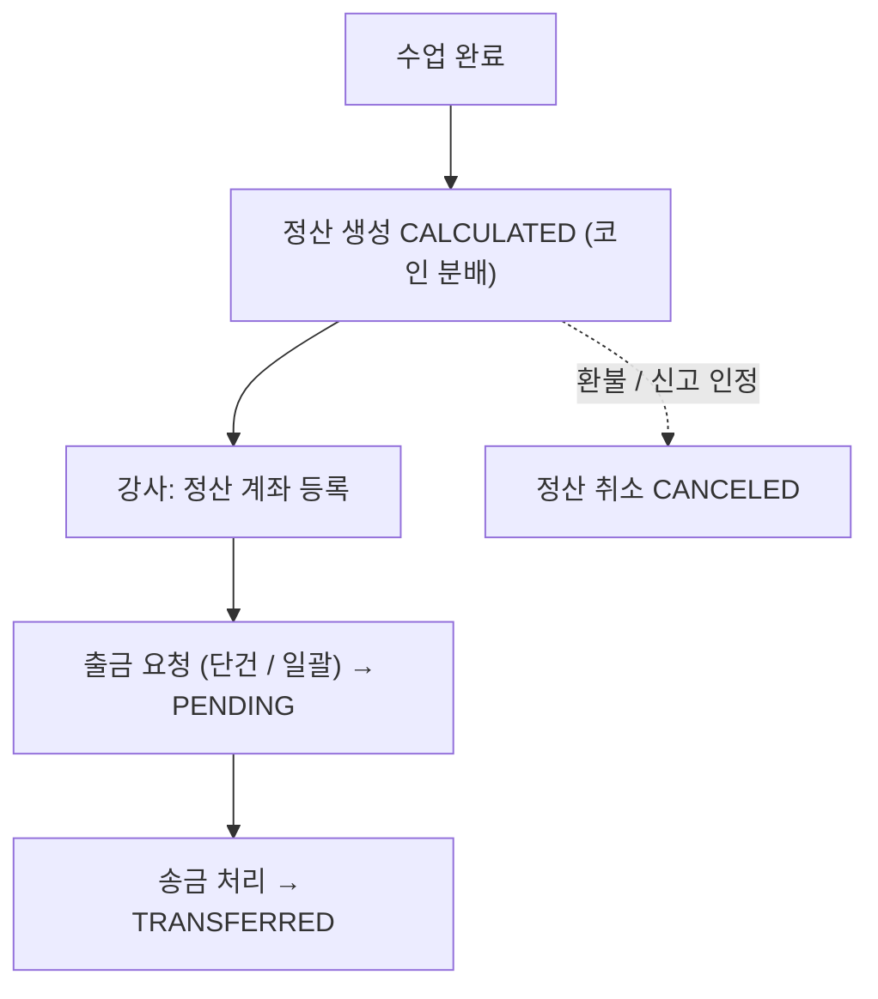
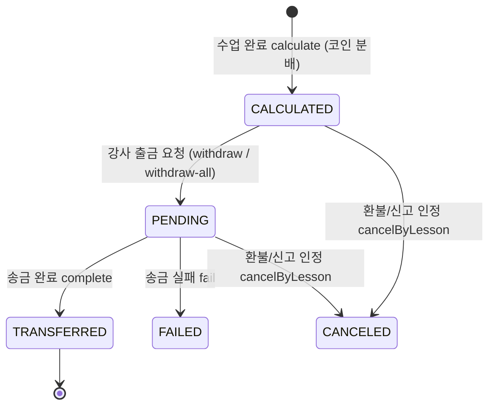

# 정산

> 담당: 정수민 · 최종 수정: 2026-07-06
>
> 강의 완료 후 강사에게 지급되는 **정산(payout)** — 수업 1건 = 정산 1건. `domain/settlement`.

## 한눈에 보기

| 항목 | 내용 |
|---|---|
| 산정 | 수업 완료 → 코인 분배(기본 수수료 20% · 등급별 10~30% · 1코인=100원) → `CALCULATED` |
| 상태 | `CALCULATED` → `PENDING` → `TRANSFERRED` / `FAILED` / `CANCELED` |
| 무결성 | `lesson_id` UNIQUE(1강의 1정산) · 강사는 `lesson.tutorId`로 결정 |
| 보류/취소 | 신고 PENDING/REVIEWING → 보류 · 환불/신고 인정 → 취소 |
| API | `SettlementController` (`/api/v1/settlements`) + 정산 계좌 |

## 기능 흐름 (사용자 관점)

## 주요 기능

- **정산 산정**: 수업 완료 → `calculate` → `SettlementPolicy.distribute()`로 코인 분배(기본 수수료 20% = 강사 80%, 강사 등급별 **10~30%** 차등, **1코인=100원**) → `CALCULATED`(출금 가능).
- **출금 요청**: 강사가 단건(`/withdraw`)·일괄(`/withdraw-all`)로 요청 → `PENDING`(송금 대기). 요청 전 **정산 계좌 등록 강제**.
- **정산 계좌 관리**: 은행/계좌번호/예금주 등록·조회(Tutor 엔티티에 저장).
- **취소/롤백**: 강의 환불·신고 인정 시 `cancelByLesson()`으로 정산 무효화(집계 제외).

## 핵심 로직 / 플로우

- **권위 있는 강사 결정**: `calculate`는 요청의 tutorId를 신뢰하지 않고 `lesson.getTutorId()`로 강사를 정한다.
- **한 강의 1정산**: `lesson_id` **UNIQUE**로 DB가 보장.
- **신고 보류(REPORT_HOLD)**: 강의 신고가 PENDING/REVIEWING이면 그 강의는 정산 확정에서 제외 → 종결 시 해제, 인정 시 취소. (상세: [리뷰·신고 무결성](./리뷰-신고-무결성.md))
- **송금 완료/실패(`complete`/`fail`)** 는 사업자·PG(펌뱅킹) 확보 전까지 **수동 stub**.

## API

기본 경로: `/api/v1/settlements`

| 메서드 | 경로 | 설명 |
|---|---|---|
| POST | `/calculate` | 정산 생성(코인 분배) — 수업 완료(시스템) |
| GET | `/?tutorId=` | 강사 정산 목록 |
| GET | `/summary?tutorId=` | 총정산/송금완료/대기 집계 |
| GET | `/{id}` | 정산 단건 |
| POST | `/{id}/withdraw` | 단건 출금 요청 → PENDING |
| POST | `/withdraw-all` | 일괄 출금 요청 → PENDING |
| POST | `/{id}/complete` | 송금 완료(⚠️ 수동 stub) |
| POST | `/{id}/fail` | 송금 실패(⚠️ 수동 stub) |
| POST | `/{id}/cancel` | 정산 취소(관리자) |

정산 계좌 (`/api/v1/tutors/me/settlement-account`):
| 메서드 | 경로 | 설명 |
|---|---|---|
| GET | `/tutors/me/settlement-account` | 계좌 조회 |
| PATCH | `/tutors/me/settlement-account` | 계좌 등록·수정 |

## 관련 테이블

- `settlements` — 정산. `tutorId` · `lessonId`(**UNIQUE**) · `totalCoin`(학생 제출) · `platformFeeCoin`(수수료) · `tutorCoin`(강사 몫) · `tutorAmount`(현금 환산) · `status` · `createdAt` · `transferredAt`
- 참조: `tutor`(정산 계좌 `settlement_bank/account/holder`), `lessons`(정산 대상 강의)

열거형

- **SettlementStatus**: `CALCULATED` → `PENDING` → `TRANSFERRED`/`FAILED`/`CANCELED`
- 보류 사유 `PendingSettlementReason`: `WAITING_PERIOD`(24h) · `REPORT_HOLD`(신고) · `PROCESSING`

> 참고: 이 코드베이스는 도메인 결합을 피하려 식별자를 `Long`으로 들고 다녀(`@ManyToOne` FK 대신), **애플리케이션 레벨 정합성**으로 보장한다.

## 더 알아보기

- **코인 원장·정산 산정·중복/위변조 차단·분쟁 게이트** 상세: [결제·정산 데이터 무결성](./결제-정산-무결성.md)
- 신고로 인한 보류/취소의 리뷰·신고 관점: [리뷰·신고 무결성](./리뷰-신고-무결성.md)

## 관련 코드

클래스 · 파일 경로

- 백엔드 (`backend/.../domain/settlement/`)
  - `controller/SettlementController.java` — 정산·출금·취소 엔드포인트
  - `service/SettlementService.java` — `calculate`(lesson 기반 산정), `withdraw`/`withdrawAll`, `cancelByLesson`
  - `policy/SettlementPolicy.java` — 코인 분배(강사 몫 / 플랫폼 수수료)
  - `entity/Settlement.java` (+ `enums/`) — 상태 전이
- 확정 트리거: `lesson/service/LessonService.java`(`finalizeDueSettlements`) · `lesson/scheduler/`(24h 폴링)
- 프론트: `frontend/lib/features/tutor/`(정산 목록·출금·계좌 등록)

