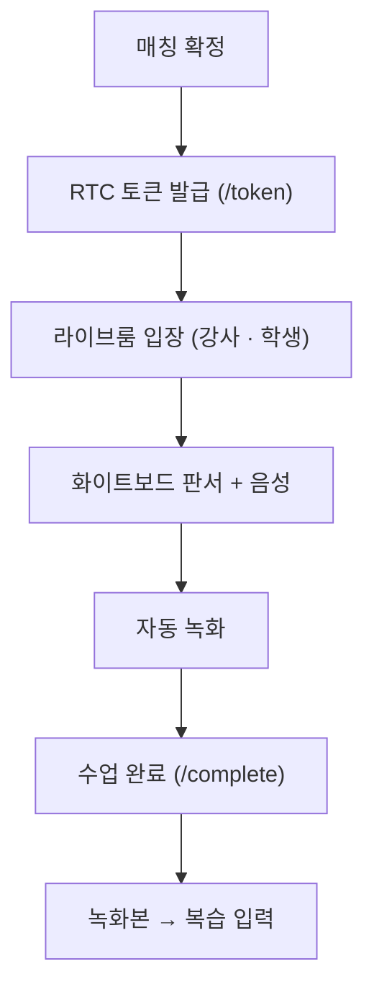

# 실시간 화상 강의

> Agora RTC 화상·음성 + 양방향 화이트보드 + 자동 녹화로 구성된 실시간 1:1 강의실.

## 한눈에 보기

| 항목 | 내용 |
|---|---|
| 화상·음성 | Agora RTC |
| 판서 | 양방향 화이트보드 (문제 이미지 배경 위 동시 필기) |
| 녹화 | Agora Cloud Recording (Web Page Recording) → S3 |
| 기본 시간 | 30분 + 연장 |
| API | `LessonController` 8개 (`/api/v1/lesson`) |

## 기능 흐름 (사용자 관점)

## 주요 기능

- **화상·음성**: Agora RTC 기반 실시간 1:1 화상·음성.
- **양방향 화이트보드**: 문제 이미지를 배경으로 강사·학생이 동시에 필기. 5색 펜·지우개, 이미지 이동/확대, 핀치 줌 지원.
- **문제 이미지 업로드**: 수업 중 이미지 업로드(강의당 최대 10장).
- **자동 녹화**: 화이트보드 화면과 음성을 함께 녹화해 복습 자료의 입력으로 재활용.
- **시간 관리**: 기본 30분, 필요 시 연장(10/20/30분).
- **정산 연동**: 수업 완료 시 코인 확정 차감 후 강사에게 정산.

## API

기본 경로: `/api/v1/lesson`

| 메서드 | 경로 | 설명 |
|---|---|---|
| POST | `/token` | Agora RTC 토큰 발급 |
| POST | `/{lessonId}/images` | 수업 중 임시 이미지 업로드 (최대 10장) |
| POST | `/{lessonId}/start` | 강의 시작 (코인 30분분 hold) |
| POST | `/{lessonId}/extend` | 강의 연장 (10/20/30분) |
| POST | `/{lessonId}/complete` | 강의 완료 (코인 확정 차감 + 정산) |
| POST | `/{lessonId}/cancel` | 강의 취소 (코인 반환) |
| POST | `/{lessonId}/recording/start` | 녹화 시작 |
| POST | `/{lessonId}/recording/stop` | 녹화 중지 |

## 더 알아보기

- Agora Cloud Recording · RTC 토큰 서버 포팅 · S3 폴링 상세: [Agora 화상·녹화 연동](./Agora-화상-녹화.md)
- 화이트보드 실시간 동기화(STOMP · 좌표계 · 에코 필터 · 투명 지우개) 상세: [실시간 화이트보드 동기화](./화이트보드-동기화.md)

## 관련 코드

클래스 · 파일 경로

- 백엔드 (`backend/.../domain/lesson/`)
  - `controller/LessonController.java` — 엔드포인트 8개
  - `controller/LessonWebSocketController.java` — 화이트보드 브로드캐스트
  - `service/LessonService.java` — 강의 생명주기 · 토큰 · 녹화 조율
  - `scheduler/LessonScheduler.java` — 비정상 종료 정리 · 정산 확정 폴링
  - `entity/Lesson.java` — 상태 · 녹화 정보 · 이미지 수
- Agora (`backend/.../global/agora/`)
  - `AgoraRecordingService.java`, `RtcTokenBuilder2.java`, `AccessToken2.java`, `ByteBuf.java`, `Utils.java`
  - `backend/src/main/resources/static/recorder.html`
- 프론트: `frontend/lib/features/lesson/` — data(STOMP) · presentation(screen · provider · whiteboard_painter) · domain(lesson_model)

