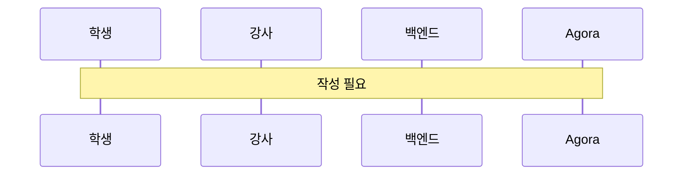

# 실시간 화상 강의

> 담당: <!-- TODO --> · 최종 수정: <!-- TODO -->

## 개요

<!-- Agora 기반 실시간 화상 강의와 녹화의 책임 범위 -->
<!-- 여기에 작성 -->

## 주요 기능

<!-- 예: Agora 토큰 발급, 화상 강의 입장, 판서 이미지 공유, 강의 녹화(Cloud Recording → S3), 강의 연장/종료 -->
- <!-- 여기에 작성 -->

## 핵심 로직 / 플로우

<!-- 채널 생성 → 토큰 발급 → 입장 → 녹화 시작/종료 → S3 업로드 → 강의 완료. WebSocket(STOMP) 시그널링 포함 -->

<!-- 여기에 작성 -->

## 관련 API

| 메서드 | 경로 | 설명 |
|---|---|---|
| <!-- TODO --> | <!-- TODO --> | <!-- TODO --> |

> 실시간 채널: WebSocket `/ws-raw`(모바일), `/ws`(SockJS) · 구독 `/topic`·`/queue` · 발행 `/app`

## 관련 테이블

- `lessons` — 강의 (채널명, 상태, 녹화 리소스/URL, 코인 비용, 종료 예정 시각)

## 트러블슈팅

<!-- 예: 강사 화면 방향에 따른 녹화 가로/세로 대응, 녹화 중지 시 resource_id/sid 관리 -->
<!-- 여기에 작성 -->
