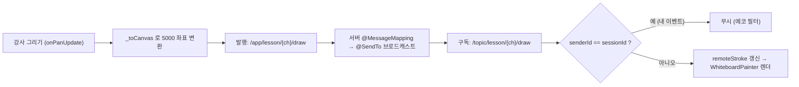

# 실시간 화이트보드 동기화

> 강사·학생이 하나의 화이트보드에 동시 필기하는 실시간 협업 드로잉. STOMP 브로드캐스트 + 에코 필터 + 공유 좌표계로 구현.

## 한눈에 보기

| 항목 | 내용 |
|---|---|
| 전송 | WebSocket(STOMP) — endpoint `/ws-raw`(모바일 plain), `/ws`(SockJS) |
| 좌표계 | 공유 5000×5000 캔버스 좌표 (디바이스 독립) |
| 이벤트 | `DrawEventDto` type 17종 |
| 충돌 방지 | 발신자 식별(senderId) 에코 필터 |

## 문제 상황

- 여러 명이 동시에 필기 → 이벤트가 오가며 **지연 누적**과 **자기 이벤트 되돌아옴(에코)** 으로 선 끊김·중복 렌더링.
- 기기마다 화면 크기가 달라 좌표를 그대로 보내면 **위치가 어긋남**.
- 한 화면에서 **1손가락 드로잉과 2손가락 핀치 줌** 제스처가 서로 간섭.
- 지우개로 지운 자리에 **배경 문제 이미지가 비쳐야** 하는데 흰색 덧칠은 배경까지 덮음.

## 해결 방법

### 동기화 흐름

### 좌표 정규화 (5000×5000 공유 캔버스)

- 캔버스를 `SizedBox(5000, 5000)`로 고정, 화면 터치를 공유 좌표로 변환: `Offset _toCanvas(screenPos) => (screenPos - _offset) / _scale;`
- 역변환은 `_buildMatrix()`(Transform matrix)로 적용 → 기기 해상도와 무관하게 같은 그림.

### 에코 필터 (자기 이벤트 무시)

- 세션마다 `sessionId` 생성: `DateTime.now().microsecondsSinceEpoch.toRadixString(36)`
- 모든 DrawEvent에 `senderId` 실어 발행, 수신 콜백에서 `if (event.senderId == sessionId) return;`로 자기 이벤트 차단.

### 제스처 분리 (드로잉 vs 핀치 줌)

- 단일 `GestureDetector`의 `onScaleStart/Update/End`에서 `d.pointerCount`로 분기.
- `pointerCount >= 2` → 줌(`_scale` clamp 0.5~4.0), 이때 `cancelCurrentStroke()`로 진행 중 획 취소.
- `pointerCount < 2` → `onPanUpdate(_toCanvas(...))` 드로잉.

### 투명 지우개 (배경 비침)

| 환경 | 구현 |
|---|---|
| Flutter 앱 (`whiteboard_painter.dart`) | `canvas.saveLayer(null, Paint())`로 레이어 격리 후 지우개 획에 `paint.blendMode = BlendMode.clear`, 끝에 `canvas.restore()` |
| recorder.html (Canvas 2D) | `ctx.globalCompositeOperation = 'destination-out'` |

- DrawEventDto `type` 17종: DRAW · ERASE · CLEAR · IMAGE_ADD · UNDO · REDO · ZOOM · IMAGE_MOVE · IMAGE_DELETE · VIEWPORT · IMAGE_SYNC · CAMERA_ON/OFF · MIC_ON/OFF · CAMERA_RATIO · LESSON_END

## 핵심 포인트

- 획 전체가 아닌 **점 단위 좌표 + 발신자 기반 에코 필터**로 지연·중복을 해결.
- **5000×5000 공유 캔버스 좌표계**로 기기 해상도 차이를 흡수(디바이스 독립 렌더).
- 레이어 합성(`BlendMode.clear` / `destination-out`)으로 배경이 비치는 투명 지우개 구현.

## 관련 코드

클래스 · 파일 경로

- 백엔드
  - `backend/.../global/config/WebSocketConfig.java` — endpoint `/ws-raw`·`/ws`, broker `/topic`·`/queue`, app prefix `/app`
  - `backend/.../domain/lesson/controller/LessonWebSocketController.java` — `@MessageMapping("/lesson/{channelName}/draw")` + `@SendTo("/topic/lesson/{channelName}/draw")`
  - `backend/.../domain/lesson/dto/DrawEventDto.java` — 좌표(x,y)·senderId·type 등
- 프론트 (`frontend/lib/features/lesson/`)
  - `data/lesson_repository.dart` — STOMP connect/subscribe/send, sessionId, 에코 필터
  - `presentation/lesson_screen.dart` — `_toCanvas`, `_buildMatrix`, GestureDetector 제스처 분리
  - `presentation/whiteboard_painter.dart` — saveLayer + BlendMode.clear
  - `presentation/lesson_provider.dart` — `_onRemoteDrawEvent`, `_applyRemoteDrawPoint`
  - `domain/lesson_model.dart` — DrawEvent, DrawType(17종), DrawingStroke

