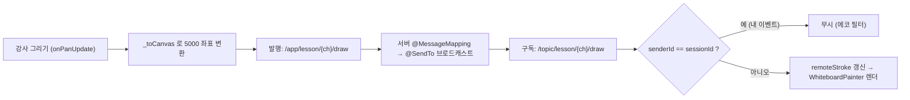
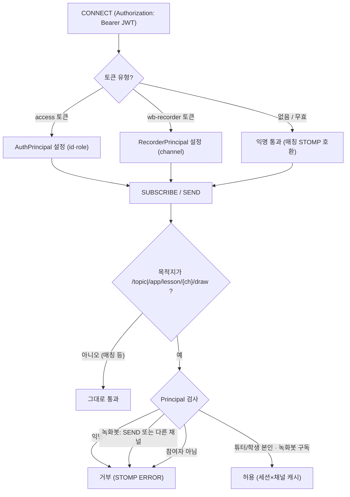

# 실시간 화이트보드 동기화

> 강사·학생이 하나의 화이트보드에 동시 필기하는 실시간 협업 드로잉. STOMP 브로드캐스트 + 에코 필터 + 공유 좌표계, 그리고 JWT 기반 채널 인증·인가로 구현.

## 한눈에 보기

| 항목 | 내용 |
|---|---|
| 전송 | WebSocket(STOMP) — endpoint `/ws-raw`(모바일 plain), `/ws`(SockJS) |
| 인증·인가 | CONNECT 시 JWT 검증 + 화이트보드 목적지만 참여자/녹화봇 인가 (`StompAuthChannelInterceptor`) |
| 좌표계 | 공유 5000×5000 캔버스 좌표 (디바이스 독립) |
| 이벤트 | `DrawEventDto` type 17종 |
| 충돌 방지 | 발신자 식별(senderId) 에코 필터 |

## 문제 상황

- 여러 명이 동시에 필기 → 이벤트가 오가며 **지연 누적**과 **자기 이벤트 되돌아옴(에코)** 으로 선 끊김·중복 렌더링.
- 기기마다 화면 크기가 달라 좌표를 그대로 보내면 **위치가 어긋남**.
- 한 화면에서 **1손가락 드로잉과 2손가락 핀치 줌** 제스처가 서로 간섭.
- 지우개로 지운 자리에 **배경 문제 이미지가 비쳐야** 하는데 흰색 덧칠은 배경까지 덮음.
- 화이트보드 STOMP 목적지가 열려 있어 **채널명만 알면 아무나 구독·전송 가능** → 그 수업의 참여자(튜터·학생)만 허용해야 함. 단, 참여자가 아닌 **녹화봇**(recorder.html)은 어떻게 인가할지, 토큰 없이 붙는 **매칭 알림 STOMP는 깨지 않아야** 하는 제약.

## 해결 방법

### 동기화 흐름

### WebSocket JWT 인증·인가 (StompAuthChannelInterceptor)

- **CONNECT — 인증**: STOMP 네이티브 헤더 `Authorization: Bearer <jwt>`를 검증해 Principal을 부여. 토큰이 없거나 무효면 **익명으로 통과**시킨다(HTTP `JwtAuthenticationFilter`와 동일 철학) — 토큰 없이 붙는 기존 매칭 알림 연결을 깨지 않기 위해서고, 실제 차단은 화이트보드 SUBSCRIBE/SEND 단계에서 수행.
- **SUBSCRIBE/SEND — 인가**: 목적지가 `/topic/lesson/{ch}/draw`·`/app/lesson/{ch}/draw`일 때만 검사. `AuthPrincipal`이면 `lessonRepository.findByChannelName()`으로 그 수업의 튜터/학생인지 확인하고, 결과를 **(STOMP 세션 × 채널)당 1회만 DB 조회 후 세션 속성에 캐시** — 초당 수십~수백 건의 드로우 SEND도 캐시 히트만 발생. 그 외 목적지(매칭 등)는 손대지 않고 통과.
- **녹화봇 채널 스코프 토큰**: 녹화봇은 튜터/학생이 아니라 참여자 인가를 통과할 수 없으므로, 녹화 시작 시 서버가 `JwtProvider.createWhiteboardRecorderToken(channelName, ttl)`로 `type=wb-recorder`, `subject=채널명`인 전용 토큰을 발급해 recorder URL에 `&wbToken=`으로 전달. 이 토큰은 **해당 채널 구독(읽기)만 허용** — SEND는 거부, 다른 채널 구독도 거부.
- **`wrap` → `getAccessor` 세션 전파 버그**: 처음엔 `StompHeaderAccessor.wrap(message)`로 accessor를 얻었는데, wrap()은 읽기 전용 '복사본'이라 CONNECT에서 `setUser()`를 해도 원본 메시지·세션에 반영되지 않음 → 이후 SUBSCRIBE에서 `getUser()`가 null이 되어 **정상 로그인 사용자도 거부**되는 버그. `MessageHeaderAccessor.getAccessor(message, StompHeaderAccessor.class)`는 인바운드 메시지에 바인딩된 '가변' accessor를 돌려줘 setUser()가 세션에 전파된다.
- **프론트 연동**: `lesson_repository.dart`가 STOMP `stompConnectHeaders`에 액세스 토큰(`Authorization: Bearer`)을 실어 CONNECT.
- **메시지 크기 상한**: 인바운드 STOMP 메시지 64KB 제한(`setMessageSizeLimit`) — 대용량 페이로드로 인한 브로드캐스트 스톰/메모리 압박 방지.

### 좌표 정규화 (5000×5000 공유 캔버스)

- 캔버스를 `SizedBox(5000, 5000)`로 고정, 화면 터치를 공유 좌표로 변환: `Offset _toCanvas(screenPos) => (screenPos - _offset) / _scale;`
- 역변환은 `_buildMatrix()`(Transform matrix)로 적용 → 기기 해상도와 무관하게 같은 그림.

### 에코 필터 (자기 이벤트 무시)

- 세션마다 `sessionId` 생성: `DateTime.now().microsecondsSinceEpoch.toRadixString(36)`
- 모든 DrawEvent에 `senderId` 실어 발행, 수신 콜백에서 `if (event.senderId == sessionId) return;`로 자기 이벤트 차단.

### 제스처 분리 (드로잉 vs 핀치 줌)

- 단일 `GestureDetector`의 `onScaleStart/Update/End`에서 `d.pointerCount`로 분기.
- `pointerCount >= 2` → 줌(`_scale` clamp 0.5~4.0), 이때 `cancelCurrentStroke()`로 진행 중 획 취소.
- `pointerCount < 2` → `onPanUpdate(_toCanvas(...))` 드로잉.

### 투명 지우개 (배경 비침)

| 환경 | 구현 |
|---|---|
| Flutter 앱 (`whiteboard_painter.dart`) | `canvas.saveLayer(null, Paint())`로 레이어 격리 후 지우개 획에 `paint.blendMode = BlendMode.clear`, 끝에 `canvas.restore()` |
| recorder.html (Canvas 2D) | `ctx.globalCompositeOperation = 'destination-out'` |

- DrawEventDto `type` 17종: DRAW · ERASE · CLEAR · IMAGE_ADD · UNDO · REDO · ZOOM · IMAGE_MOVE · IMAGE_DELETE · VIEWPORT · IMAGE_SYNC · CAMERA_ON/OFF · MIC_ON/OFF · CAMERA_RATIO · LESSON_END

## 핵심 포인트

- 획 전체가 아닌 **점 단위 좌표 + 발신자 기반 에코 필터**로 지연·중복을 해결.
- **5000×5000 공유 캔버스 좌표계**로 기기 해상도 차이를 흡수(디바이스 독립 렌더).
- 레이어 합성(`BlendMode.clear` / `destination-out`)으로 배경이 비치는 투명 지우개 구현.
- **화이트보드 목적지만 선별 인가**하는 STOMP 인터셉터 — 매칭 알림 등 기존 연결은 그대로 두고, 수업 참여자·녹화봇(채널 스코프 읽기 전용 토큰)만 화이트보드에 접근. (세션×채널) 1회 조회 캐시로 고빈도 드로우에도 부하 없음.

## 관련 코드

클래스 · 파일 경로

- 백엔드
  - `backend/.../global/config/WebSocketConfig.java` — endpoint `/ws-raw`·`/ws`, broker `/topic`·`/queue`, app prefix `/app`, 인터셉터 등록·64KB 상한
  - `backend/.../global/config/StompAuthChannelInterceptor.java` — CONNECT 인증 · 화이트보드 SUBSCRIBE/SEND 인가 · RecorderPrincipal · 세션 캐시
  - `backend/.../domain/auth/jwt/JwtProvider.java` — `createWhiteboardRecorderToken()`, `isWhiteboardRecorderToken()` (type=wb-recorder)
  - `backend/.../domain/lesson/controller/LessonWebSocketController.java` — `@MessageMapping("/lesson/{channelName}/draw")` + `@SendTo("/topic/lesson/{channelName}/draw")`
  - `backend/.../domain/lesson/dto/DrawEventDto.java` — 좌표(x,y)·senderId·type 등
- 프론트 (`frontend/lib/features/lesson/`)
  - `data/lesson_repository.dart` — STOMP connect(JWT `stompConnectHeaders`)/subscribe/send, sessionId, 에코 필터
  - `presentation/lesson_screen.dart` — `_toCanvas`, `_buildMatrix`, GestureDetector 제스처 분리
  - `presentation/whiteboard_painter.dart` — saveLayer + BlendMode.clear
  - `presentation/lesson_provider.dart` — `_onRemoteDrawEvent`, `_applyRemoteDrawPoint`
  - `domain/lesson_model.dart` — DrawEvent, DrawType(17종), DrawingStroke

